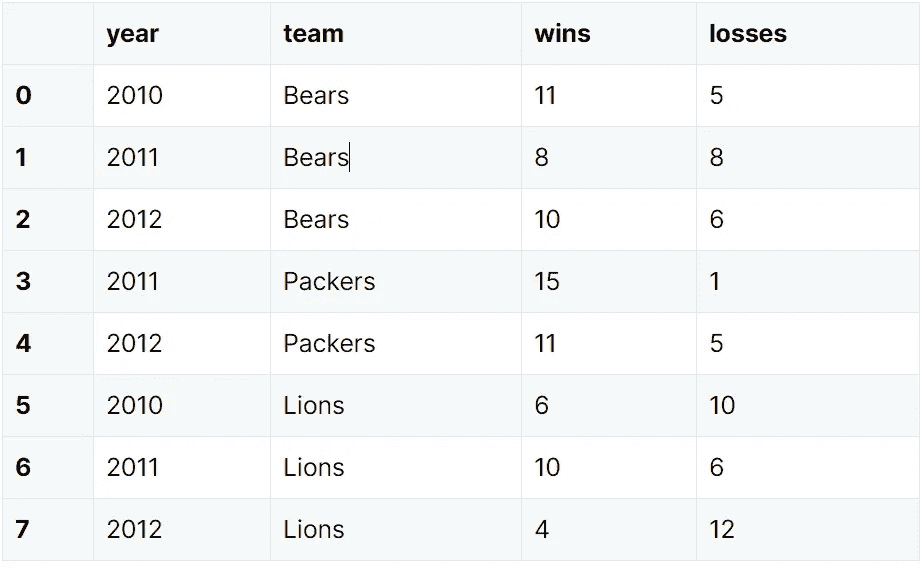

# 实习生日记:熊猫概念

> 原文：<https://medium.com/analytics-vidhya/intern-diaries-pandas-concepts-467d93a16dfa?source=collection_archive---------22----------------------->

在今天的博客中，我们将讨论 python 中的 Pandas 库，以及学习这些概念将如何使您更接近成为数据科学的“神龙大侠”。


所以让我们从 0 级开始……(我喜欢功夫熊猫参考:P)

# 熊猫是什么？

它是一个开源库，为我们提供了用于 python 编程的高性能数据结构和数据分析工具。它有助于:

*   计算任务(寻找平均值、中间值和众数)
*   处理大型 CSV 文件
*   数据集的准备和操作

# 熊猫怎么装？

## 主要有两种方法:

*   您可以使用下面给出的命令提示符通过**“pip 安装熊猫”**来完成:


图 1

*   或者您可以在您的系统上安装 anaconda，它会附带所有需要的包(强烈推荐初学者使用)。


图 2

*   安装完成后，你只需要使用 **import pandas as pd** 将它导入到你的 IDE 中，然后我们就可以开始了。


图 3

# 概念入门…

Pandas 为我们提供了三种非常重要的数据结构:

*   数据帧
*   系列
*   嵌板

在这个博客中，我们将只讨论数据帧和序列。它们都是值可变的。

*   **DataFrames:** 它们是二维的、大小可变的表格数据，包含不同种类数据项的列。它包含带标签的轴，即行和列。对于系列对象，我们可以说它是一个类似字典的对象。



图 4 来源:[www.gregreda.com](http://www.gregreda.com)

*   **系列:**它们是一维的、大小不变的数组，能够保存任何类型的数据，如整数、字符串、python 对象等。它们有轴标签，统称为索引。它们非常类似于 excel 表格中的列。


图 5:熊猫系列(LHS)和 excel 表格中的一列(RHS)。相似之处是一点，对不对？(资料来源:哥伦比亚广播公司和 howtoexcel.org)

***注:*** *大小可变性是一种属性，数据结构的大小可以通过添加或删除元素来改变。请注意，虽然系列是* ***值可变的(现有值可以更改)*** *，但它们不是大小可变的，这意味着一旦形成，就不允许执行删除和追加等操作。*

现在，让我们从创建系列和数据帧开始。

# 创建系列:


图 6: np.nan 为空值。你可以在这里查看 NumPy 数据类型的列表。

# **创建数据帧:**

但在此之前，我们需要知道数据帧的参数:

*   **数据:**用于构建数据帧的数据
*   **索引:**这些是行标签
*   **列:**这些是列标签
*   **dtype:** 数据框的数据类型
*   **复制:**从输入中提取的任何复制数据

我们将讨论创建数据帧的两种方法:

*   使用 numpy 数组
*   通过传递对象字典

## 使用 numpy 数组:

在当前示例中，我们将使用日期时间索引和带标签的列创建数据帧。为此，我们首先使用 pandas 的 date_range()函数创建日期时间索引。我们已经将所有这样的索引存储在日期变量中。


图 7

我们使用 NumPy 随机函数并创建一个包含 0 到 9 范围内的随机整数的数组。我们创建了一个形状数组(12，4)。由于这有 4 列，我们需要 4 列标签。我们将它定义为一个包含‘A’、‘B’、‘C’和‘D’的列表。在我们的 panda dataframe 构造函数中，即 pd。DataFrame()，我们提供了图像中给出的参数:


图 8

## 通过传递对象字典:

非常简单，如下图所示。字典中的键成为列标签，而行标签是我们用来访问任何数据结构的普通索引，即从 0 开始的索引。


图 9

如果我们要检查每列项目的数据类型:


图 10

# **如何使用熊猫查看数据:**

*   使用**dataframe _ name . head(<number>)**:如果没有传递参数，那么它返回 data frame 的前五行，如下所示:


图 11

*   使用**data frame _ name . tail(<number>)**:与 head()类似，如果没有传递参数，它只返回最后 5 行。


图 12

*   我们可以查看数据帧的索引(行标签)和列标签:


图 13

*   将我们的 dateframe 和 series 转换为 numpy 数组:


图 14

*   如果我们想要生成数据帧的描述性统计数据(或以平均值、中值、众数等形式对我们的数据进行描述或汇总)。)然后我们用<data_frame_name>。描述()。下图给出了图 9 中**数据帧 df1 的描述。它为我们提供了非空项的计数、平均值、标准偏差、最小值、第 25、50、75 百分位和每列的最大值，只要这些操作适用。**</data_frame_name>


图 15

*   根据轴标签对数据帧值进行排序:


图 16:当我们使用 sort_index 并将 false 赋给升序属性时，我们的行标签以降序排列。


图 17:现在列标签以降序排序

*   按特定列的值对数据帧中的数据进行排序:


图 18

## 从数据帧中选择数据:

*   使用列标签作为索引来访问单个列。


图 19

*   数据帧切片


图 20

*   使用 loc 访问:


图 21


图 22:loc[]的第一部分表明我们想要访问所有的行。第二个建议我们只对 A、B 和 d 列感兴趣。


图 23:图 22 的修改版本，只需使用切片添加所需的索引范围，您将获得指定的行。

*   使用 iloc:


图 24

*   布尔索引:


图 25

# 处理缺失数据:

*   **Reindexing:** 改变行列标签的方法。使用这种方法，我们可以对现有数据重新排序以符合新的标签集，或者用值替换空值或缺失的数据。

在下面的例子中，我们从现有的数据帧中创建了一个新的数据帧，并向其中添加了一个新的列 E。因为它不在我们的数据帧 df 中，所以它将具有空值。然后使用 loc，我们用 10 替换前三行的空值。


图 26

*   为了检查和计算空值的数量，我们可以使用 **df.isnull( )** 和 **df.isnull()。sum( )** 。当我们使用 df.isnull()时。sum()，它返回每一列的总和。在这种情况下，对于每个假值，加 0，对于每个真值，加 1。因此，如果我们的一列有 2 个 false 和 3 个 trues，那么我们将得到总和 0+0+1+1+1=3。这将告诉我们，该列中有 3 个位置为空。


图 27

*   我们可以删除那些包含一个或多个空值的行，或者用另一个值填充那些空位置。


图 28

*   检查空值的另一种方法是:


图 29

# **合并和分组数据:**

*   可以使用 concat 函数连接两个系列，如下所示:

```
**>>> pd.concat([series_a,series_b])**
```

*   数据帧的连接:我们不是创建两个数据帧，而是创建一个数据帧，然后将其分成 3 个部分。我们的初始数据帧 df 如下所示。


图 30


图 31:注意数据帧的每个部分都有单独的列标签。

使用 concat()将它们合并起来:


图 32

*   **使用 merge( ):** 这里的参数“on”让我们根据公共列合并数据帧。我们制作了两个数据帧，即左数据帧和右数据帧。我们可以看到它们有一个共同的列。所以我们通过用。


图 33


图 34:合并后的结果数据帧

*   使用 groupby()进行分组。groupby()据说是三个任务的组合——将一个表分成组，对所述组应用一些操作，并组合结果。下面给出的是我们的数据帧，我们应该根据标签为 2 的列的值对数据帧进行分组。


图 35:初始数据帧测向

*   让我们关注在标有 2 的列中找到的公共值。我们得到:值 8(在列 2 中)对于行标签{0，11}是常见的；对于值 1，它是{ 1 }；值 2 有{2，4 }；值 6 为{3，6，8}，值 3 为{5}，值 4 为{9}，值 9 为{ 7，10}。列 2 中的不同值充当分组数据帧的行标签。


图 36:分组后的结果数据帧

*   现在，我们已经对上一点中的数据帧值进行了分组，我们可以看到为什么求和后的值是这样的。例如:在我们得到的数据帧中，对于行标签=6 和列标签=0，我们得到总和 15，这可以看作是，

原始列 0 值 3+原始列 0 值 6+原始列 0 值 8= 2+6+7 = 15。

*   ** * * * * *注意:对于第 2 列，值 6 在行标签 3、6 和 8 中是常见的。这就是为什么将它们的第 0 列初始值相加，得到结果值。*********
*   类似的逻辑可以应用于多列中的分组。虽然我承认，在这里可视化分组有点复杂。


图 37

*那么，今天就到这里。熊猫是一个很长的话题，写这篇博客就像坐过山车一样。这绝不是一个完整的教程。在一个博客中涵盖所有的基础变得很困难。*

*但是我仍然喜欢学习它。写这篇博客的时候，我一直在学习，我希望这篇博客对读者有所帮助。*

顺便说一句，有传言说，每当有人为我的博客鼓掌，一只熊猫宝宝就会和家人团聚…..ok jk。

谢谢你坚持到最后！！！