# 作为数据科学家解读概率密度函数

> 原文：<https://medium.com/analytics-vidhya/interpret-as-data-scientist-of-the-probability-density-functions-32e933fa47c5?source=collection_archive---------8----------------------->

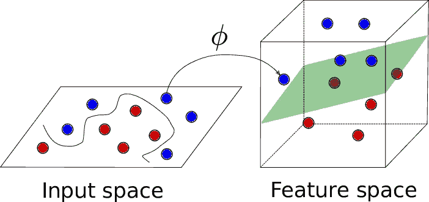

## 随机变量:

**离散随机变量:** X 是离散随机变量，如果它的值域是可数的。

**连续随机变量:**连续随机变量是数据可以取无穷多个值的随机变量。例如，一个测量做某事所用时间的随机变量是连续的，因为有无限个可能的时间戳可以取。

## 人口和样本:

*   一个**群体**包括来自一组数据的所有[元素](https://stattrek.com/Help/Glossary.aspx?Target=element)。总体平均值表示为 **μ** 。
*   一个**样本**由从总体中抽取的一个或多个观察值组成。样本的平均值表示为 **X̄** 。如果抽样是随机进行的，则称之为随机抽样。

随着样本量的增加，样本均值收敛于总体均值。

根据抽样方法的不同，样本的观测值可能少于总体，也可能有相同数量或更多的观测值。一个以上的样本可以来自同一个群体。

## 高斯分布(正态分布):

1.  分布的平均值、中值和众数是一致的。
2.  分布曲线呈钟形，关于 x=μ线对称。
3.  曲线下的总面积为 1。
4.  正好一半的值在中心的左边，另一半在右边。

大多数连续型随机变量本质上服从高斯分布。概率密度函数如下所示。

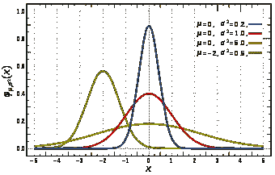

峰值大多位于总体的平均位置，其中σ表示总体的方差。σ决定了 PDF 的形状。

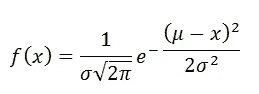

1.  随着 x 的增加(远离 **μ** )，y 减小 squire 的指数。
2.  曲线是对称的。
3.  形状下降是指数二次的。

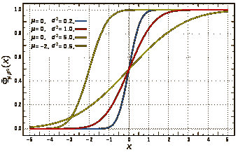

当均值= 0 时，所有曲线的概率=0.5。

随着方差的减小，曲线试图在 x=0 处变成垂直线。

**68–95–99.7 规则**

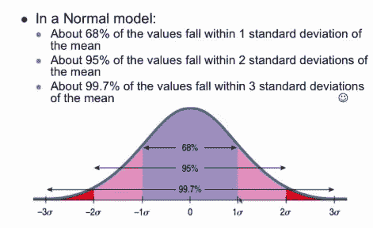

68%的点位于平均值的-1σ到 1σ偏差之间。

## 对称分布、偏斜度和峰度:

**对称分布**是一种左侧分布与右侧对称的分布。根据定义，对称分布绝不是偏斜分布。

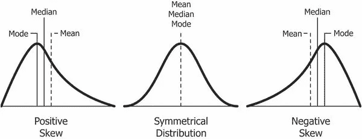

1.  峰度测量分布的峰值。
2.  **表示**受到异常值的影响。

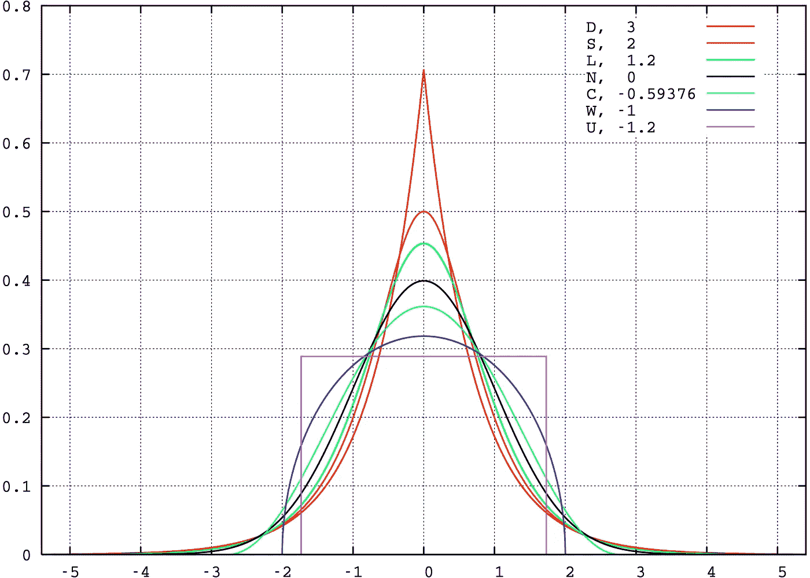

正常图上方的曲线是正峰度，正常曲线下方(N=0)是负峰度。

## 标准正态变量:

给定任何具有给定点的分布(X1，X2，X3，X4..)用均值和方差= N( **μ** ，σ)，可以标准化转换成标准正态变量 N(0，1)。

标准化后，你可以简单地分辨出 68%的点位于-1 和+1 之间。95%的点位于-2 到+2 之间。

## 核密度估计；

用于将直方图转换为 PDF。

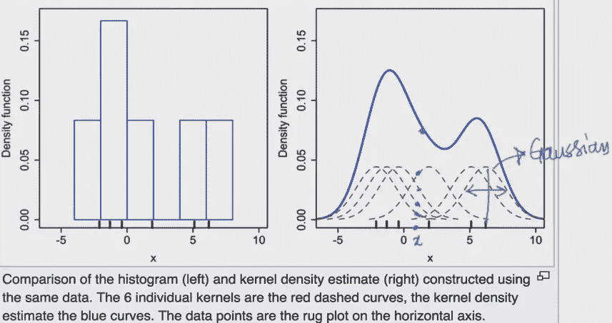

取单个内核上所有点的高度并求和——总和就是分布的总高度。

 [## 核密度估计

### 在统计学中，核密度估计(KDE)是一种估计概率密度函数的非参数方法

en.wikipedia.org](https://en.wikipedia.org/wiki/Kernel_density_estimation) 

## 抽样分布和中心极限定理；

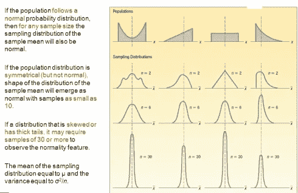

**:总体中每个样本的均值等于总体均值( **μ)。****分布可以是任何分布。****

****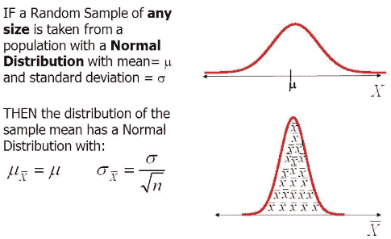****

## ****分位数-分位数图(Q-Q 图):****

****确定随机样本变量是否正态分布。如果样本数量很少，就必须解释 Q-Q 图。****

****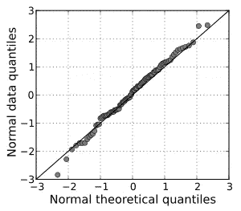****

## ****如何使用发行版？****

****高斯分布给出了在许多自然现象中观察到的数据分布的理论模型。****

****假设我们知道数据服从正态分布 X ~ N(，σ)，均值和偏差σ。我们可以用上面的随机数据画出 PDF 和 CDF。****

****PDF 和 CDF 告诉我们数据是如何分布的。PDF 和 CDF 只在高斯分布的情况下绘制。****

## ****切比雪夫不等式；****

****如果我不知道分布，均值=有限，标准=有限。因为分布的原因，我们不能画 PDF 和 CDF。****

****您可以在这里找到位于给定范围之间的点的百分比。****

****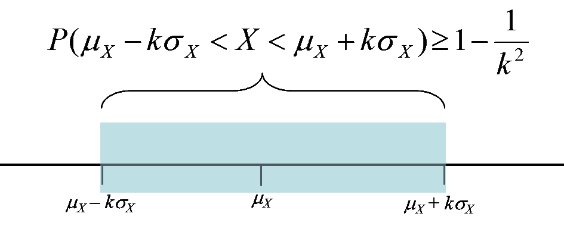****

## ****均匀分布:****

****它被用来产生一个有很多应用的随机数。高度告诉我们找到那个值的概率是多少。连续随机变量的概率密度函数(PDF)和离散随机变量的概率质量函数(PMF ):****

****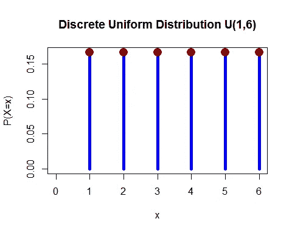********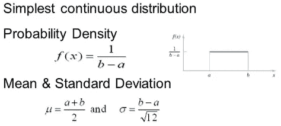******** [## 均匀分布(连续)

### 在概率论和数理统计中，连续均匀分布或矩形分布是一族…

en.wikipedia.org](https://en.wikipedia.org/wiki/Uniform_distribution_%28continuous%29) 

注意:均匀采样意味着每个点在样本数据集 D '中具有相同的机会

## 伯努利和二项式分布:

 [## 伯努利分布

### 在概率论与统计中，以瑞士数学家雅各布·伯努利[1]命名的伯努利分布…

en.wikipedia.org](https://en.wikipedia.org/wiki/Bernoulli_distribution)  [## 二项分布

### 在概率论和统计学中，参数为 n 和 p 的二项分布是离散的概率…

en.wikipedia.org](https://en.wikipedia.org/wiki/Binomial_distribution) 

## 对数正态分布:

如果 ln(X)是正态分布。如果没有，您可以使用 Q-Q 图进行检查。

**注**:如果数据为对数正态分布，取对数转换为高斯分布。所以你可以使用所有的 ML 技术。

在实际应用中，大多数时候分布是对数正态的。随着σ值的增加，对数正态是右偏的。请参见下面给出的例子链接。

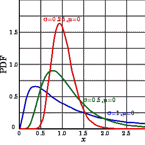

在下面的链接找到的例子。

 [## 对数正态分布

### 在概率论中，对数正态分布是随机变量的连续概率分布

en.wikipedia.org](https://en.wikipedia.org/wiki/Log-normal_distribution#Occurrence_and_applications) 

## 幂律分布:

 [## 幂定律

### 在统计学中，幂律是两个量之间的函数关系，其中一个量的相对变化…

en.wikipedia.org](https://en.wikipedia.org/wiki/Power_law) 

也被称为 80-20 法则。在 20%的时间间隔中找到 80%的时间值。

## 帕累托分布:

 [## 帕累托分布

### 以意大利土木工程师、经济学家和社会学家维尔弗雷多·帕累托的名字命名的帕累托分布是一种…

en.wikipedia.org](https://en.wikipedia.org/wiki/Pareto_distribution) 

你可以在上面链接的应用部分找到一个例子。

## Box cox 变换；

如果数据集呈幂律/帕累托分布，为了将**转换成高斯分布**，使用 Box cox 变换。

通过把所有 x 值放入 Box cox 函数，你将得到 lambda( [λ](https://en.wikipedia.org/wiki/Lambda#Lower-case_letter_%CE%BB) )值。使用λ([λ](https://en.wikipedia.org/wiki/Lambda#Lower-case_letter_%CE%BB)值你可以将每个 x 转换成 y

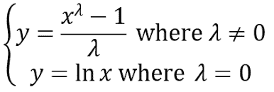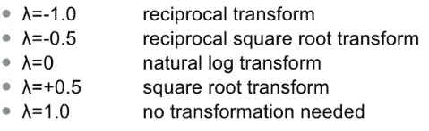

你可以使用链接中给出的公式直接找到 Y 值

 [## scipy.stats.boxcox - SciPy v1.3.1 参考指南

### scipy.stats. boxcox( x，lmbda=None，alpha=None) [source]返回一个由 Box-Cox 幂变换的正数据集…

docs.scipy.org](https://docs.scipy.org/doc/scipy/reference/generated/scipy.stats.boxcox.html) 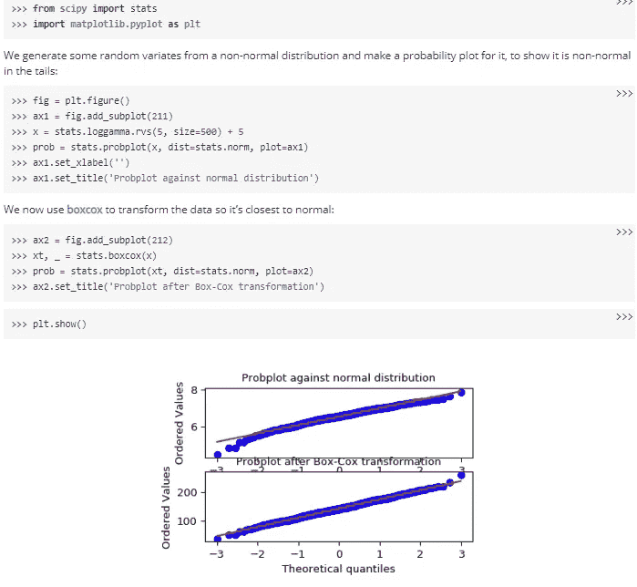

在一行中使用 boxcox(x)函数，在仅仅一行中，我们可以找到正态分布的 y 值。

## 威布尔分布:

用来测量大坝的高度。收集一周间隔的降雨数据。

为了确定颗粒大小

 [## 威布尔分布

### 在概率论和统计学中，威布尔分布是一种连续的概率分布。它被命名为…

en.wikipedia.org](https://en.wikipedia.org/wiki/Weibull_distribution#Applications)****