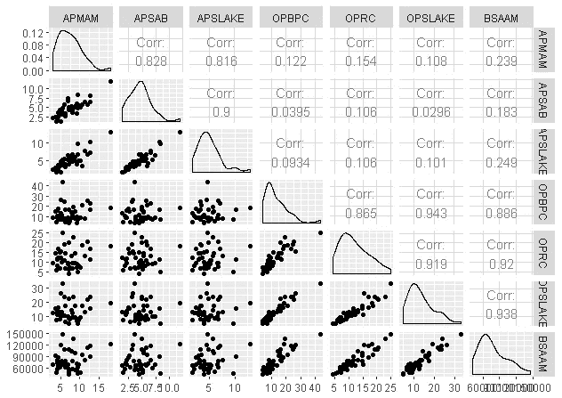
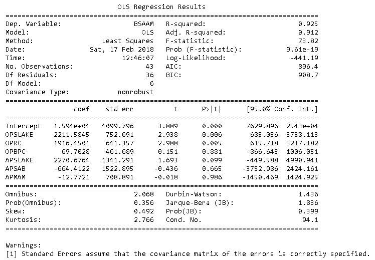

# 解释 R 线性/多元回归输出

> 原文：<https://medium.com/analytics-vidhya/interpret-r-linear-multiple-regression-output-lm-output-point-by-point-also-with-python-8e53b2ee2a40?source=collection_archive---------0----------------------->

## (lm 逐点输出)，也是用 Python

线性回归是非常简单、基本但非常强大的监督学习方法。这种方法非常适合于预测分析，并在进入更复杂的机器学习算法之前，建立对任何数据的通用方法。

线性回归已经讨论了很多，几乎所有教我们分析的书都有它的描述，互联网上有更多的资料，所以我留下了很多细节，除了基本的理解，它都是关于预测基于单个预测因子 X 的定量反应 Y，基于它们之间存在线性关系的假设，当然，一些系数，截距也起着决定性的作用，不要忘记随机误差，它使一切更真实，几乎无处不在！！！。更多详情请见[https://en.wikipedia.org/wiki/Linear_regression](https://en.wikipedia.org/wiki/Linear_regression)

假设我们对这个概念有足够的了解，并尝试用真实的东西，例如用 R/Python 写代码。首先，与 R 一起工作，并采用一个已经干净的标准数据，为什么！！！因为获取和清理数据，数据争论几乎是任何数据科学或机器学习任务的 60–70%。

# 了解您的数据

```
library(alr3)
Loading required package: car
library(corrplot)
data(water) *## load the data*
head(water) *## view the data*

  Year APMAM APSAB APSLAKE OPBPC  OPRC OPSLAKE  BSAAM
1 1948  9.13  3.58    3.91  4.10  7.43    6.47  54235
2 1949  5.28  4.82    5.20  7.55 11.11   10.26  67567
3 1950  4.20  3.77    3.67  9.52 12.20   11.35  66161
4 1951  4.60  4.46    3.93 11.14 15.15   11.13  68094
5 1952  7.15  4.99    4.88 16.34 20.05   22.81 107080
6 1953  9.70  5.65    4.91  8.88  8.15    7.41  67594

filter.water <- water[,-1] *## Remove unwanted year* 

*# Visualize the data* 
library(GGally)
ggpairs(filter.water) *## It's multivaribale regaression*
```



# LM 魔法开始，感谢 R

就像 yi = b0 + b1xi1 + b2xi2 + … bpxip + ei，i = 1，2，… n，这里 y = BSAAM，x1…xn 是所有其他变量

```
mlr <- lm(BSAAM~., data = filter.water)
summary(mlr)

*# Output* 

Call:
lm(formula = BSAAM ~ ., data = filter.water)

Residuals:
   Min     1Q Median     3Q    Max 
-12690  -4936  -1424   4173  18542 

Coefficients:
            Estimate Std. Error t value Pr(>|t|)    
(Intercept) 15944.67    4099.80   3.889 0.000416 ***
APMAM         -12.77     708.89  -0.018 0.985725    
APSAB        -664.41    1522.89  -0.436 0.665237    
APSLAKE      2270.68    1341.29   1.693 0.099112 .  
OPBPC          69.70     461.69   0.151 0.880839    
OPRC         1916.45     641.36   2.988 0.005031 ** 
OPSLAKE      2211.58     752.69   2.938 0.005729 ** 
---
Signif. codes:  0 ‘***’ 0.001 ‘**’ 0.01 ‘*’ 0.05 ‘.’ 0.1 ‘ ’ 1

Residual standard error: 7557 on 36 degrees of freedom
Multiple R-squared:  0.9248,	Adjusted R-squared:  0.9123 
F-statistic: 73.82 on 6 and 36 DF,  p-value: < 2.2e-16
```

# 解释输出

# 残差

通常，它给出了因变量(Y)的观测值和预测值(X)之间差异的基本概念，给出了具体细节，即最小值、第一季度、中值、第三季度和最大值，通常不用于我们的分析

# 系数截距

我们可以看到，所有剩余变量都有一行“截距”，截距是在所有变量都为 0 时给出的数据，因此所有测量都不考虑任何变量，这在正常情况下也不太常用，它是 x = 0 时 y 的平均值

```
*#            Estimate    Std. Error t value Pr(>|t|)* 
*# (Intercept) 15944.67    4099.80   3.889 0.000416 ****
```

# 系数估计

这是 X 的一个单位增加，然后 Y 的预期变化，在这种情况下，OPS LAKE 的一个单位变化，然后 BSAAM 的 2211.58 个单位变化

# 系数-标准。错误

估计值的标准偏差称为标准误差。系数的标准误差衡量模型估计系数未知值的精确程度。系数的标准误差总是正的。

该误差的低值将有助于我们的分析，也用于检查置信区间

# 系数-t 值

t 值=估计值/标准误差

高 t 值将有助于我们的分析，因为这将表明我们可以拒绝零假设，这是用来计算 p 值

# 系数 Pr(>|t|)

每个参数接受或拒绝零假设的单个 p 值，这是 x 和 y 的统计估计值。降低 p 值允许我们拒绝零假设。如果我们错误地分析 p 值，所有类型错误(真阳性/阴性、假阳性/阴性)都会出现。

星号旁边的 p 值表示该值的显著性，较低的值表示显著性较高

```
# Signif. codes:  0 '***' 0.001 '**' 0.01 '*' 0.05 '.' 0.1 ' ' 1
```

# 剩余标准误差

```
Residual standard error: 7557 on 36 degrees of freedom
```

在正常工作中，一个模型的平均误差，我们的模型平均预测数据的能力

自由度类似于考虑参数的估计中考虑的数据点的数量，不确定，但在这种情况下，我们总共有 43 个数据点和 7 个变量，因此删除了 7 个数据点(43–7)= 36 自由度

# 多重 R 平方和调整 R 平方

```
Multiple R-squared:  0.9248,	Adjusted R-squared:  0.9123
```

它总是在 0 到 1 之间，高值是由解释变量的变化解释的响应变量的更好的变化百分比，这用于计算模型在解释事物方面做得有多好，当我们增加变量的数量时，它也会增加，并且没有适当的限制来定义我们可以增加多少。

我们取的是灰值，其中我们不取所有变量，在调整后的 R 平方中只考虑显著变量

# f 统计量

```
F-statistic: 73.82 on 6 and 36 DF
```

这显示了预测值和反应之间的关系，数值越高，拒绝零假设的理由就越多，其对整个模型的意义不在于任何特定参数

DF——自由度

# p 值

```
p-value: < 2.2e-16
```

基于 F 统计的总体 p 值，通常 p 值小于 0.05 表示总体模型显著

# 所以巨蟒

我使用 OLS(普通最小二乘法)方法，但同样可以使用 SciPy 产生，它给出了更标准的结果。

```
import pandas as pd
import scipy.stats as stats
from statsmodels.formula.api import olsmlr = ols("BSAAM~OPSLAKE+OPRC+OPBPC+APSLAKE+APSAB+APMAM", df).fit()
print(mlr.summary())
```



大部分参数与 R 输出匹配，其余参数可用于下一步研究工作:)

所有的描述都是基于一般的看法，如果有什么不对的地方请告诉我，我们非常欢迎您的反馈。