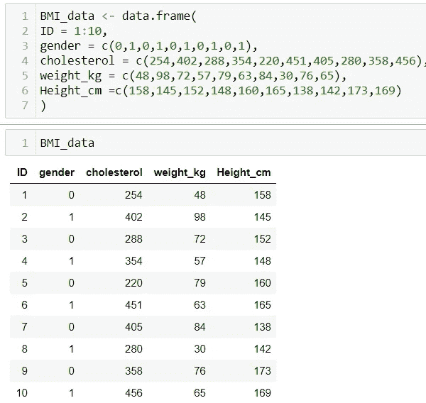
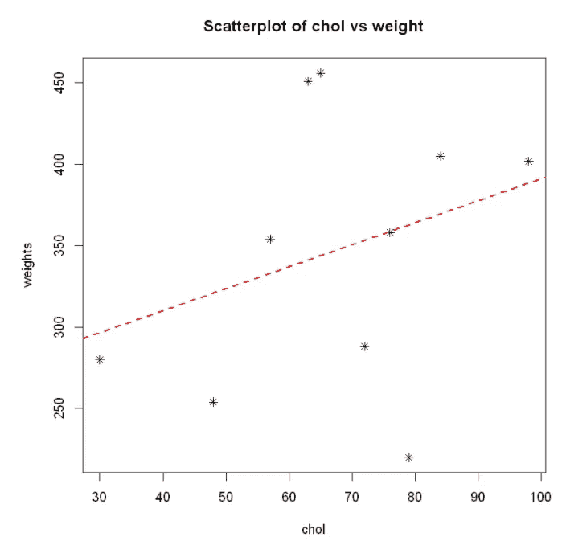

# 解读 R:生物医学数据中的回归分析结果

> 原文：<https://medium.com/analytics-vidhya/interpret-regression-analysis-results-using-r-biomedical-data-82f8df090dac?source=collection_archive---------11----------------------->

基于用例，我们的数据讲述了许多故事，但描绘适当的含义不同于仅仅使用预先存在的库来获得一些准确性或结果。

我觉得解释结果总是令人困惑，尤其是 P 值、总体、斜率，甚至简单的置信区间，这些术语在寻找或解决问题陈述中的确切含义。

你对这些解释有什么看法？

为了理解线性回归的概念，这是一个很好的开始[https://medium . com/analytics-vid hya/understanding-the-Linear-Regression-808 C1 f 6941 c0](/analytics-vidhya/understanding-the-linear-regression-808c1f6941c0)

让我们创建一个样本数据集，

这个数据集包含 ID、性别(男性= 1，女性= 0)、胆固醇、体重(kg)和身高(cm)。我们对检查体重对胆固醇水平的影响很感兴趣。

数据汇总

y 截距:当解释变量(x)为 0 时，响应变量(y)的值。它是最小二乘回归线与 y 轴相交的地方。

哪条线是“最适合”的线？

使点之间的垂直距离最小的线和拟合它们的线(也称为最小二乘回归线)。

y = b0 + b1(X) + e

Y-hat =(截距的估计值为)+(斜率的估计值为)*X

y = 256.252+ 1.347X

参考:shorturl.at/qxCST

回归方程可用于估计 10 名参与者的总胆固醇，作为他/她的身体质量指数的函数。

这里**身体质量指数**可以计算为**体重/(身高)**

例如，假设一个参与者的身体质量指数为 30

估计截距为 97.395

我们估计他们的总胆固醇为 256.252+ 1.347(30) = 296.662

体重为零公斤时的平均胆固醇(可能根本无法解释)

# 95%预测区间:

a)对于一个数据点

我们有 95%的把握认为体重为零公斤的人的胆固醇水平处于置信区间[-1.983828，4.678717]。

CI =点估计误差幅度

[-1.983828，4.678717] à中点公式

即[-1.983828，4.678717]/2 = 1.347444

这里的点估计值是 1.347444，即 1.34

**我们得到一个 p** - **值**比如 0.03782。**假设体重对胆固醇人群的影响为零，由于随机样本误差，我们在 3%的研究中获得了样本效应或更大的样本效应。**

通常，统计显著性的 P 值被定义为 P < 0.05。在我们的用例中，阈值被突破，零假设被拒绝，总体均值相等。

一般来说，95% CI 意味着，如果我们必须取 100 个不同的样本，并为每个样本计算 95%的置信区间，那么 100 个置信区间中大约有 95 个将包含真实平均值(μ)。

我们有 95%的把握认为，体重为 0 公斤的人的真实胆固醇含量在-1.983828 毫克/100 毫升和 4.678717 毫克/100 毫升之间。

但在这种情况下，我们创建的 CI 区间可能会高估或低估平均值。CI 不显示任何未知参数的可变性。

***P(【样本均值】—误差幅度< μ <【样本均值】+误差幅度)= 0.95***

这里，

**我们有 95%的信心，有效体重对胆固醇水平的影响介于区间[** -1.983828，4.678717 **]之间。**

# 回归的 95%置信区间和预测区间

这些关系的线性表明，体重每增加一公斤，风险就会增加，额外的风险通过斜率来估计。这也许有助于我们思考高胆固醇的后果。

# Q-Q 图

相对于拟合值绘制的残差，此处残差应随机分布在水平线周围，残差为零。Q-Q 图，表明残差呈正态分布。未发现明显趋势的比例尺位置图。残差与杠杆显示每个点的杠杆，这是在确定任何回归结果时衡量其重要性的一种方法。

我希望这是一本好书！！