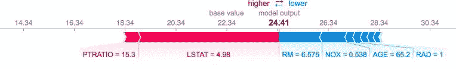

# 机器学习中的可解释性

> 原文：<https://medium.com/analytics-vidhya/interpretability-in-machine-learning-f79e1da4f797?source=collection_archive---------20----------------------->


图片来源:[https://www . IDG connect . com/visitories/1503734/demystifying-black-box-IBM-started-ai](https://www.idgconnect.com/interviews/1503734/demystifying-black-box-ibm-started-ai)

机器学习是一个非常令人兴奋的领域，正被用于解决各种领域的商业问题。每天都有新的人工智能框架和工具发布，这提高了不同类型数据的模型预测准确性。但是这些框架和模型越复杂，就越难解释为什么模型会做出特定的决定。这种“黑箱”模式可能会产生问题，特别是在银行和金融部门，在那里事情都经过严格的审计和规范。

在这篇文章中，我们将深入探讨如何构建可解释的 ML 模型以及模型的解释。对于信任“黑盒”模型的人来说，模型的“可解释性”是必需的，即给出关于其决策过程的见解。此外，在需要时，它还需要向审计人员为其特定决策进行辩护。

一般来说，模型的可解释性和预测能力之间存在权衡。例如，决策树模型是可以解释的，但不如 XGboost 模型准确，反之亦然。对于一个可解释的模型，有各种问题需要回答，如:什么是最重要的特征/预测？模型内部是如何工作的？为什么一个特定的决定是由一个模型做出的？模型将如何预测不属于训练数据的新案例？

*   ***可译 ML 算法:***

获得可解释模型的最简单方法是使用可解释的 ML 算法创建模型，如决策树、线性回归、逻辑回归、k-最近邻、朴素贝叶斯等。例如，您可以将决策树模型理解为简单的 if-else-then 规则。

*   ***特征重要性:***

对于像随机森林这样的复杂模型，你可以得到每个输入变量的相对重要性。特征重要性估计模型预测方差因排除单个特征而改变的程度。在任何系综树模型中，当基于*基尼重要性*或*熵*构建树时，发生节点的最佳分裂。特征重要性只不过是在集合中构建的所有树上平均的节点杂质的总减少。如果随着我们沿着树往下走，准确度的下降很低，那么该特征就不太重要。

```
from sklearn.ensemble import RandomForestClassifier
from sklearn.datasets import make_classification
import pandas as pdX, y = make_classification(n_samples=1000, n_features=4,
                           n_informative=2, n_redundant=0)
rfc= RandomForestClassifier(max_depth=2, random_state=0)
rfc.fit(X, y)

print(dict(zip(X.columns,rfc.feature_importances_)))

feature_importances = pd.DataFrame(rfc.feature_importances_, 
   index = X.columns, columns=  ['Feature_imp']).sort_values('Feature_imp',ascending=False)
```

*   ***排列重要性:***

对于特征重要性，我们研究当特定特征/预测因子从数据集中排除并且模型被重新训练时，模型得分(如 F1-score，R)如何降低。针对每个功能进行重新培训将耗费大量资源。因此，我们可以通过打乱特征的值，用随机噪声(无用信息)替换特征列，而不是删除特征。因此，置换特征重要性使我们在随机改组单个特征值后模型得分降低。如上所述的基于杂质的特征重要性不能应用于未知/测试数据，而排列重要性是在拟合模型后计算的。因此，如果我们随机打乱测试数据集中一个不太重要的特征*，不会导致模型预测能力的问题，但如果我们打乱一个重要的特征，我们将得到可怕的预测。*

```
from sklearn.ensemble import RandomForestClassifier
from sklearn.datasets import make_classification
import pandas as pd
import eli5
from sklearn.inspection import permutation_importancefrom sklearn.model_selection import train_test_split
from eli5.sklearn import PermutationImportanceX, y = make_classification(n_samples=1000, n_features=6,
                           n_informative=4, n_redundant=2)
train_X, test_X, train_y, test_y = train_test_split(X, y)rfc = RandomForestClassifier(max_depth=10, random_state=0).fit(train_X, train_y)
perm_imp = PermutationImportance(rfc, random_state=1).fit(test_X, test_y)
eli5.show_weights(perm_imp, feature_names = test_X.columns.tolist())
### OR using sklearn
result = permutation_importance(rfc, X_train, y_train,n_repeats=10,random_state=42)
perm_sorted_idx = result.importances_mean.argsort()
```

*   ***【部分依赖情节】(PDP):***

置换重要性或特征重要性(基于杂质的平均减少)告诉我们哪些是影响预测的最重要的变量，而部分相关图显示了特定特征如何影响预测。对于线性回归模型，部分相关图将类似于系数(βs)。因此，在 PDP 中，我们在数据集中选取一行，只更改一个要素的值，并对不同的值应用训练好的模型来获得预测。PDP 将是 Y 轴上的预测输出和 X 轴上的特征值的曲线图。它们是“部分的”,因为它们一次只考虑一个或两个特征，并且不考虑特征的相互作用。sklearn 支持 PDP 以及来自 V scikit-learn 0.22( `[sklearn.inspection](https://scikit-learn.org/stable/modules/classes.html#module-sklearn.inspection)`)的置换重要性。

```
from sklearn.datasets import load_iris
from sklearn.ensemble import GradientBoostingClassifier
from sklearn.inspection import plot_partial_dependenceiris = load_iris()
mc_clf = GradientBoostingClassifier(n_estimators=10,
    max_depth=1).fit(iris.data, iris.target)
features = [3, 2, (3, 2)]
plot_partial_dependence(mc_clf, X, features, target=0)
```

*   ***本地代理模型:LIME***

LIME 是模型不可知的，因此可以应用于任何 ML 模型。LIME 提供了局部可解释性，以确定哪些要素变化对预测影响最大。假设你有一个复杂的黑盒模型，你想知道为什么这个模型会产生一个特定的预测，那么 LIME 会帮助你理解。接下来，我们将在数据集上创建简单的可解释模型，如决策树或线性回归，该数据集由置换样本数据和复杂模型的相应预测创建。该模型在局部而非全局给出了黑盒模型的更好的近似。

这里看石灰纸:[https://arxiv.org/abs/1602.04938](https://arxiv.org/abs/1602.04938)

*   ***SHAP 值:***

SHAP(SHapley Additive exPlanations)值可用于解释模型的每个预测。Shapely values 是博弈论中的一个概念，它告诉我们如何在预测者中公平地分配特定的预测。

```
import xgboost
import shap

X,y = shap.datasets.boston()
model = xgboost.train({"learning_rate": 0.01}, xgboost.DMatrix(X, label=y), 100)

# Explain the model's predictions using SHAP
explainer = shap.TreeExplainer(model)
shap_values = explainer.shap_values(X)

# Visualize the first prediction's explanation
shap.force_plot(explainer.expected_value, shap_values[0,:], X.iloc[0,:])
```



模型可解释性的 Shapley 值

上图显示了将模型输出从基础值推至模型输出的每个特征/预测值。将预测值推高的要素显示为红色，将预测值推低的要素显示为蓝色。

所以在这里，我们看到了不同的方法来解释复杂的 ML 或 AI 模型。可解释的 ML 模型和工具是重要的，因为它们帮助我们调试模型，与用户建立信任，向用户、审计员和监管者解释模型做出的决定。