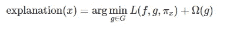
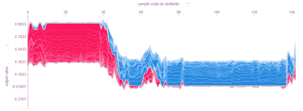

# 机器学习模型的可解释性

> 原文：<https://medium.com/analytics-vidhya/interpretability-of-machine-learning-models-9787cf8a3789?source=collection_archive---------12----------------------->


安杰洛·摩尔勒在 [Unsplash](https://unsplash.com?utm_source=medium&utm_medium=referral) 上拍摄的照片

在机器学习决策过程中，人们常说越简单的模型越容易解释和理解。但是，我们知道在大多数情况下，较简单的模型表现不佳，为了实现更好的性能和准确性，有必要依赖复杂的模型，在向业务用户或决策者解释时，这些模型又被视为黑盒。所以，总的来说，简单模型和复杂模型之间有一个权衡。

但是最近在机器学习模型的可解释性方面的突破(**莱姆**和 **SHAP** )提供了一个有用的指导，可以有效地用来解释模型的行为。这两个概念背后的基本原理简单明了。 **LIME** 取局部特征的重要性， **SHAP** 处理集体或个人特征对目标变量的贡献。

所以，如果我们能够清晰地解释这个模型，那么可解释性可能是一项伟大的技术

*   向业务用户解释模型。
*   帮助数据科学家从业务角度理解特性的重要性。
*   培养对已开发模型的信心和信任。
*   以帮助模型的调试和验证。

在这篇博客中，我将介绍流行的技术和它们的实现来解释模型。

# **SHAP(沙普利加法解释)**

SHAP 是由 Scott Lundberg 和 Su-In Lee 在 2017 年提出的，原始论文可以在这里找到[](http://papers.nips.cc/paper/7062-a-unified-approach-to-interpreting-model-predictions.pdf) **shap 算法是一种模型不可知的算法，所提出的技术大大降低了附加特征归属方法的复杂性，从***【o(tld^m】***到 ***O(TLD )*** 其中*和**开源的 SHAP 库几乎可以与所有流行的集合模型很好地工作，比如 XGBoost、LightGBM、CatBoost 和 sklearn 树模型。*****

***SHAP 算法受 [**合作博弈论**](https://en.wikipedia.org/wiki/Cooperative_game_theory) 的启发，用 [**Shapley 值**](https://en.wikipedia.org/wiki/Shapley_value) 来解释特征对权重(系数)的贡献。***

## *****SHAP 在机器学习中的用法*****

***对于简单模型，很容易直观地解释特征的重要性和影响，例如，如何为预测计算关联权重，为什么为一个类形成特定的决策树，等等。然而，对于复杂的模型来说，这不是很直接，这里出现了 **Shapely Value** 的概念来解释个人或一组特征如何影响预测的目标。***

***一般来说，Shapley 值是作为玩家联盟中每个玩家的边际贡献的平均值来计算的。对于**“支付”，需要考虑玩家之间的公平分配。*****

***要了解数学和细节，请看看 [**原文**](https://www.rand.org/content/dam/rand/pubs/research_memoranda/2008/RM670.pdf)***

***对合作博弈论术语及其公理的基本理解是理解 Shapely 值计算的基础。

***合作博弈理论:*** 合作博弈(或联盟博弈)是一种博弈，由于合作行为的外部强制的可能性，参与者群体之间存在竞争。***

******玩家:*** 参与游戏的代理(玩家)。***

******联盟:*** 玩家之间为游戏出力的临时联盟。***

******公平分配:*** 公平贡献如何在玩家之间分配？***

## *****公理*****

******i)效率:*** 所有代理的 Shapley 值之和等于大联盟的值，使得所有的收益在代理之间分配。***

******

***其中 N =代理总数，φ(v)=shapley 值，v(N)=所有参与者的大联盟。***

******ii)对称性:*** 所有玩家都有公平的机会加入游戏。这个属性也被称为*平等对待平等者。****

***如果 I 和 j 是两个等价的参与者***

******

***对于 N 中既不包含 I 也不包含 j 的每个子集 S，则***

******

******iii)线性:*** 如果将增益函数 v 和 w 描述的两个联盟博弈组合起来，那么分配的增益应该对应于从 v 得到的增益和从 w 得到的增益***

******

***对于 n 中的每个 I。***

******iv)空玩家或哑玩家:*** 一个游戏 v 中一个空玩家 ***i*** 的 Shapley 值为零。参与人 I 在 v 中为空，如果***

******

***对于所有不包含的联盟，也就是说，如果玩家对联盟没有贡献，那么贡献将为零。***

***在现实生活中，一个 ***游戏*** 可以被翻译成任何动作，例如共享出租车/食物、玩游戏、为协作动作而工作，或者通过使用可用特征来预测任何分类或回归模型的结果。***

***为了更好地理解 Shapley 值的计算，我们来看一个简单的例子。***

***三个朋友 F1、F2 和 F3 将共享出租车到达他们的家。如果他们单独去，那么每个人需要分别支付 10 美元、15 美元和 30 美元。如果他们随团旅行，最高支付额是 30 美元。但问题是，除了一般平均工资贡献[(10+15+30)/3]，我们如何计算联盟的公平个人工资？***

***著名的沙普利救援值来了。***

***根据给定的细节，我们知道如果每个朋友将单独前往他们的家，那么他们将支付

*F1->**10
F2->**15
F3->**30****

***然而，如果他们要一起旅行，那么下面的组合就会形成***

******

***现在，让我们创建一个可能的排列，如果他们在一个给定的联盟中旅行。***

******

***我们是如何计算置换集的？***

***{F1，F2，F3} = > 如果 F1 & F2 将组成联盟，那么他们将一起支付 15 美元。由于 F1 先下来，他将支付 10 美元，剩余的 5 美元将由 F2 支付，15 美元将由 F3 支付(因为 15 美元已经支付)***

*****{F1，F3，F2} = >** 这一次，F1 和 F3 将组成联盟。因此，F1 将支付 10 美元，剩余金额将由 F3 支付，即 30 美元–10 美元= 20 美元。当 F3 和 F2 之间形成联盟时，F2 将不必支付任何费用。***

***以同样的方式，计算其他排列集合和个体贡献。***

***计算出的平均值是 T2 沙普利值，如果一起旅行，个人会为所有的朋友付费。如果我们将排列集的所有朋友和联盟支付的平均值相加，那么它总是以 30 结束，这表明支付是公平分布的**。**

同样的概念也适用于我们在预测目标变量时对特征的重要性及其权重进行可视化。我们可以把这些计算出的 Shapley 值看作是它们对某一类或某一值的预测的贡献。

在机器学习中，我们可以这样联系上面的理解。***

> ****游戏- >型号****
> 
> ****玩家- >特性****
> 
> ****玩家子集- >特征子集****
> 
> ****特征的 Shapley 值- >特征的贡献。****

# *****LIME(局部可解释的模型不可知解释)*****

***LIME 也是由马尔科·图利奥、Sameer Singh 和 Carlos Guestrin 提出的一种流行算法。我为什么要相信你***

***该算法使用局部解释来描述特征的重要性。可以通过用具有很少非零系数的简单线性模型来近似底层模型来产生解释。***

***石灰的数学表示是***

******

***因此，模型的解释通过保持模型复杂度低来测量解释与原始模型(f)的预测有多接近。***

****其中 x =实例，L =位置感知损失函数，f=要解释的模型(原始模型)，g =线性模型，G=解释模型族，Pi -定义位置的实例 x 的邻近性度量，Omega(g) =模型复杂度。****

***为了对酸橙有一个大致的了解，让我们来理解每个单词的意思。***

> *****局部:**局部可靠的解释。这是 LIME 算法背后的关键直觉。***
> 
> *****可解释:**可以处理和理解的信息。如果我们正在处理**文本**，那么它会显示**存在/不存在单词，**对于图像，它是**存在/不存在超像素**，对于表格数据，它是**特征的加权组合**(系数)。***
> 
> *****模型不可知:**适用于任何类型的预测模型，也就是说，在提供解释时，它不应对模型做出任何假设。***
> 
> *****说明:**模型输入输出的关系和理解。***

## *****执行石灰的步骤*****

***选择一个我们想要解释的观察。

**ii)** 在观测周围，对每个数据点进行扰动，生成邻域。不考虑模型的复杂性，在局部水平上，可以线性地划分区域(局部线性回归)。在扰动中，在设置为 1 的所有特征(对于给定的数据点)中，随机采样特征的子集，并将它们的值设置为 0。***

***参见原始论文中的下图***

******

***在上图中，我们可以看到这些决策边界非常复杂，任何简单的模型都很难将其全局分离。然而，如果我们缩小范围并达到单个数据点，那么在局部上很容易用线性模型来分离决策边界。***

*****iii)** 计算新点与观测值之间的距离(相似性的度量)。

**iv)** 找到与我们的目标类关系最强的 m 个特征的子集。

**v)** 在由相似性加权的 **n-** 维的数据集上拟合线性模型或任何可解释模型。

**vi)** 线性模型的权重被用来解释决策，我们知道简单模型是可以解释的。***

## *****弊端*****

***它依赖于新点的随机抽样，所以可能不稳定。***

*****ii)** 拟合线性模型可能不准确。然而，LIME 提供了 R 值，并且同样可以被检查以查看局部线性回归是否是良好的拟合。***

*****iii)** 由于我们需要为每次观察生成一个样本数据集进行解释，这使得单次观察相对较慢，尤其是对于图像。***

# *****排列重要性或平均降低准确度(MDA)*****

***这也是用于模型可解释性的技术之一。它测量某项功能不可用时**分数如何降低**。这种方法的算法很简单——*去除特征，重新训练模型。检查 R、F1 值和模型的准确性。所以，这些值的任何变化都可以说明特性的重要性。****

## *****弊端*****

*   ***计算成本很高，因为它需要重新训练模型。但是，可以通过使用与原始特征值相同的分布为测试数据集中移除的列生成噪声数据来避免这种情况。这样做将有助于避免重新训练模型，但它需要仔细填充数据。***

# ***部分相关图***

***部分相关图是一种有用的技术，用所有其他独立变量的平均效应来表示**独立变量(特征)对因变量(目标)的边际效应**。一旦模型被训练，然后通过绘制 PDP，我们可以可视化图形并关联特征与目标的交互。***

## ***缺点***

*   ***PDP 假设为其创建图的特征与其他特征不相关。***
*   ***有限的可视化技术(一个 PDP 图不能显示 3 个以上的特征。情节变得混乱和难以阅读)***

# ***可用的 Python 包***

***下面是几个流行的 python 包，可以用来解释这些特性的重要性。***

*****shap，LIME，Skater，azureml-interpret，azureml-interpret-contrib，ELI5(像我 5 一样解释)→** 提供 MDA 的实现**。*****

*****sklearn.ensemble** 模块提供**partial _ dependency**函数。***

# *****让我们看看代码中的可解释性*****

***以下代码片段的想法并不是建立一个好的模型，而是展示如何使用现有的最先进的技术以更好的方式理解预测。***

***完整的笔记本可以在 [**这里找到**](https://github.com/saurabh2mishra/model-interpretation)***

*****必需库** sklearn，numpy，matplotlib，shap，azureml，eli5***

```
 *from sklearn.model_selection import train_test_split
 from sklearn.ensemble import RandomForestClassifier
 from sklearn.metrics import classification_report
 import numpy as np
 import matplotlib.pyplot as plt
 import shap
 from interpret.ext.blackbox import TabularExplainer
 from interpret_community.widget import ExplanationDashboard
 shap.initjs()*
```

***我正在加载乳腺癌数据集，以展示如何在随机森林这样的复杂模型上解释模型的可解释性。***

```
*cancer_dataset = shap.datasets.sklearn.datasets.load_breast_cancer()
feature_names = cancer_dataset.feature_names
class_names = ["Malignant(0)", "Benign(1)"]
X_train, X_test, Y_train, Y_test = train_test_split(cancer_dataset.data, cancer_dataset.target, test_size=0.25, random_state=23)
rfc = RandomForestClassifier()
rfc.fit(X_train, Y_train)*
```

***在使用可解释库之前，让我们看看哪些特性对 forest tree 很重要***

```
*def plot_imp_features(model, top_n):
     try:
         tree_feature_importances = rfc.feature_importances_
     except Exception as e:
         raise TypeError(f"Model must be a type of DecisionTree to use feature_importances_ Excpetion is {e}")
     sorted_idx = tree_feature_importances.argsort()
     select_n = sorted_idx[:top_n]
     y_ticks = np.arange(0, len(select_n))
     fig, ax = plt.subplots()

     ax.barh(y_ticks, tree_feature_importances[select_n])
     ax.set_yticklabels(feature_names[select_n])
     ax.set_yticks(y_ticks)
     ax.set_title("Random Forest Feature Importances (MDI)")
     fig.tight_layout()
     plt.show() plot_imp_features(rfc, 15)*
```

******

```
*print(classification_report(Y_test, rfc.predict(X_test),  target_names=class_names))*
```

******

***现在，使用 **shap** lib 来看看我们如何解释这些特性对目标类的影响***

```
*explainer = shap.TreeExplainer(rfc, X_train, link="logit")
shap_values = explainer.shap_values(X_test, check_additivity=False)* 
```

***在下面的 force_plot 中，两个颜色代码用于绘制形状值和特征之间的关系。***

***要理解这个图的意思，首先我们需要理解图中使用的颜色代码。***

******

***有了这样的理解，让我们看看下面的特征是如何解释模型的结果的。***

```
*#first 10 classes for X_test dataset
Y_test[:10] # (array([1, 1, 0, 1, 0, 0, 0, 1, 1, 0]),)expected_index = 1 # indexes are 1,0
test_data_index = 1 # test_data_index can range from 0 to #len(test_data_index)
shap.force_plot(explainer.expected_value[expected_index], 
                 shap_values[expected_index][test_data_index,:], 
                 X_test[test_data_index,:],
                 feature_names=feature_names)*
```

******

*****力图**显示了各种特征及其值对模型输出的累积影响。上图中，预测值为 0.60；平均凹点将预测值从 0.5167 推高到 0.60***

***如果我们遵循蓝色代码，那么我们可以看到其他特征正在最小化影响，并且将所有预测推向 0，即恶性和最差周界导致更大的裕度。***

***现在，让我们分析第二个数据点，在这里我们可以看到，最差周长、平均凹点、平均面积、最差半径等特征将预测推向 0，即恶性***

```
*expected_index, test_data_index = 1, 2 #test_data_index can range     #from 0 to len(test_data_index)
shap.force_plot(explainer.expected_value[expected_index], 
                 shap_values[expected_index][test_data_index, :], 
                 X_test[test_data_index, :],
                 feature_names=feature_names)*
```

******

***为了获得整个数据集的解释，我们可以选择上面显示的许多解释，将它们旋转 90 度，然后水平堆叠。***

```
*i=0 # class label. Can be change to 1 to see the behavior
shap.force_plot(explainer.expected_value[i], shap_values[i], features=X_test, feature_names=feature_names)*
```

******

***shap 还提供了另一种类型的绘图，名为**汇总绘图。**在该图中，中间线表示 shap 值=0，与中线的偏差(+ve 到-ve 值)显示特定特征如何影响目标值的预测。***

```
*i=1
shap.summary_plot(shap_values[i], features=X_test, 
                   feature_names=feature_names, 
                   class_names=class_names)*
```

******

****概要图通过保持 X 轴上的特征和 Y 轴上的 SHAP 值来绘制图表****

*****理解单个特征:**该函数自动包含另一个与所选变量交互最多的变量。下图描绘了平均纹理和目标变量**之间的负趋势，并且最差周长**与平均纹理**频繁交互。*****

******

***这段代码可用于显示每个类和要素的 SHAP 值***

```
*for feature_name in range(len(feature_names)):
     for target_label in range(len(cancer_dataset.target_names)):
         shap.dependence_plot(feature_name, shap_values[target_label], features=X_test, feature_names=feature_names)*
```

*****SHAP 库**还包含其他解释器，如 **PermutationExplainer、GradientExplainer、KernelExplainer、LinearExplainer、DeepExplainer 等。**在 API 中我们可以看到关于这些解释器的详细信息***

```
*dir(shap)['BruteForceExplainer', 'DeepExplainer', 'GradientExplainer', 'KernelExplainer', 'LinearExplainer', 'PartitionExplainer', 'PermutationExplainer', 'SamplingExplainer', 'Tree', 'TreeExplainer', '__builtins__', '__cached__', '__doc__', '__file__', '__loader__', '__name__', '__package__', '__path__', '__spec__', '__version__', '_cext', 'approximate_interactions', 'bar_plot', 'common', 'datasets', 'decision_plot', 'dependence_plot', 'embedding_plot', 'explainers', 'force_plot', 'have_matplotlib', 'hclust_ordering', 'image_plot', 'initjs', 'kmeans', 'matplotlib', 'monitoring_plot', 'multioutput_decision_plot', 'other', 'partial_dependence_plot', 'plots', 'sample', 'save_html', 'summary_plot', 'unsupported', 'warnings', 'waterfall_plot']*
```

## *****LIME(局部可解释的模型不可知解释)*****

***石灰使用起来也很简单。首先，我们需要为数据集创建一个特定的解释器，然后我们可以调用解释器实例的 **explain_instance** 方法来解释原始模型。***

```
*from lime.lime_tabular import LimeTabularExplainer
np.random.seed(11)tab_explainer=LimeTabularExplainer(X_train,feature_names=feature_nam   es,class_names=class_names, discretize_continuous=True,random_state=11)def explain_model(model, test_data, index=0, num_features=1, top_labels=1): 
    if test_data.size ==0:
        raise ValueError("Empty dataset is passed")
    expl = tab_explainer.explain_instance(test_data[index], 
                                          model.predict_proba, 
                                          num_features=num_features, 
                                          top_labels=top_labels)

    expl.show_in_notebook(show_table=True,show_all=False) explain_model(rfc, X_test, index=0, num_features=10) # Y_test[1] = 1(Benign)*
```

******

***在上图中，我们可以看到模型预测了良性类，突出显示的功能产生了更大的影响。在右侧，我们可以看到最差区域的值为 517.88，低于其实际值 564.20。我们可以从数据集中检查上述值。***

```
*cancer_dataset.feature_names[-7] # worst area
X_test[0][-7]Out[196]:
564.2cancer_dataset.feature_names[-8] # worst perimeter
X_test[0][-8]Out[197]:
86.6*
```

## ***部分相关图***

***scikit-learn 提供了 PDP 的内置实现。partial _ dependence 函数接受 BaseGradientBoosting 拟合模型作为参数来提供 PDP。因此，出于这个原因，我在训练一个新的分类器。***

```
*from sklearn.ensemble import GradientBoostingClassifier
from sklearn.ensemble import partial_dependence
gbc = GradientBoostingClassifier()
gbc.fit(X_train, Y_train)# [20] is the index of columns of train data for PDP
partial_dependence.plot_partial_dependence(gbc, X_train, [20], feature_names=feature_names)*
```

******

***该图显示了最差半径如何与目标相互作用(恶性和良性)。一旦最差半径的大小越过 16 的标记，预测就从良性急剧下降到恶性。***

## ***AzureML***

***Azure 还在其 azuleml SDK 下发布了一个开源库。该库可用于遵循 scikit-learn 方法惯例的所有类型的机器学习模型，即 **fit()和 transform()*****

***如果我们正在使用任何自定义算法，那么我们可以简单地将我们的主模型包装在函数 **fit()** 中，并将其传递给 azureml 来解释这些特性。***

***下面的可解释性图表有助于理解不同的解释者***

******

***[https://docs . Microsoft . com/en-us/azure/machine-learning/how-to-machine-learning-interprebility](https://docs.microsoft.com/en-us/azure/machine-learning/how-to-machine-learning-interpretability)***

***现在，如果我们将同一个随机森林分类器作为一个参数传递给 TabularExplainer，那么我们就可以得到模型的解释。***

```
*tab_explainer = TabularExplainer(rfc, X_train, features=feature_names, classes=[0, 1])global_explanation = tab_explainer.explain_global(X_test) # How globally all features set interpretate the outcomeglobal_feature_rank_values = dict(zip(global_explanation.get_ranked_global_names(),
                                       global_explanation.get_ranked_global_values()))
 global_feature_rank_valuesOut[23]:{'worst perimeter': 0.07595532987463141,
  'worst concave points': 0.06780037332226518,
  'worst radius': 0.06178580090500718,
  'worst area': 0.061688813644569004,
  'worst concavity': 0.051432037342211356,
  'mean area': 0.02544095929461229,
  'mean concavity': 0.022822935606762865,
  'mean perimeter': 0.02230714237151857,
  'mean concave points': 0.014994114385124891,
  'mean texture': 0.01426150261834639,
  'mean radius': 0.012523284263610842,
  'worst texture': 0.012036364340557092,
  'worst compactness': 0.011888211618859144,
  'worst smoothness': 0.007687756633585173,
  'mean compactness': 0.007227320108198555,
  'perimeter error': 0.006870732294207836,
  'area error': 0.006006945019138089,
  'worst symmetry': 0.0059455597100683925,
  'radius error': 0.00498892192057288,
  'compactness error': 0.00440812326792559,
  'mean fractal dimension': 0.004065060877333495,
  'concavity error': 0.003417519253002984,
  'texture error': 0.003318578728239531,
  'worst fractal dimension': 0.0029870047227208156,
  'symmetry error': 0.00259608337064409,
  'mean smoothness': 0.0018153337349097675,
  'concave points error': 0.0015773339816971782,
  'fractal dimension error': 0.001495528819412792,
  'smoothness error': 0.0007389462921350583,
  'mean symmetry': 0.0005036257960195172}*
```

*****Azureml** 还提供了**解释仪表板**，这是一个强大的仪表板服务。它为模型解释提供了 4 个基本图。***

1.  *****数据浏览:**在此选项卡中，我们可以选择 X 轴和 Y 轴的值来查看各自的目标分布。在右上角，我们可以看到目标类***
2.  *****全局重要性:**全局重要性变量，我们可以选择前 K 个特征***
3.  *****解释探究:**该选项卡解释为什么某个特定特征对预测很重要。***
4.  *****汇总重要性:**汇总所有特征及其与目标变量的关系。***

```
*ExplanationDashboard(global_explanation, rfc , datasetX=X_test)*
```

******

## ***结论***

***总之，我们可以说，采用可解释性作为反馈循环可以增强对模型的信任。简单且符合逻辑的解释极大地增加了涉众的商业价值，并为模型提供了信心，使其能够如预期的那样明智地执行。因此，随着模型的各种度量(例如，准确性、交叉验证)，可解释性也应该在模型开发生命周期中获得自己的位置。***

## *****参考文献*****

***[https://christophm.github.io/interpretable-ml-book/](https://christophm.github.io/interpretable-ml-book/)***

***[https://arxiv.org/abs/1705.07874](https://arxiv.org/abs/1705.07874)***

***https://arxiv.org/abs/1602.04938——我为什么要相信你。***

***[https://docs . Microsoft . com/en-us/azure/machine-learning/how-to-machine-learning-interpreability？wt . MC _ id = azure media-blog-lazzeri](https://docs.microsoft.com/en-us/azure/machine-learning/how-to-machine-learning-interpretability?WT.mc_id=azuremedium-blog-lazzeri)***

***[https://docs . Microsoft . com/en-us/azure/machine-learning/how-to-machine-learning-interprebility](https://docs.microsoft.com/en-us/azure/machine-learning/how-to-machine-learning-interpretability)***

***[https://books.google.nl/books?id=wlexDwAAQBAJ&pg = SA6-PA21&lpg = SA6-PA21&dq = azure ml+Tabular+explainer&source = bl&ots = 7 _ stx daw0 l&SIG = acfu 3 u 12 ipmji 0 imltjiitwy3 VO 1 vdp eg&HL = en&sa = X&ved = 2 ahukewidu 56 GTM 3 pahvlaihherqca 0 q 6a](https://books.google.nl/books?id=wlexDwAAQBAJ&pg=SA6-PA21&lpg=SA6-PA21&dq=azureml+Tabular+explainer&source=bl&ots=7_Stxdaw0l&sig=ACfU3U12IPmJI0ImltJIitWY3VO1vdPGeg&hl=en&sa=X&ved=2ahUKEwiDu56gtM3pAhVLwAIHHerQCa0Q6AEwBXoECAoQAQ#v=onepage&q=azureml%20Tabular%20explainerTreeScoringExplainer&f=false)***

***【https://www.youtube.com/watch?v=C80SQe16Rao】T2&t = 2334s***

***[https://scikit-learn . org/stable/modules/partial _ dependency . html](https://scikit-learn.org/stable/modules/partial_dependence.html)***

***[https://eli5.readthedocs.io/en/latest/#](https://eli5.readthedocs.io/en/latest/blackbox/permutation_importance.html)***

***[https://docs . Microsoft . com/en-us/azure/machine-learning/how-to-machine-learning-interprebility](https://docs.microsoft.com/en-us/azure/machine-learning/how-to-machine-learning-interpretability)***