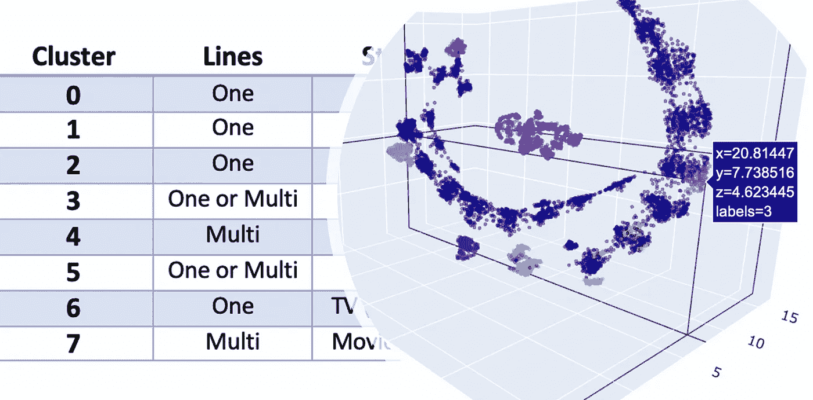

# 可解释的客户细分

> 原文：<https://medium.com/analytics-vidhya/interpretable-customer-segmentation-4ac71a329ea0?source=collection_archive---------1----------------------->

## 使用 Python 中的无监督 ML 推动商业价值的简单指南

使用本教程，将 40 维数据的三维合成转化为可解释的客户细分是轻而易举的事情。

有针对性的营销要求我们[确定客户群体或细分群体](https://www.shopify.com/encyclopedia/customer-segmentation)，并定义将他们聚集在一起的特征。例如，在开发一个新品牌时，你想知道新产品是否有可能从其他渠道获得客户…