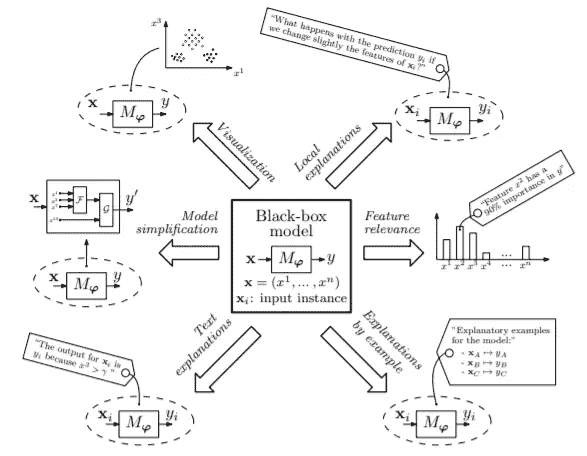

# 可解释的机器学习 VS 机器学习的可解释性

> 原文：<https://medium.com/analytics-vidhya/interpretable-machine-learning-vs-machine-learning-interpre-tability-da038e10af6f?source=collection_archive---------12----------------------->

## 透明机器学习模型与黑盒机器学习模型的事后解释技术

可解释的机器学习和机器学习可解释性的二重性可以与透明模型和事后可解释性相关联。在阐述时，透明模型处理设计透明机器学习模型的问题，而事后可解释性处理通过外部可解释的 AI 技术解释黑盒机器学习模型的问题。因此，透明模型可以通过设计来解释，而黑盒模型需要通过事后可解释性来解释。

首先，必须了解可解释学习模型的两个极端。一方面，我们有*不透明的学习模型*，用户不知道学习系统内部的功能。相反，我们有*可理解的学习模型*，其中除了常规学习模型的输出之外，学习模型还在神经网络的情况下提供不同神经元之间的规则和映射，以便用户可以容易地理解学习模型的内部工作。*可解释的学习模型*位于上述两个边缘的中间，用户可以在这里分析学习模型，以了解学习模型的底层映射。

深度伪造检测

I **可解释的机器学习**模型可以有不同级别的透明度。下面解释由可解释的机器学习模型实现的三个主要级别的透明度。

*   ***算法透明*** 赋予用户理解内部过程的能力，通过该过程，学习模型在给定特定输入的情况下生成其输出。如果学习模型可以完全通过数学模型和分析来研究，那么可以说学习模型已经实现了*算法透明性*。
*   ***可分解性*** 在透明度方面比*算法透明度更高。*可分解性赋予学习模型向用户解释其每个部分(即输入、参数和映射)的能力。不是每个算法透明的学习模型都是可分解的。对于可分解的学习模型，除了算法透明性的限制，即能够通过数学模型和分析来探索，它还应该具有其所有变量、参数和函数在没有任何外部帮助的情况下对用户是可理解的潜力。
*   ***可模拟性*** 处理学习模型被其用户模拟的能力。*可模拟性*是一个学习模型可以实现的最高级别的透明性。因此，不是所有可分解的学习模型都是可模拟的。对于一个拥有*模拟能力的可分解学习模型来说，*它应该拥有在没有任何额外帮助的情况下以一种独立的方式作为一个整体被思考或推理的能力。

当学习模型在设计上不可解释，因此用户必须采用外部可解释技术时，机器学习可解释性是有用的。用于机器学习模型的可解释性的可解释性技术是基于 1)用户的意图，即用户希望如何解释学习模型(通过文本或可视化)，2)要使用的程序，即注意力分析，以及 3)学习模型接受的数据类型来决定的。事后可解释性技术主要分为以下几种。

概念图显示了 ML 模型可用的不同事后解释方法。**来源:[1]**

*   ***视觉解释*** *是*向对机器学习缺乏专业知识的用户解释机器学习模型功能的最有效方法。大多数事后可解释性技术都涉及降维，以便机器学习模型变量的复杂映射可以在 2D 或 3D 图上可视化。
*   ***局部解释*** 事后可解释性技术通过划分解决方案空间，然后解释与整个机器学习模型相关的较简单的解决方案子空间，来处理解释复杂的机器学习模型。因此*局部解释*通过分解解空间来工作，然后解释机器学习模型相对于分解的解子空间的功能。如果需要，这些单独的解释可以重新统一，以实现全面的机器学习模型的可解释性。
*   ***通过简化的解释*** 过程试图创建待分析的机器学习模型的新的简化版本，使得新模型类似于先前模型的功能。此外，新模型应该不太复杂，同时具有相同的性能分数。如果新的简化机器学习模型满足上述所有条件，则由于其复杂性较低，解释新模型变得容易。
*   ***文本解释*** 通过学习*描述模型内部工作的文本解释*和*符号*来解决解释机器学习模型的结果和输出的问题。生成*符号*背后的思想是学习从模型到符号的语义映射，以理解机器学习算法的推理。
*   ***举例说明*** 方法包括抽取特定类别的代表性候选示例，目的是理解机器学习模型中变量的映射以及算法的基本原理。这种方法类似于人类在试图理解复杂过程时所采取的过程。
*   ***特征相关性解释*** 为机器学习模型的变量分配适当的重要性或相关性分数。基于特定变量或参数如何影响机器学习模型的输出来分配分数。

# 参考:

可解释的人工智能(XAI):概念、分类学、面向负责任的人工智能的机遇和挑战信息融合 58(2020):82–115。