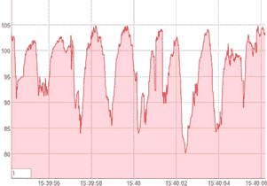
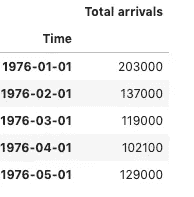
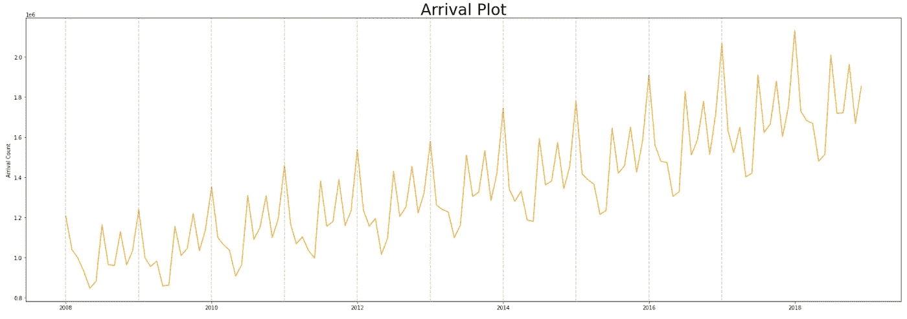
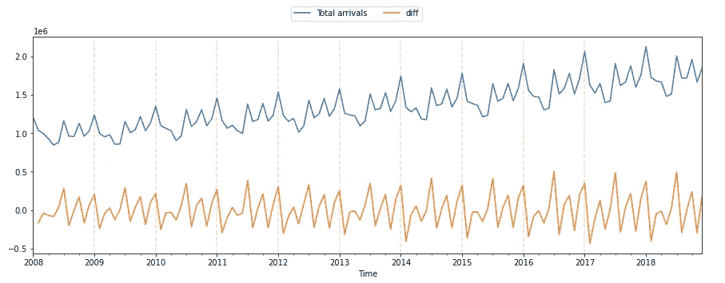
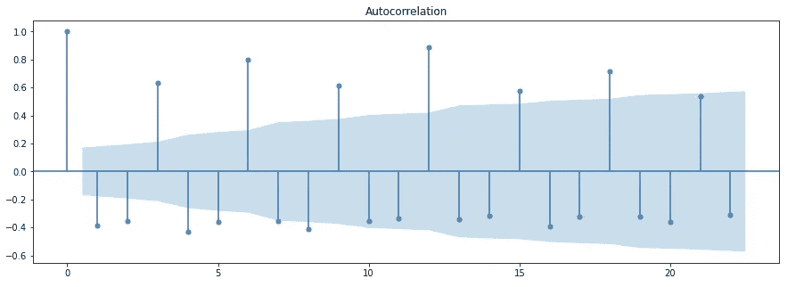
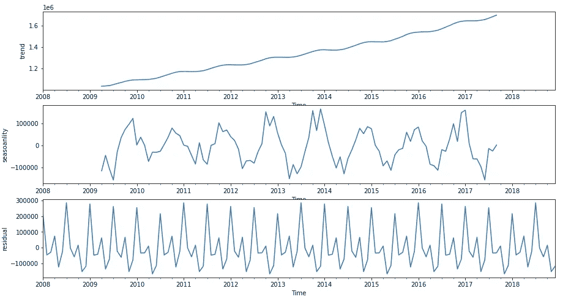
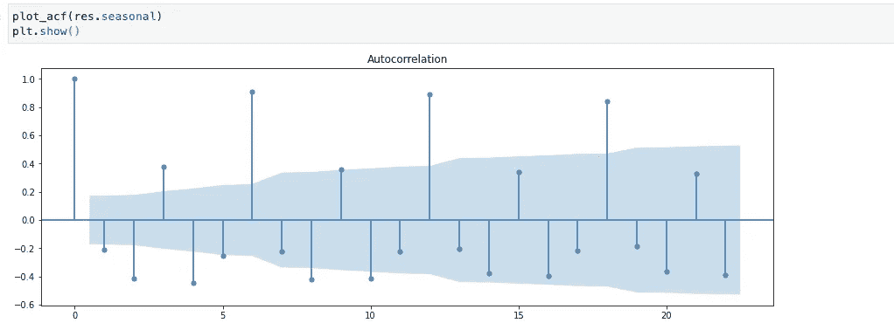

# 解读 ACF 或自相关图

> 原文：<https://medium.com/analytics-vidhya/interpreting-acf-or-auto-correlation-plot-d12e9051cd14?source=collection_archive---------0----------------------->

*时间序列与其自身的滞后版本线性相关。*



[图片由](https://www.aridhia.com/blog/creating-animated-time-series-charts-with-dygraphs-and-htmlwidgets/)提供

> 什么是 ACF 情节？

**时间序列**是一段时间内对相同变量的一系列测量。通常，测量在均匀间隔的时间进行，例如，每月或每年。时间序列中两个值之间的相关系数称为**自相关函数** ( **ACF** )。换句话说，

*>自相关表示给定时间序列与其自身在连续时间间隔内的滞后版本之间的相似程度。*

*>自相关测量变量的当前值与其过去值之间的关系。*

*>自相关+1 代表完全正相关，自相关-1 代表完全负相关。*

> 为什么有用？

1.  帮助我们发现数据中隐藏的模式，并帮助我们选择正确的预测方法。
2.  帮助识别时间序列数据中的季节性。
3.  分析自相关函数(ACF)和偏自相关函数(PACF)对于选择合适的 ARIMA 模型进行时间序列预测是必要的。

> ACF 有什么假设吗？

弱平稳—意味着均值、方差没有系统性变化，也没有系统性波动。

因此，在执行 ACF 时，建议消除数据中存在的任何趋势，并确保数据是稳定的。

> 用真实数据集试试？

```
data = pd.read_csv(**'data.csv'**,
                   engine=**'python'**,parse_dates=[0], 
                   index_col = **'Time'**, 
                  date_parser = parser)

st_date = pd.to_datetime(**"2008-01-01"**)
data = data[st_date:]
```



数据的曲线图如下所示:



从 2008 年到 2018 年

现在，在执行 ACF 之前，让我们移除趋势，看看它是什么样子的:

```
*#acf -> remove trend* data[**"diff"**] = data.diff()

ax = data.plot()
ax.legend(ncol=5, 
          loc=**'upper center'**,
          bbox_to_anchor=(0.5, 1.0),
          bbox_transform=plt.gcf().transFigure)
**for** yr **in** range(2008, 2018):
    ax.axvline(pd.to_datetime(str(yr)+**"-01-01"**), color =**"red"**, linestyle = **"--"**, alpha = 0.2)
```



使用 pandas 的 diff()方法移除趋势，该方法查找上个月和当前月值之间的差异

现在让我们应用 ACF:

```
**from** statsmodels.graphics.tsaplots **import** plot_acf
data[**"diff"**].iloc[0] = 0
plot_acf(data["diff"])
plt.show()
```



x 轴>滞后月数，y 轴>相关系数

> 你能看到现在的季节性吗？

注意滞后 3，6，9，12 时的系数有多高。就月份而言，如果我不得不说，三月，六月，九月，十二月的相关性很高，而一月，二月和四月的相关性很低，但这也会随着时间的推移而消失。我们将重点关注蓝色区域以外的点，因为它们具有很强的统计学意义。

重要提示:**确保你的数据没有 NA 值，否则 ACF 会失败。**

> 我们能不能分开看趋势和季节性来深入研究数据？

是的，我们来分解数据。为此，我将使用一个统计模型 API，但是也可以使用 NumPy 和 Pandas 来分解时间序列的三个部分——趋势、季节性和剩余。

```
**from** statsmodels.tsa.seasonal **import** seasonal_decompose

res = seasonal_decompose(data, model = **"additive"**,period = 30)

fig, (ax1,ax2,ax3) = plt.subplots(3,1, figsize=(15,8))
res.trend.plot(ax=ax1,ylabel = **"trend"**)
res.resid.plot(ax=ax2,ylabel = **"seasoanlity"**)
res.seasonal.plot(ax=ax3,ylabel = **"residual"**)
plt.show()
```



请注意，我选择了加法而不是乘法，因为幅度不会随时间呈指数增长。

现在，如果我对 API 生成的 res.seasonal 组件运行相同的 ACF 图，我们将获得与之前相同的系数。



希望这有帮助。时间序列分析可能会令人困惑和费时。因此，有必要明确基本概念。我自己也在学习的过程中。所以，在你离开之前，请留下你的评论或有价值的反馈。:)

*参考文献*:

[](https://dzone.com/articles/autocorrelation-in-time-series-data) [## 时间序列数据中的自相关

### 时间序列是一系列按时间索引的数据点。时间序列数据是有序的这一事实使得它在…

dzone.com](https://dzone.com/articles/autocorrelation-in-time-series-data) 

[https://github . com/bhattbhavesh 91/time-series-decomposition-from scratch/blob/master/time-series-decomposition-from scratch . ipynb](https://github.com/bhattbhavesh91/time-series-decomposition-from-scratch/blob/master/time-series-decomposition-from-scratch.ipynb)

[*https://github . com/ritvikmath/Time-Series-Analysis/blob/master/Time % 20 Series % 20 data . ipynb*](https://github.com/ritvikmath/Time-Series-Analysis/blob/master/Time%20Series%20Data.ipynb)