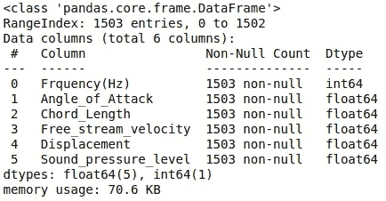
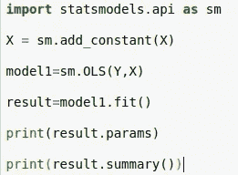
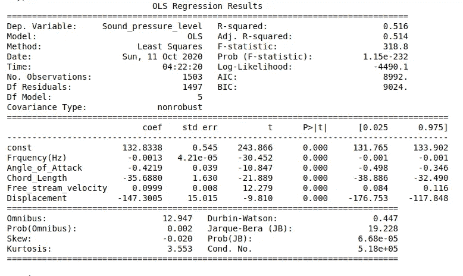

# 解读 OLS 模式摘要！

> 原文：<https://medium.com/analytics-vidhya/interpreting-an-ols-model-summary-78d24da75373?source=collection_archive---------15----------------------->

谷歌图片

线性回归可能是第一个基于 Boston House 数据集或工资预测构建的模型。

虽然模型本身不需要太多的超参数调整，但理解模型结果对许多人来说可能是个小问题。

在这篇文章中，我试图涵盖 OLS 模式总结中的重要概念以及面试问题，这可能会对你有用！

> 我已经在我的 GitHub repo 中链接了数据集和代码，请在本文末尾找到相同的链接。

假设我们有一个数据集，

目标变量为“声音 _ 压力 _ 水平”。

由于这是一个连续变量，我们使用多元线性回归对此建模，并预测任何新数据的水平。

## df.info()

—介绍数据集中存在的要素以及任何缺失的数据值。

现在让我们来看看 OLS 模式。

X —是独立的特征，例如:

> 频率(赫兹)
> 
> 迎角
> 
> 弦长
> 
> 自由流速度
> 
> 排水量

Y —“目标”变量

> 声音压力水平

导入 statsmodel 库，并使用以下代码构建您的第一个模型:

**输出**:

OLS _ 摘要 _ 报告

让我们理解摘要中的各种变量:

## 1.R 平方和调整的 R 平方:

如果校正后的 R 平方值和 R 平方值相差很大，则表明某个要素/变量可能与您的模型不相关。

> **从我们的 OLS 摘要**来看，我们的值是 0.516 和 0.514，因此我们可以说它们之间没有太大的差异。

## 2.F-统计或 f 检验:

它用于评估模型的整体重要性。在多重 LR 中，它比较没有预测值的模型，即创建两个模型，一个有预测值，另一个没有预测值(只有常量变量)。

**零假设**是这两个模型(仅截距模型)相等。

**另一个假设**是‘仅拦截模型’比我们的‘OLS 模型’更糟糕。

我们得到一个 p 值和一个统计值，这有助于我们选择/拒绝零假设。

> **根据我们的 OLS 总结，**p 值非常小(0.00)且 F 统计值很高(318.8)，因此我们拒绝零假设并得出结论:自变量和目标变量之间存在线性关系。

## 3.t 检验:

与 f-test 不同， **t-test 将每个特征与目标变量**进行比较，并判断它们之间是否存在关系。

**零假设**是特征系数将为 0。

**另一个假设**是特征系数不会为 0。

t 检验值越高，拒绝零假设的可能性就越大。

> **根据我们的 OLS 总结**，该值较高，因此我们拒绝零假设(p 值也为< 0.05，因此我们拒绝零假设)。

***这是几个与机器学习一起应用的统计概念，在面试官中相当有名。***

我希望你喜欢这篇文章，一定要支持我的工作，并与你那些试图进入数据科学领域的朋友分享这篇文章。

找到 [GitHub 存储库链接](https://github.com/Lokeshrathi/Interpreting_OLS_Summary_LR)用于数据清理、可视化和模型管线。

关注我的[链接](https://www.linkedin.com/in/lokeshrathi/)，了解更多此类数据科学相关内容。