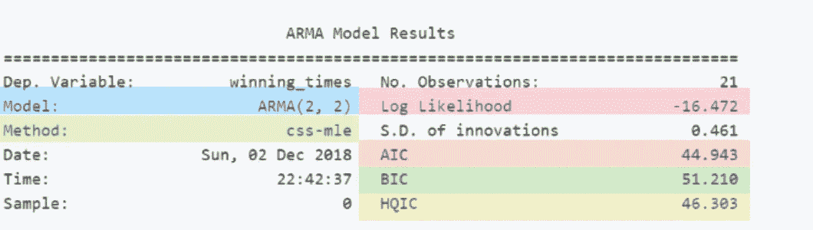
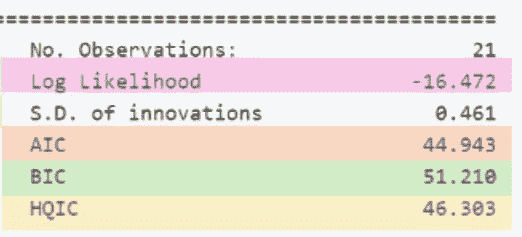
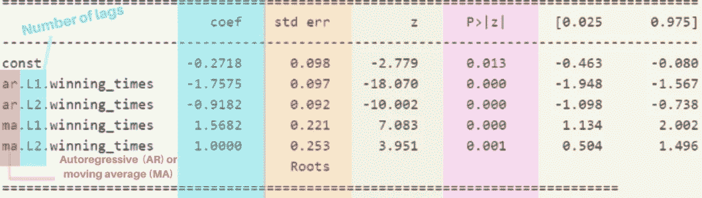
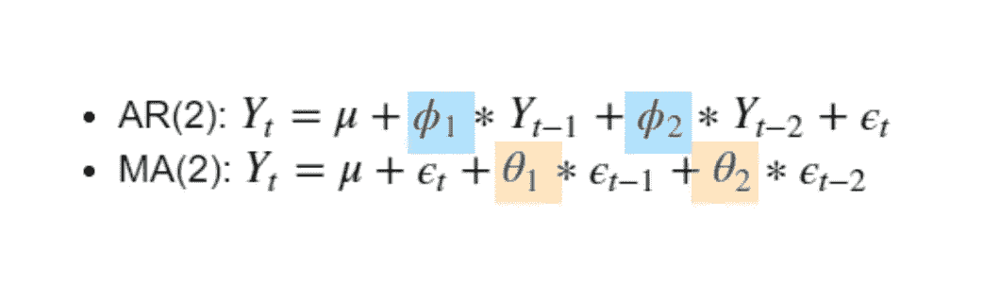

# 解释 ARMA 模型会为绝对初学者带来 stats 模型

> 原文：<https://medium.com/analytics-vidhya/interpreting-arma-model-results-in-statsmodels-for-absolute-beginners-a4d22253ad1c?source=collection_archive---------1----------------------->

当我从事我的第一个系列项目时，我很难解释我的模型的结果。尽管度量标准和系数类似于线性回归中的那些，但不知何故，我对如何解释它们感到困惑。我在网上搜索一个易懂的指南，一行一行地解释结果。我找不到一个好的来源，它不会只关注一个指标。所以，我决定自己编译这个源码！

在这篇博文中，我将介绍 ARMA 时间序列的 Statsmodels 模型结果。我将用一个例子来描述每个结果代表什么。我将跳过显而易见的，如' Dep。变量”或“观察次数”。我们先来看看大致的结果。

**型号**

这是对正在使用的模型的引用。ARMA(2，2)是指自回归(AR)，移动平均(MA)模型。括号中的数字表示您的模型所使用的特定滞后。在这种情况下，我们使用的是 ARMA 模型，它接受“p”(自回归)和“q”(移动平均)的值 2 和 2。以下结果将涉及这一特定组合。如果你想了解更多关于这些价值代表的东西，t [的视频](https://www.youtube.com/watch?v=HhvTlaN06AM)很好地解释了 ARMA 模型背后的基本概念。

**方法**

该字段告诉您哪个计算用于定义参数。有各种方法可用于估计参数，如尤尔沃克程序，矩法或最大似然估计(MLE)。该字段向我们显示了使用哪种方法来计算参数。在我们的例子中，“css-mle”代表“条件平方和”和“最大似然估计”。但这意味着什么呢？

[StatsModels 文档](https://www.statsmodels.org/stable/generated/statsmodels.tsa.arima_model.ARMA.fit.html)页面告诉我们“条件平方和似然性最大化，其值用作通过卡尔曼滤波器计算精确似然性的初始值。”

嗯，如果你像我一样，你可能还会问“但这意味着什么？”

这意味着分布的估计平均值基于正态分布，其峰值位于观察值的最高概率点。最大似然法在算法中的作用是确定模型参数的值，模型的结果很可能接近观察到的(给定的)数据。

卡尔曼滤波器呢？[卡尔曼滤波器](https://www.youtube.com/watch?v=mwn8xhgNpFY)是一种在这种背景下运行的简便算法。它包含一系列随时间推移的观察值(值)以及统计噪声和其他不准确性。在此基础上，它产生了对新变量的估计，这些估计通常比基于单一观察的估计更准确。听起来很不错，对吧？卡尔曼滤波器在阿波罗计划中被广泛使用，它被集成到导航计算机中来计算轨迹估计！

资料来源:nasa.gov

**对数似然**

对数似然值是最大似然估计的简单表示。它是通过记录先前值而创建的。这个值本身是没有意义的，但是如果您将多个模型相互比较，它会很有帮助。一般来说，对数似然性越高越好。但是，它不应该是比较您的模型的唯一指导指标！

**AIC**

AIC 代表赤池的信息标准。这是一个帮助您评估模型强度的指标。它接受你的最大可能性的结果以及你的参数总数。由于向模型中添加更多参数总是会增加最大似然值，因此 AIC 通过惩罚参数数量来平衡这一点，从而搜索参数较少但数据拟合良好的模型。查看 AIC 最低的型号是选择最佳型号的好方法！该值越低，模型的性能越好。

**BIC**

BIC(贝叶斯信息标准)与 AIC 非常相似，但也考虑数据集中的行数。同样，你的 BIC 越低，你的模型运行得越好。与 AIC 相比，BIC 对具有复杂参数的模型引入了更高的惩罚。

BIC 和 AIC 都是用于特征选择的很好的值，因为它们可以帮助你找到最简单的版本，同时得到最可靠的结果。

**HQIC**

HQIC 代表汉南-奎因信息标准，也可用于特征选择。这个不像 BIC 或 AIC 那样经常使用。

现在让我们看看系数表。

**‘coef’**列表示每个特性的重要性。

*   ar。L1 指的是滞后 1，ar 的自回归项。L2 代表相同，但滞后 2。
*   马。和马。L2 指的是滞后 1 和 2 的“移动平均线”术语。所有这些系数都是下面 ARMA 方程的一部分。这个例子是一个二阶模型。你在模型中使用的滞后次数越多，方程就越长。

*   ' **std err** '列是预测值的误差估计值。它会告诉您残差对估计参数的影响有多强(第一列)。
*   **‘z’是**，等于‘coef’除以‘STD err’的值。因此，这是标准化系数。
*   **P > |z|** 列是系数的 P 值。在继续使用模型之前，检查这些 p 值非常重要。如果这些值中的任何一个高于您给定的阈值(通常为 0.05)，您可能使用了不可靠的系数，这可能会导致误导性的结果。在我们的例子中，所有的 p 值都低于 0.05，所以这个模型看起来不错！
*   最后两列代表置信区间。我在上一篇博文中写了关于置信区间[！简而言之，这些值是系数值减去(左栏)和加上(右栏)给定的误差容限。](/@nikolh92/confidence-intervals-in-hypothesis-testing-3dd573287d0e)

更多资源:

*   [来自 Statsmodels 的时间序列案例研究](http://www.statsmodels.org/0.6.1/examples/notebooks/generated/tsa_arma_0.html)
*   [官方文件](https://www.statsmodels.org/dev/generated/statsmodels.tsa.arima_model.ARMAResults.html)