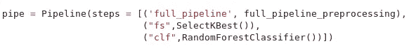
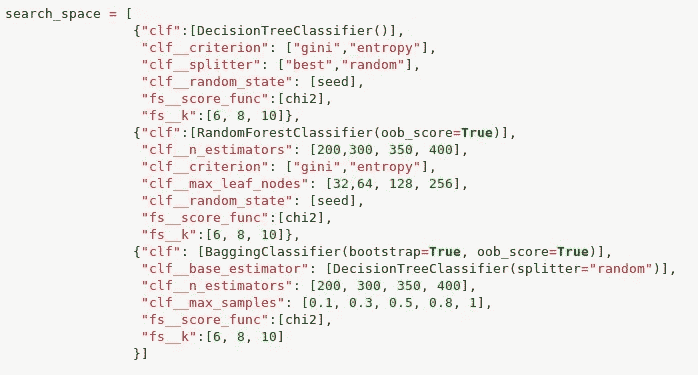
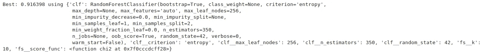
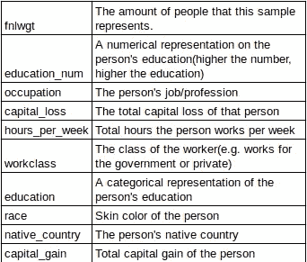
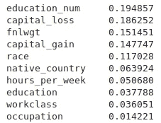
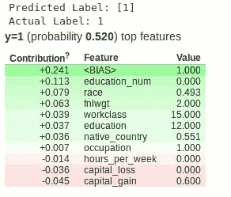
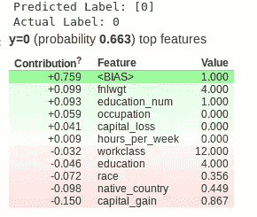
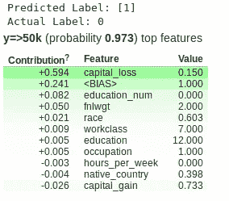
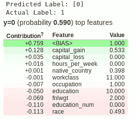
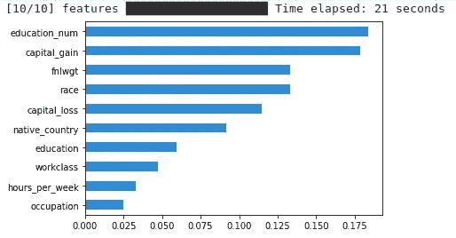

# 解读人口普查收入数据集中的机器学习模型

> 原文：<https://medium.com/analytics-vidhya/interpreting-machine-learning-models-in-census-income-data-set-56c9dc7e0f27?source=collection_archive---------2----------------------->

在 [Unsplash](https://unsplash.com?utm_source=medium&utm_medium=referral) 上由 [Helloquence](https://unsplash.com/@helloquence?utm_source=medium&utm_medium=referral) 拍摄的照片

一个著名的机器学习问题是 1994 年的美国人口普查，其中，基于每个人的各种社会经济特征，我们可以确定某人一年的收入是大于还是小于 50，000 美元。到目前为止，使用一个微调的预测模型，我们可以以越来越少的错误获得很好的结果，但是，现在，理解模型预测特定结果的原因可能与完美预测我们的问题一样重要。这就是所谓的可解释的人工智能，在 [DJ Sarka](https://towardsdatascience.com/explainable-artificial-intelligence-part-3-hands-on-machine-learning-model-interpretation-e8ebe5afc608) r 的一系列帖子中有描述。此外，在这个数据集中，了解为什么有人有预测的原因对于政府制定政策造福人民是极其重要的。

也就是说，在本文中，我们将从机器学习的角度探索美国人口普查数据集，创建一个管道并应用 [*GridSearchCV*](https://scikit-learn.org/stable/modules/generated/sklearn.model_selection.GridSearchCV.html) 以便在决策树、随机森林和带有决策树的 bagging 分类器之间调整各种模型，从而找到最佳预测模型。在此之后，我们将使用一些方法来分析最佳性能模型的特征重要性，如 sklearn 的 *feature_importances* ，如果选择的最佳模型是随机森林还是决策树，以及 [ELI5](https://github.com/TeamHG-Memex/eli5) 和 [Skater](https://github.com/oracle/Skater) 包。最后，我们将比较每个模型的结果，并讨论我们可以对结果做出的可能推断。

## 准备模型

在我写的上一篇文章([链接](/analytics-vidhya/classifying-song-genres-with-pipelines-c7186f66cebd))中，我使用了与 GridSearchCV 相关联的管道来选择最佳性能模型来对歌曲流派进行分类，这里我将保持相同的策略，尽管是不同的数据集。首先，我们确定将要使用的管道步骤，如下图所示。

收入分类管道。

这条流水线有三个步骤:第一步是一系列的数据预处理，其中我们对数据集的数字特征应用*最小最大缩放器*和*标签编码器*以及其他特征工程来减少分类数据的基数。这为我们的数据做好了准备，以适应 sklearn 的预测模型。

第二步是使用 SelectKBest 函数根据特定的度量标准选择 K 个最佳特性(稍后我们将看到使用了 sklearn 的 *chi2* 度量标准)。最后，我们指定一个预测模型，其中默认情况下将是一个默认的 *RandomForestClassifier* ，尽管它将在我们接下来看到的搜索空间中发生变化。

准备好管道后，我们现在必须设置用于搜索优化模型的参数。这些参数可以在下图中看到。

用于调整模型的搜索空间。

在这个搜索空间中，我们使用了三种基于树的分类模型:决策树分类器、RandomForestClassifier 和带有决策树分类器的 BaggingClassifier，它们都是基于树的方法。请注意，我们将 chi2 函数确定为特征选择器，对于集成方法，我们将参数 *oob_score* 设置为 True，因为我们将有另一种方式来对我们的模型在看不见的数据上进行评分。此外，在 BaggingClassifier 上，使用的 *base_estimator* 是 splitter 设置为“随机”的决策树，以区别于随机森林分类器 splitter 方法。

最终，当应用网格搜索来调整模型时，使用 AUC 作为模型评估度量，我们获得了以下最佳性能模型:

我们管道的最佳性能模型是具有熵标准的 *RandomForestClassifier* ，256 个最大叶节点，350 棵树，来自 SelectKBest 函数的 10 个变量和 42 个随机状态，AUC 得分为 0.9164。

在我们使用可解释的人工智能技术来理解模型结果之前，我们将分析模型将使用的数据，因为我们使用 chi2 度量选择了 10 个最佳得分特征，并解释每个变量的含义，然后分析每个变量的重要性。

## 了解模型使用的数据

在分析特征之前，要做的第一件事是查看我们的管道将使用哪些特征来进行预测。让我们看看下表中使用的 10 项功能:

最佳性能模型使用的列。

同样，这 10 个特性是通过使用 chi2 指标的 *SelectKBest* 方法选择的，通过比较每个变量与目标值之间的 chi2 值，并将用于我们的特性分析。

## 特征重要性

我们将在分析中使用的第一个方法是 *feature_importances* 属性，因为最佳性能模型是一个 *RandomForestClassifier* 。此属性是基于选择变量来分割模型的单个树的次数来计算的，这意味着一个变量以这种方式使用的次数越多，对机器学习方法的最终决策就越重要。

在下一张图中，我们可以看到与获胜模型的特征重要性相关的属性。

随机森林分类器的特征重要性。

我们可以看到，根据这种方法，教育数字是决定这个人收入的最相关特征，其次是总资本损失、*【fnlwgt】*、总资本收益和这个人的种族。

## 使用 ELI5 分析重要性

ELI5 是一个 python 包，用于帮助数据科学家调试和分析机器学习分类器。它易于理解和执行，尽管它仅限于分析基于树的模型和一些线性模型( [SARKAR，2018](https://towardsdatascience.com/explainable-artificial-intelligence-part-3-hands-on-machine-learning-model-interpretation-e8ebe5afc608) )。此外，该包分析单个结果，描述每个特征对分类器给定结果的贡献加上偏置权重(有关如何实现和应用该包的更多解释，请查看 [SARKAR，2018](https://towardsdatascience.com/explainable-artificial-intelligence-part-3-hands-on-machine-learning-model-interpretation-e8ebe5afc608) )。

由于我们的机器学习问题是二元分类，我们将分析每个变量对四种可能结果的贡献:真阳性、真阴性、假阳性和假阴性。这种方法的原因是研究为什么模型给了我们正确的结果，并且还通过提出以下问题来分析错误分类的可能原因:既然有人年收入超过 50，000 美元，为什么模型预测它没有？还有为什么模型预测有人赚的比这个值多而数据集却说赚的少？这就是使用 ELI5 的重要性和原因，请回答这些问题。

该方法的结果将在垂直表中给出，绿色值表示对预测有积极贡献的要素，红色值表示有消极贡献的要素。假设模型预测值为 1(>50k)，绿色值是对此预测贡献最大的变量，当模型预测值为 0(≤50k)时，红色值是对此结果贡献最大的变量。

第一个分析将是对真正积极的预测，其人民收入超过 50k，模型准确地预测了这一结果。结果如下图所示。

对真阳性结果的贡献。

我们可以看到，促成这个结果的特征是*学历 _ 人数*、*种族*、 *fnlwgt* 、*劳动阶级*、*学历*、母国*劳动阶级*。其他变量对结果没有积极的贡献。此外，值得注意的是，该特定结果有 52%的概率来自类别 1，接近类别 0 和 1 之间的分类下限。

接下来的结果是真正的负面影响:一个人被预测收入低于 50，000 美元，而实际收入低于这个数字。

对真实底片的贡献。

正如我们所看到的，对于这个人来说，对这个结果贡献最大的特征是，因为我们正在分析 0 类的预测:总资本收益、母国、种族、教育和*工作类别*。

现在，我们要分析假阳性结果:假设这个人的年收入低于五万美元，模型预测的结果正好相反。

特征对假阳性的贡献。

在讨论特征之前，这个例子具有 97.3%的预测概率，尽管它的标签预测错误，这是一个很好的例子来探索为什么某人具有收入超过 50，000 美元但实际上收入较少的人的特征。

促成这一结果的特征是总资本损失(最相关的属性)、 *education_num、fnlwgt* 和 *race。*正如我们在表格中看到的，其他属性的贡献不如所引用的特性大。

最后，假阴性:模型预测这个人来自 0 类，但它实际上来自 1 类。

对假阴性的贡献。

在这个结果中，对这个结果贡献最大的变量是种族、 *education_num* 、 *fnlwgt* 和教育。其他特征并没有对这个结果产生积极的影响。

## 使用溜冰者分析特征

最后，分析我们的预测模型上的特征的重要性的最后一个方法:溜冰者。

Skater 是一个 python 包，用于解释机器学习模型，包括全局和局部。它也是一个工具，允许用户在黑盒模型(不允许自己解释的模型)上使用，通过消除模型解释的复杂线性代数，使它们由人类来解释。

在本文中，我们将只使用全局解释，这是分析和解释哪些特征与预测相关的方法，而不考虑它预测的值。要查看如何使用这个包的更多细节，请查看这篇文章。

下图是使用 skater 对我们的最佳性能分类器的特征重要性进行的全局分析:

Skater 全局解释器结果。

最后，使用 Skater 的结果向我们表明，*education _ num*、 *capital_gain* 、 *fnlwgt* 、race 和 *capital_loss* 是我们选择用来预测每个人收入的模型中最相关的 5 个特征。我们还可以看到，本土国家的重要性也很高，几乎占 10%。

## 结论

在说了所有这些和我们观察到的结果之后，重要的是要指出，在我们用来分析的大多数方法中， *educational_num* 是确定一个人一年的收入是否超过 50，000 美元的最重要的特征之一，但真正的负面预测除外，在这种情况下，它对预测没有有效的贡献。

此外，资本收益和资本损失在大多数分析中都非常重要，因为它代表了一个人在一段时间内损失或获得了多少钱。

值得注意的一点是，在大多数方法中，一个人每周工作多少小时并不像其他特征那样重要。另一件要注意的事情是关于假阳性类别，其中它描述了一个收入低于 50，000 美元的人，但模型预测他会赚得更多，我们可以看到总资本损失具有最佳的正贡献，而资本收益对这一预测具有负贡献。这可能意味着这个人赚了很多钱，但由于个人情况失去了很多，也意味着其他特征类似于那些赚得更多的人。

最后，在这篇文章中，我们探索了这些可解释的人工智能工具可以做的一些事情，并基于它们，我们可以从我们的数据中提取大量信息和理论，甚至还有更多我们在这篇文章中没有的东西。在这种视角下研究这样的数据集对于政府制定政策以提高公民的生活质量，特别是教育政策来说是极其重要的，因为我们已经看到这是我们使用的大多数方法中最相关的特征之一，如果不是最相关的话。