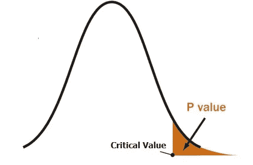
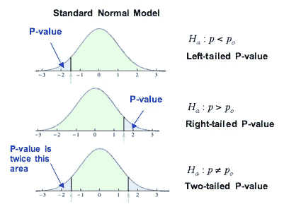
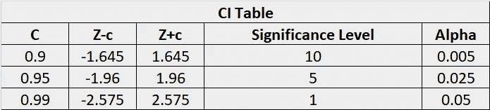
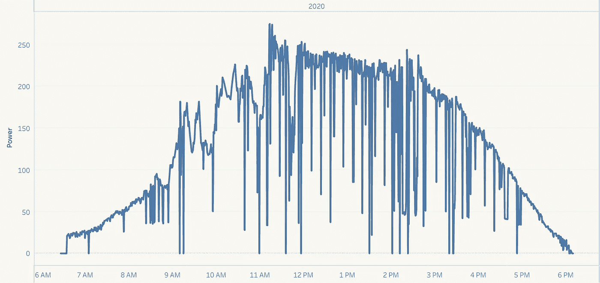
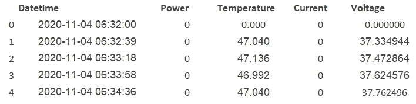
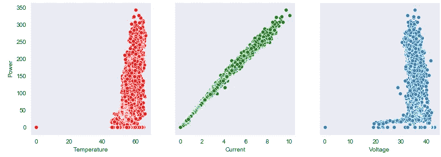
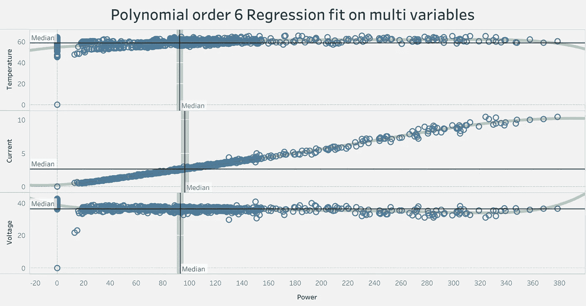
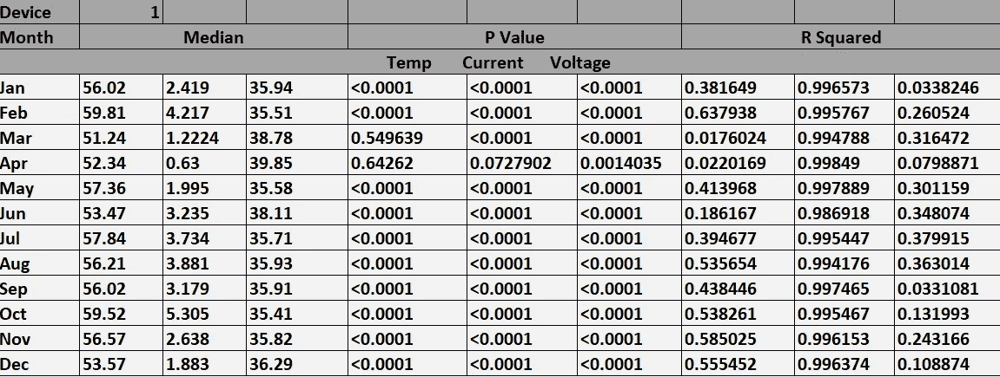
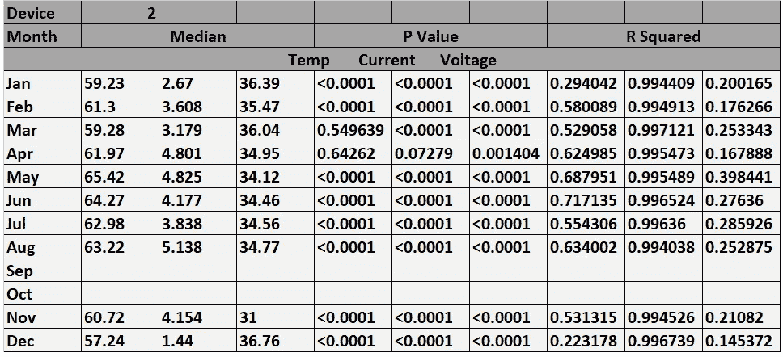

# 解读实时数据的 P 值和 R 平方得分—统计数据探索

> 原文：<https://medium.com/analytics-vidhya/interpreting-p-value-and-r-squared-score-on-real-time-data-statistical-data-exploration-632cbdb16ce3?source=collection_archive---------42----------------------->

# 概观

在这篇文章中，我将在下面分享我的想法

*   自变量对因变量方差的统计数据探索
*   如何利用实时数据从 P 值和 R 平方得分中进行推断
*   使用 Anova 等统计测试比较两个不同的系统参数

# 介绍

在任何数据科学项目中，统计数据探索阶段或探索性数据分析(EDA)是任何模型构建的关键。一旦我们准备好将我们的业务问题转化为数据科学问题，并确定和列出围绕它的所有假设，这将立即开始。在这里，我们将尝试从给定的数据集中找到主要特征和隐藏模式。本文的重点将是如何使用一些统计方法(如 P、R 2、假设检验)进行数据探索，以及比较两个不同组的方差分析，重点更多地放在应用方面而不是概念本身。

我使用了像 Tableau 这样的分析工具来获得一些有用的图，使用了像 scipy 这样的 python 包来进行统计测试，比如单向方差分析和比较 f 比率。如果数据呈钟形曲线，大多数统计检验都会给出好的结果。在我的案例中，因变量(研究变量)是一种高斯曲线，因此我想从统计学的角度探索数据，并根据数据做出推论。

回归分析和统计数据探索测试(如假设检验)中使用的两个最重要的度量是 R 平方和 P 值，但我们在分析中往往很少考虑这些。但是，借助 Tableau 或 power bi 等现代分析工具，我们可以生成一些带有趋势线的良好图表，并轻松计算这些指标，而不是编写自己的代码，我们可以使用它们进行推理。

# 重要术语

与概述一样，本文分为 3 个部分。但在我们进入各个部分之前，这里有一些我们应该熟悉的统计数据探索术语-

## 决定系数:

这通常表示为 R 2or 或 R 2or，更普遍的说法是 R 的平方，它表示特定的自变量对因变量的影响程度。该值通常介于 0 和 1 之间。值< 0.3 is weak , Value between 0.3 and 0.5 is moderate and Value > 0.7 意味着对因变量的强烈影响。我们将在稍后的博客中回到这个话题。

## p 值:

这是一种概率度量，表明观察值是随机的。当相应的自变量发生变化时，未观察到因变量的显著变化。因此，P 值越低，观察到的差异越显著。这通常用于统计假设检验，通常 P < 0.05 would mean a null hypothesis can be rejected and P > 0.05 意味着变量改变时没有显著差异。在下图中，阴影部分表示 P 值。



## 零假设 H0:

这里的想法是拒绝或取消零假设，并提出替代假设，这更好地解释了这一现象。

## 替代假设 Ha:

这与零假设相反，也就是说，它与描述标准正态模型(均值=0，标准差为 1)的零假设相反。这里，P c 是临界值或测试统计值



## 置信区间和显著性水平(α):

置信区间(CI)是取值的范围(-R，+R)，我们确信我们的总体参数(真值)在于。这主要用于假设检验。显著性水平定义了我们需要多少证据来拒绝 H0 而支持 Ha。它作为截止点。通常使用的默认截止值是 0.05。下表列出了标准正态分布在(1%、5%、10%)显著性水平下的临界值和α值的置信区间表



## 回归线和方程式:

通常，当在机器学习的上下文中提到回归时，我们指的是线性回归和 y 截距的线，即这条线与 y 轴相交的点。这条线在数学上可以表示为一条穿过(自变量、因变量)的数据点坐标的直线。以方程式的形式，

y = m * x + C，其中 C 是 y 轴截距，m 是梯度或斜率

在实时情况下，这可能不总是一条直线，并且独立变量或预测器相对于因变量或我们想要预测结果的变量存在非线性。因此，我们需要根据我们正在挖掘的数据集，查看其他回归，如多项式、指数甚至对数回归。在本文中，我的数据(目标变量)看起来有点像高斯曲线，因此我将尝试对其进行多项式回归。

## 多项式回归:

在统计学中，多项式回归是一种考虑自变量非线性的回归分析形式，目标变量建模为预测变量的 n 次多项式。即

其中 y 是目标或因变量，

，b 1，b 2 …b n 是多项式每一次的回归系数和 b 0 的 y 截距，x 1，x 2 …x n 是预测值或独立变量。

# 自变量对因变量方差的统计数据探索

为了演示，我将从我的私人项目数据集中选取 3 个自变量(温度、电流、电压)和因变量(功率)。这些数据与能源系统有关，其中，在系统运行期间，我们在任何给定的一天的每个时间步长都有连续的瞬时发电。让我们看看任意一天的功率趋势图(使用 tableau 生成)。



上图非常类似于钟形曲线，可以看到许多尖峰，因为这是在 35-45 秒的持续时间内产生的瞬时功率。

```
df.dtypesDatetime object Power float64 Temperature float64 Current float64 Voltage float64 dtype: object
```

样本数据框记录



我们可以看到功率值每 30-40 秒变化一次。该数据集包含 2019 年和 2020 年两年的数据。让我们来看看某个特定月份的因变量和每个自变量的散点图。



我们可以看到这一点

*   当设备主动(功率> 0)发电时，大多数情况下温度值在 42 到 65 之间
*   当设备主动(功率> 0)发电时，大多数情况下电压值在 18 到 45 之间
*   电流似乎具有很强的线性关系，当电流值接近 10 时，功率最大

由于输出似乎具有正态曲线的趋势，我将使用多项式回归对其进行测试(针对 6 阶非线性)。我们也可以尝试拟合三阶多项式，基本上是一种超参数。我在这里使用了 tableau 分析工具，因为我们可以轻松地进行一些统计分析和绘制趋势线等，而不必编写自己的代码。

接下来，让我们在下一节看看如何解释这些值

这可以从 ***Tableau 桌面-分析-模型-趋势线-多项式*** 中得出



# 如何利用实时数据从 P 值和 R 平方得分中进行推断

在我们对数据进行解释之前，我们需要在某个地方收集所有这些数据。我已经获得了某个设备每个月的值，并以表格数据的形式存储了这些值。(见下文)。我们先来了解一下数据。共有 12 行 9 列。行包含当月的数据，列包含与目标相关的 3 个独立变量的数据。前三列是特定月份的中值(也可以使用平均值)，接下来的三列是 P 值，最后三列是 R 平方值。绿线是多项式趋势线。



## 数据解释—我收集了一些可见的事实:

从上表中，我们可以得出一些第一手的推论，比如

> *1。所有的独立变量都指向拒绝零假设。也就是说，有证据表明这些预测因素确实会影响目标。通常我们只考虑 0.05 或 5%的显著性水平，但在上述数据中，大多数值的 P <为 0.0001，这意味着每 1000 个数据中有 999 个有统计学上的强有力证据支持替代假设，即如果该预测值发生变化，目标也会发生变化。*
> 
> *2。根据 R 2 分数，我们可以推断出预测因素对因变量的影响程度。我们可以看到，电流是影响最大的变量，其次是温度和电压。*
> 
> *3。在整个研究期间，该设备始终产生 140-160 瓦的功率。换句话说，我们可以有把握地推断，这个设备能够在任何一天产生> = 140(至少)瓦的功率。*

## 数据解释— II 更深入的见解:

> *1。电源上的电流有很强的线性关系，当电流值增大或减小时，电源值也成比例地增大或减小。这也可以从 R* 2 *scrore 推断出来，它始终具有接近 0.99 的值。参考上面的散点图，该图也显示了与电流的线性关系。*
> 
> *2。当审查中的预测值为(电流= 10.42，温度= 60.62，电压= 36.30)时，达到了目标变量的最大值(功率 378 瓦)。目前这只是一个信息。我们需要进一步挖掘，以获得更多的线索或模式组合，从而获得最大的产出。*
> 
> *3。在整个实验期间，3 月和 4 月似乎是不寻常的，因为在这两个月中，温度中值最低(< =53)，电压中值偏高(> =38)。与其他月份相比，目前的中位数也处于最低水平。这也可以从当月对应的 R 2score 推断出来。一个更有趣的推论是，每当温度较低时，电压对目标变量的影响更大，反之亦然，影响的程度可以从当前中值的值直观地看出。*
> 
> *4。基于这些，我们可以在系统中设置实时警报，以监控这些关键值的预测值以及最近 D 天的当前中值，并验证两个假设'* ***。基于当前中值，支配程度可能会变化*** *'和另一个假设— '* ***。当温度中值偏高时，温度将比电压对目标具有更大的影响，如果温度中值下降，则电压将影响更多的*** *。*
> 
> *5。3 月和 4 月的温度 P 值异常高，这再次* ***触发了设备*** *中的一些异常行为，当我们将来遇到这样的 P 值时。这基本上意味着，我们无法拒绝零假设的情况*

# 使用 Anova 等统计测试比较两个不同的系统参数

**方差分析和 F-统计:**可进行 ANOVA 测试以比较两组(在本例中为 2 个不同的装置)并计算 F-统计以确定变异性。

在本节中，我使用了来自另一台设备的类似数据来做一些统计假设测试。我已经演示了如何对两个不同设备的特定自变量进行单向 ANOVA 测试。如果将这些设备彼此相邻放置在同一位置，我们将无法拒绝零假设，因为这两个设备的性能相当，但如果将这些设备放置在不同的地理位置，则会观察到差异。下面是另一个远处的设备 2 的数据。使用 python 的 scipy，我们可以做一个简单的测试来比较这两个器件的温度可变性，并评估每个月的 f 比率。为了演示，我用了 4 月到 8 月的时间来获取光圈系数。



我们还可以做更复杂的测试，比如

1.  检查每日的可变性，而不是月份值
2.  使用 f 比率作为新特征，稍后可在预测建模中用于预测值，例如在设备 2 中，我们可以看到 Sep 和 Oct 的值不可用，或将其用于复杂的分析，如假设分析(新设备放置在特定位置，我们需要根据从当前设备获得的结果预测该设备的值)

## 使用单向 ANOVA 测试假设的简单 Python 示例:

```
Enter the temperature scores of the 2 devices device1 = [52.34,57.36,53.47,57.84,56.21] device2 = [61.97,65.42,64.27,62.98,63.22] **from scipy.stats import f_oneway f_oneway(device1,device2) #perform one-way ANOVA** F_onewayResult(statistic=43.35900660252281, pvalue=0.00017210195536532808) since the pvalue is < 0.05, we reject the Null Hypothesis. So the population mean of the 2 devices are not same.**F = variation between sample means / variation within the samples (43 in this case)**
```

# 结论

在这篇博客中，我只分享了一些关于统计数据探索的想法，并确定了围绕因变量和自变量的新假设。类似的分析也可以在任何其他数据集中进行，所有可能的假设都可以在 EDA 探索性 daEDA 之前得到理想的识别和列出。此外，我们还可以获得一些与数据所属领域相关的见解，这些见解没有被概念化或在早期被遗漏，或者是因为未知(不可见)变量影响了目标。

您也可以在我们的移动应用程序上阅读这篇文章

*原载于 2020 年 11 月 30 日*[*【https://www.analyticsvidhya.com】*](https://www.analyticsvidhya.com/blog/2020/11/interpreting-p-value-and-r-squared-score-on-real-time-data-statistical-data-exploration/)*。*