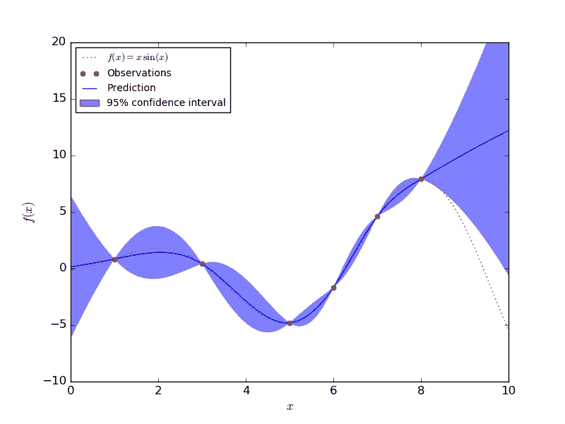

# 解释回归高斯过程的后验概率

> 原文：<https://medium.com/analytics-vidhya/interpreting-posterior-of-gaussian-process-for-regression-1bcfaab8e8aa?source=collection_archive---------8----------------------->

高斯过程图由 [scikit-learn](https://scikit-learn.org/0.17/auto_examples/gaussian_process/plot_gp_regression.html) 提供

我最近了解了[高斯过程](http://mlg.eng.cam.ac.uk/teaching/4f13/1920/) (GP)以及它如何用于回归。然而，我不得不承认，我很难理解这个概念。只有在我推导出方程式并尝试过几个样本之后，我才设法开始破译这整个想法是关于什么的。

> 高斯过程是随机变量的集合，任何有限的…