# 间断时间序列分析

> 原文：<https://medium.com/analytics-vidhya/interrupted-time-series-analysis-10d73659c6af?source=collection_archive---------7----------------------->

“很难做出预测，尤其是对未来的预测”

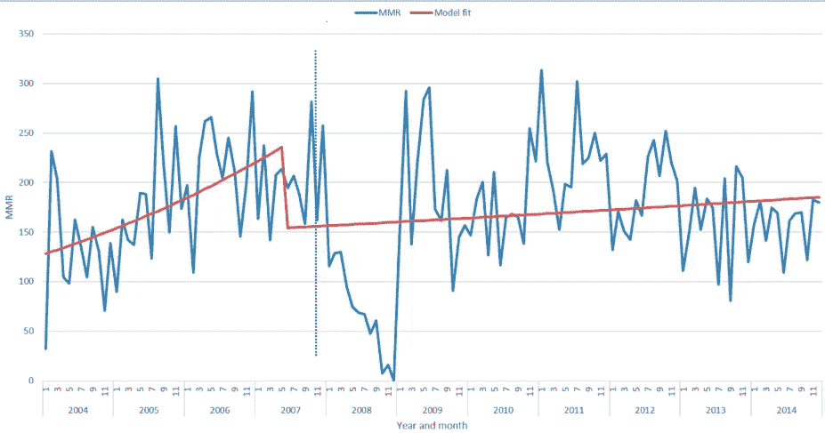

**间断时间序列分析**，有时也称为**准实验时间序列分析**，是一种对已知受干预(受控外部影响)影响的单个时间序列数据进行分析的方法。

信息技术的应用包括各个部门，例如:

*   营销研究:分析设计好的市场干预(如广告)对销售的影响。
*   经济学:信贷控制变化对借贷行为的影响。
*   政治学:姻亲关系的变化对人们行为的影响。
*   医学:在医学研究中，医学治疗是一种干预，其效果有待研究。

通过时间序列的水平和斜率的变化以及干预参数的统计显著性来评估干预的效果。

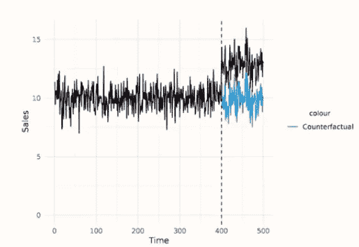

时间序列经常受到特殊事件或环境的影响，如政策变化、广告促销、环境法规和类似事件，我们称之为干预事件。在本文中，我们将描述干预分析的方法，该方法可以说明这些干预的预期效果。为此，使用了传递函数模型，但在干预分析模型中，输入序列将以简单脉冲或阶跃指示函数的形式表示事件的存在或不存在。最初，假设干预事件的时间是已知的。稍后，还讨论了在未知时间点检测时间序列中异常或异常行为的相关问题的方法。

> ***干预分析方法***

在干预分析的设置中，假设干预事件已经在时间序列的已知时间点 T 发生。感兴趣的是确定在与事件相关联的所研究的时间序列 Y(t)上是否有任何预期种类的变化或影响的证据。我们考虑使用传递函数模型来模拟干预的性质和估计干预效果的大小，从而解释与事件相关的时间序列中可能的异常行为。基于由 **Box 和 Tiao** 进行的研究，模型的类型被认为是形式

其中，Y(t)-N(t)项代表干涉事件对确定性输入序列 e(t)的影响，N(t)是噪声序列，代表没有干涉影响的背景观测序列 Y(t)。假设 N(t)遵循 ARIMA(p，d，q)模型，

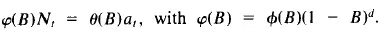

乘法季节性 ARIMA 模型也可以包括在内。对于 N(t)，有两种常见类型的确定性输入变量已被发现可用于表示干预事件对时间序列的影响。这两者都是指示变量，仅取值 0 和 1 来表示干预的不发生和发生。一种类型是时间 t 的阶跃函数，由下式给出

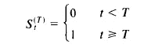

其通常用于表示在时间 T 之后在某种程度上预期会永久保持的干预效果。另一种类型是 T 处的脉冲函数，由下式给出

这些指标输入变量用于许多情况，在这些情况下，干预的效果不能用对定量变量的反应来表示。因为这种定量变量不存在，或者不切实际或不可能获得这种变量的测量值。

此外，可以通过直接检查数据来帮助识别，以表明已知事件的影响形式，并且有时可以通过检查在引入干预项之前拟合的模型的残差来获得补充证据。

通过传递函数的不同选择，几种不同的响应模式 *Y(t)* 是可能的。图(12.1)显示了以阶跃和脉冲指示器为输入的各种简单传递函数的响应。例如，图 12.1(a)中的模型 y(t)可用于表示时间 T 后未知量级 w 的永久阶跃变化，而形式

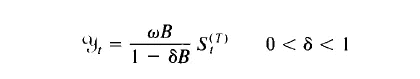

*在图 12 中，1(b)，)*暗示 Y(t)，t≥T，对应于速率 *6* 的逐渐变化，最终接近等于*(w/1–6)*的长期水平变化。类似地，模型

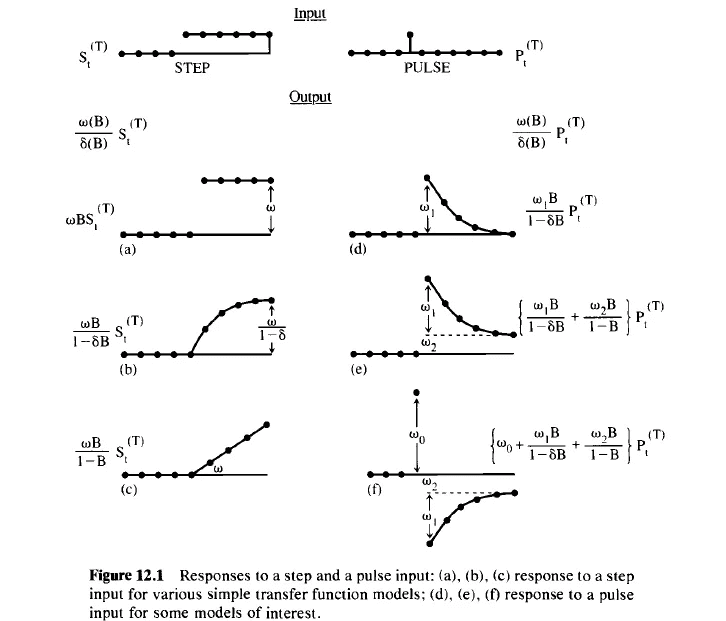

如图 12.1(d)所示。这意味着 Y(t) *t > T)* 将代表未知大小 w1 的时间 T 之后的突然“脉冲”变化。随后，速率“γ”逐渐衰减回到最初的干预前水平，没有永久影响。更复杂的响应形式可以通过简单形式的各种线性组合得到，如图 12.1(f)所示。还要注意的是，由于 *(I-B))S(t) = P(t)，*任何涉及 S(t)的传递函数模型同样可以用 P(t)来表示。

以下关于干预模式的附加要点值得注意。函数 Y(t)表示干预事件对噪声或“背景”系列 N(t)的附加影响。因此，在可能的情况下，噪声的模型 *N(t)* 基于应用于干预日期之前可用的时间序列观测值的常用程序进行识别，即 Y(t)，t < T。此外，在上述模型中，假设只有序列的水平受到干预的影响，特别是，N(t)的时间序列模型的形式和参数在干预前后是相同的。人们还应该认识到，根据噪声是稳定的还是不稳定的，以及根据假设的是永久的还是暂时的影响，可以在估计干预模型参数的精确度方面存在相当大的差异。

一般来说，干预模型的参数估计及其标准误差

通过传递函数-噪声模型的最小二乘法估计得到。来自模型的残差 a(t)的诊断检查(类似于前面讨论的方法)也将用于评估拟合模型的适当性。

> ***干预实例分析***

**例 1**

Box 和 Tiao 研究了从 1953 年 7 月到 1972 年 12 月美国消费者价格指数(CPI)的月度时间序列。从 1971 年 9 月开始，第一阶段的经济控制实施了 3 个月，在此阶段之后，第二阶段开始实施。调查第一和第二阶段控制对消费物价指数变化率的可能影响是有意义的。

对 CPI 变化率的样本自相关函数及其在第一阶段之前的 218 个月观测值的一阶差分的检查表明了一个如下形式的噪声模型

最大似然估计(I = 0.84，di '，0.0019)。对残差及其自相关的检验表明，这个模型没有明显的缺陷。

然后，为了解决第一阶段和第二阶段控制的可能影响问题，假定第一阶段和第二阶段预计会使消费物价指数的变化率发生变化，而噪声模型的形式保持不变。基于这些假设，评估控制措施影响的适当模型是

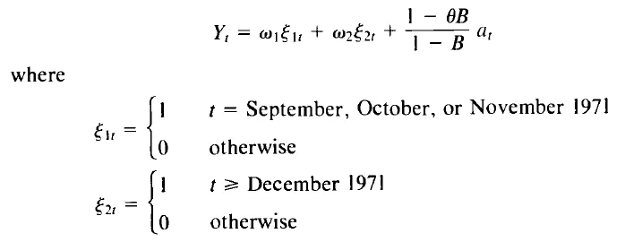

获得了模型中参数的非线性最小二乘估计，因此分析表明，CPI 增长率的下降与第一阶段有关，但第二阶段的影响不太确定。

**例 2**

古吉拉特邦、马哈拉施特拉邦和全印度的棉花产量年度数据是从农业与合作部收集的。整个数据集被分为属于干预前和干预后时期的观察值。干预前阶段的观察结果进一步分为两部分，即用于模型拟合和验证的数据集。

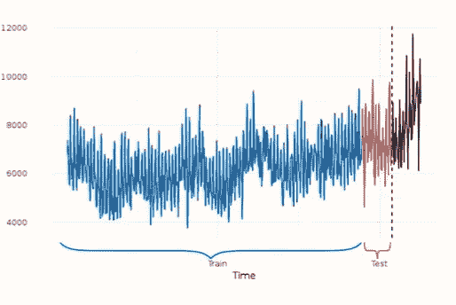

> ***ARIMA 模型拟合***

ARIMA 模型由下式给出:

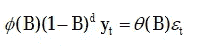

在哪里

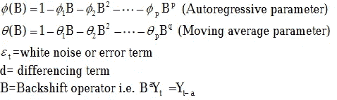

ARIMA 方法分三个阶段实施，即识别、估计和诊断检查。在识别阶段试验性地选择 ARIMA 模型的参数，并且在估计阶段使用迭代最小二乘技术来估计参数。然后在诊断检查阶段测试所选模型的充分性。如果发现模型不合适，就重复这三个阶段，直到为所考虑的时间序列选择了一个令人满意的 ARIMA 模型。

***标识:***

d 的识别是使非平稳时间序列变平稳的必要条件。平稳性存在的正式统计测试，称为单位根假设测试或扩展的 Dickey-Fuller 测试，用于测试平稳性。零假设是时间序列是非平稳的，另一个假设是时间序列是平稳的。

***参数估计:***

ARIMA 模型的参数估计通常通过迭代最小二乘法来完成，它们是在识别阶段选择的。ARIMA 模型的阿凯克信息标准(AIC)和贝叶斯信息标准(BIC)值计算如下:

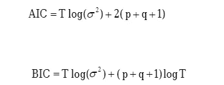

其中 T 表示用于参数估计的观测值数量，σ2 表示均方误差。

***诊断-检查:***

在这个阶段，进行测试以查看估计的模型在统计上是否足够，即误差项是否是白噪声，这意味着误差项与零均值和恒定方差不相关。零假设是序列是白噪声，另一个假设是直到滞后 m 的一个或多个自相关不为零。测试统计数据由下式给出:

其中 T 是用于估计模型的观察值的数量，m 是滞后的最大数量。统计量 Q*近似遵循具有(T-k)个自由度的卡方分布，其中 k 是 ARIMA 模型中估计的参数数量，r(k)是滞后 k 处残差的自相关函数。如果不满意，我们返回到识别阶段以尝试性地选择另一个模型。

***干预模型拟合:***

干预模型由下式给出

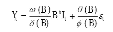

在哪里

Y(t) =因变量

I(t) =根据干预类型编码的指标变量。阶跃函数的干预类型从给定时间开始，直到最后一个时间段。从数学上讲，阶跃函数的干预类型可以写成:

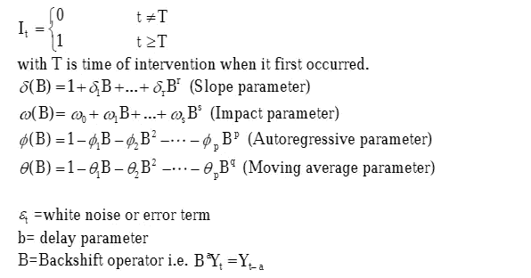

与 ARIMA 模型一样，拟合干预模型包括通常的三个阶段，即识别、估计、诊断检查。虽然估计过程和诊断检查类似于 ARIMA 建模，但识别过程略有不同，这将在随后讨论。

干预模型由三个参数“w”、“6”和“b”组成，其中 w 被称为影响参数，表示由于干预而产生的变化(积极的或消极的)，而“6”被称为斜率参数，在不同类型的干预中具有不同的含义。在阶跃干预的情况下，它接近于零，干预的效果随时间保持不变，如果‘6’接近于 1，干预的效果随时间增加。延迟参数 b 通常取值 0、1 或 2；b=0 意味着干预的效果已经在干预本身的时候出现，b=1 意味着干预的效果在一个时期的延迟之后被感觉到，等等。

b 的阶可以通过视觉检查数据来确定，并且通过将计算的脉冲响应函数与理论脉冲响应函数进行比较来确定模型的形式。通过绘制残差来获得脉冲响应函数，该残差是干预后观测值的实际值与根据干预前数据拟合的 ARIMA 模型获得的预测值之间的绝对差。

***预测性能:***

通过计算平均绝对百分误差(MAPE)来判断模型的预测性能。具有较小 MAPE 的模型是用于预测目的的首选。MAPE 的计算方法如下

其中 n 是预测值的总数。y 是期间 t 的实际值,( Ycap)是相应的预测值。MAPE 越少，天气预报越好。

***结果，和*** 比较

***全印度***

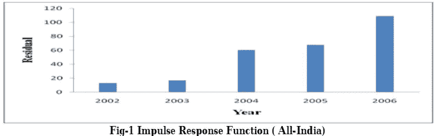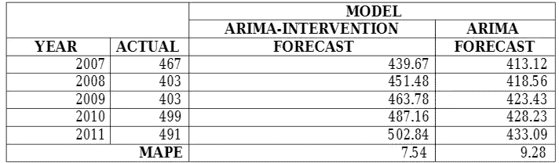

***古吉拉特***

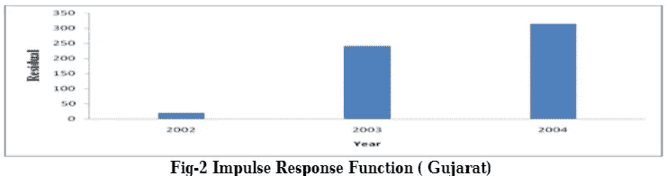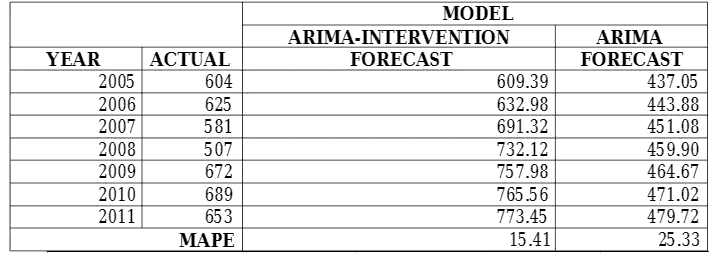

***马哈拉施特拉邦***

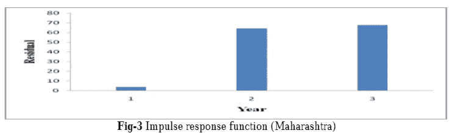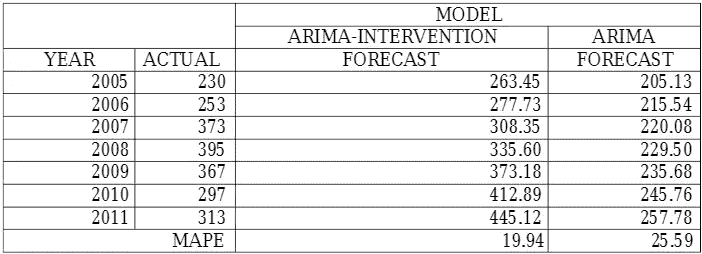

因此，时间序列干预模型可以有效地用于棉花产量预测。从上表中还可以推断出，ARIMA 干预模型的预测精度优于 ARIMA 模型。

***参考文献及演职员表:***

时间序列分析预测和控制，第 5 版，作者:乔治·E·P，博克斯·格维利姆，M·詹金斯，格雷戈里·C·赖因塞和格里塔·M·永。

[https://www . researchgate . net/figure/The-effect-size-estimated-by-time-series-regression-analysis-of-an-interrupted-time _ fig 1 _ 8607608](https://www.researchgate.net/figure/The-effect-sizes-estimated-by-time-series-regression-analysis-of-an-interrupted-time_fig1_8607608)

 [## 间断时间序列

### 间断时间序列分析，有时被称为准实验时间序列分析，是一种研究时间序列的方法

en.wikipedia.org](https://en.wikipedia.org/wiki/Interrupted_time_series) 

*谢谢，*

*施拉万·阿杜拉普兰*