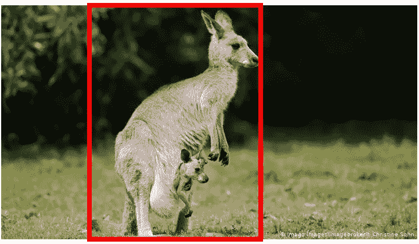

# 并集上的交集——目标检测评估技术

> 原文：<https://medium.com/analytics-vidhya/intersection-over-union-object-detection-evaluation-technique-954357ec2b8?source=collection_archive---------6----------------------->

> 本文将描述 IoU 在任何对象检测问题中的概念。它还将通过 python 代码引导您完成相同的应用程序。

# 欠条是什么？

正如我们所知，任何对象检测算法，无论是 RCNN，快速 RCNN 还是掩模 RCNN，都会在图像中我们想要检测的对象周围绘制一个包围矩形框。

