# 关于逻辑回归的面试问题

> 原文：<https://medium.com/analytics-vidhya/interview-questions-on-logistic-regression-1ebd1666bbbd?source=collection_archive---------0----------------------->

嘿，我又写了一篇关于机器学习面试问题的博客。我希望你已经看过我之前关于[线性回归](/analytics-vidhya/preparing-for-interview-on-machine-learning-3145caeea06b)面试问题的博客。在这篇文章中，我将讨论面试中逻辑回归的所有重要问题。在常用的机器学习算法上测试数据科学有志者是一种常见的做法。这些最常用的传统算法是线性回归、逻辑回归、决策树、随机森林等。数据科学家应该对这些算法有深入的了解。

# 所以，我们从逻辑回归开始吧！

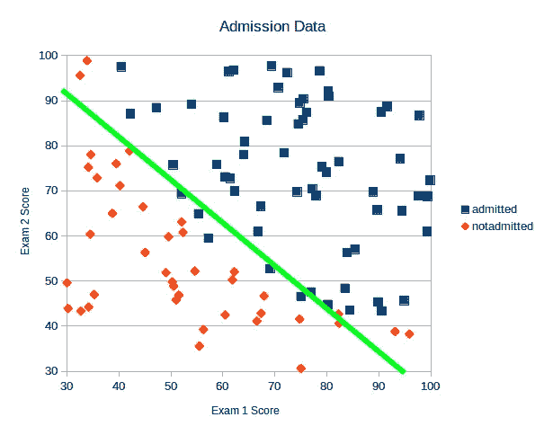

***面试官:*什么是 logistic 回归？**

***您的答案:*** 这是一种分类算法，用于响应变量为*分类*的情况。逻辑回归的想法是找到特征和特定结果概率之间的关系。

***例如*** 当我们必须预测一个学生在一次考试中通过还是失败时，当花费在学习上的小时数作为一个特征给出时，响应变量有两个值，通过和失败。

这种类型的问题被称为**二项式逻辑回归**，其中响应变量有两个值 0 和 1 或通过和失败或真和假。**多项逻辑回归**处理响应变量可能有三个或更多可能值的情况。

***面试官:*logistic 回归有哪些假设？**

***你的答案:***logistic 回归中所做的假设如下:

1.  逻辑回归假设独立变量之间的多重共线性很小或没有。
2.  在结果的 logit 和每个预测变量之间应该有一个线性关系。logit 函数给定为`logit(p) = log(p/(1-p))`，其中 p 是结果的概率。
3.  逻辑回归通常需要大样本量才能正确预测。
4.  有两类的逻辑回归假设因变量是二元的，有序逻辑回归要求因变量是有序的，例如*太少，大约右边，太多*。
5.  逻辑回归假设观察值相互独立。

***面试官:*为什么 logistic 回归叫回归而不叫分类？**

***你的答案:*** 回归和分类的主要区别在于，回归的输出变量是数值型的(或连续型的)，而分类的输出变量是分类型的(或离散型的)。逻辑回归基本上是一种监督分类算法。但是，该模型会像线性回归一样建立一个回归模型，以预测给定数据条目属于编号为“1”的类别的概率。

例如，对于二进制分类，让***【x’***为某个特征，让***【y’***为输出，输出可以是 0 或 1。
给定输入，输出为 1 的概率可表示为:

如果我们通过线性回归预测概率，我们可以将其表述为:

其中，p(x) = p(y=1|x)

逻辑回归模型可以将 ***预测概率*** 生成为从负到正无穷大范围内的任意数，而结果概率只能位于 0 < P(x) < 1 之间。然而，为了减轻异常值的问题，在逻辑回归中使用了 sigmoid 函数。线性方程放在 sigmoid 函数中。

***面试官:*解释逻辑回归背后的一般直觉。**

我们在逻辑回归中的主要目标是在给定的数据集上找到一条线(在 2D 中)或一个平面/超平面(在 3D 或更多维中),该线或平面/超平面可以尽可能完美地分离两个类点，以便当它遇到任何新点时，它可以容易地分类，它属于哪个类点。由于 x 和 y 是在训练数据中给定的，所以如果我们可以找到 w(法线)和 b (y 截距)，那么我们可以很容易地找到一条线或平面，也称为决策边界，它几乎可以线性地分隔这两个类。让我们只关注两个特性(x1 和 x2)，这样直觉就变得容易了。

现在，让我们从下图中选取任何+ve 类点，并计算从一个点到平面的最短距离。最短距离由下式给出:

**迪= w^t*xi/||w||**

设，||w||=1。然后，

**迪= w^t*xi**

由于 w 和 xi 位于决策边界的同一侧，因此距离将为+ve。现在我们要计算 dj = w^t*xj.因为 xj 是 w 的对边，所以距离是-ve。由此我们可以得出结论，与 w 方向相同的点都是+ve 点，与 w 方向相反的点都是-ve 点。

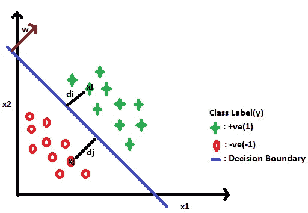

现在，我们可以很容易地对-ve 和+ve 点进行分类。如果 w^t*xi>0，那么 y =+1，如果 w^t*xi < 0，那么 y = -1。

*   如果 yi = +1 且 w^t*xi > 0，那么分类器(一种数学函数，由分类算法实现，将输入数据映射到一个类别)将其分类为+ve 个点。如果 yi*w^t*xi > 0，会发生什么？那么它就是正确分类的点，因为两个+ve 数相乘总是大于 0。
*   如果 yi = -1 并且 w^t*xi < 0, then classifier classifies it as -ve point. If yi * w^t*xi > 0，那么它是正确分类的点，因为两个 ve 数相乘将总是大于 0。所以对于+ve 和-ve 点，yi* w^t*xi > 0。这意味着模型正确地对 xi 点进行了分类。
*   如果 yi = +1，< 0, i.e, yi is +ve point but classifier is saying it is -ve then we will get -ve value. Which means actual class label is +ve but it is classified as -ve then this is miss-classified point.
*   If yi = -1 and w^t*xi > 0，这表示实际类标号为-ve 但归类为+ve，那么就是误归类点(< 0).

From above observations, we want our classifier to minimize miss-classification error, i.e, we want yi*w^t*xi to be greater than 0\. Here, xi, yi are fixed because these are coming from data-set. As we change w, and b the sum will change and we want to find such w and b that maximize the sum given below. w and b can be calculated using Gradient Descent.

***面试官:*解释 sigmoid 函数的意义。**

***你的答案:*** Sigmoid 函数用于消除离群值的影响。选择 sigmoid 函数的原因如下:

1.  概率推理:如果 z=y*w^T*xi=0，它意味着 d=w^T*xi 是 0，即点到平面的最短距离是零。现在，如果 d 是 0，这意味着点位于超平面本身。同样，如果 z=0，则 P(z)=0.5。

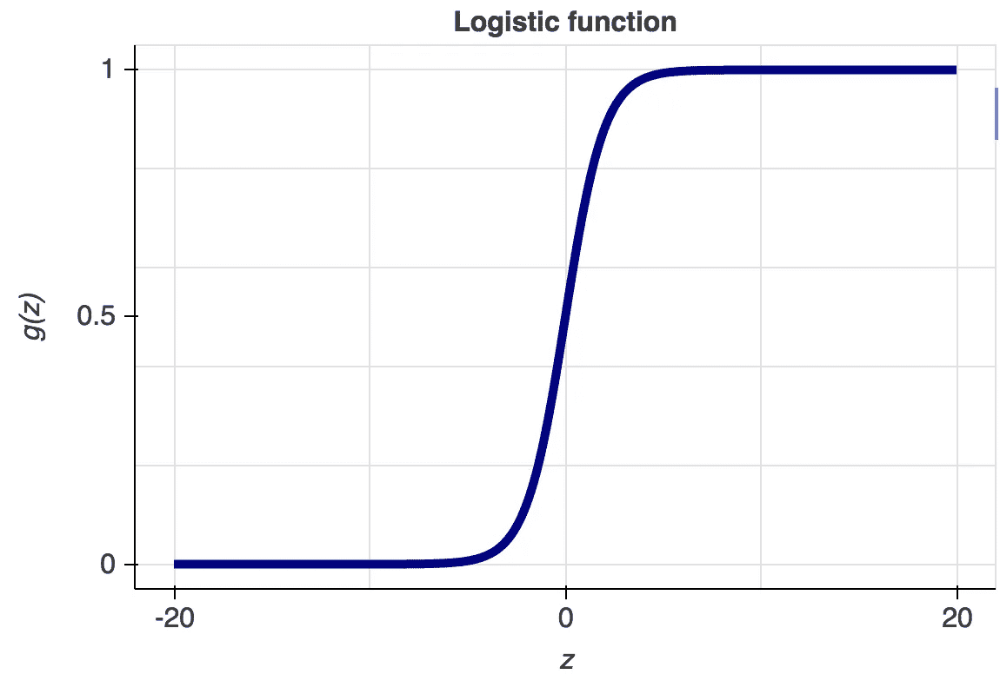

所以，如果一个点位于平面上，那么这个点是+ve 或-ve 的概率是相等的。

2.函数在每一点都是可微分的:像梯度下降这样的优化算法被用来寻找 w 和 b 的值。因为 sigmoid 函数是可微分的，所以可以容易地计算最小值和最大值。

***面试官:*什么是决策边界？**

***你的答案:*** 把类分开的线或超平面叫做决策边界。与任何分类器一样，逻辑回归的目标是找出某种分割数据的方法，以便使用特征中存在的信息准确预测给定观察值的类别。(例如，如果我们正在检查鸢尾花数据集，我们的分类器会找出一些方法来根据以下内容分割数据:萼片长度、萼片宽度、花瓣长度、花瓣宽度。)在一般二维示例的情况下，拆分可能如下所示。

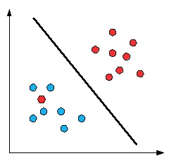

***面试官:*什么是异常值，sigmoid 函数如何缓解逻辑回归中的异常值问题？**

***您的回答:*** 有时数据集可能包含超出预期范围的极值，这与其他数据不同。这些被称为异常值。

sigmoid 函数在缓解异常值问题方面发挥着重要作用。让我们举一个非常简单的例子，我们将看到带符号距离之和(yi*w^t*xi)如何受到错误/异常值点的影响，我们需要提出另一个受异常值影响较小的公式。

假设在左图中，对于决策边界点的所有-ve 侧和决策边界点的+ve 侧，从任意点到决策边界的距离(d)是 1，除了在决策边界的+ve 侧的异常点，并且距离是 100。如果我们计算带符号的距离，那么它将是-90。在右图中，从任意点到决策边界的距离(d)是 1，它们之间的距离也是 1。如果我们计算带符号的距离，那么它将是 1。因此，我们有 5 个错误分类的点(点是-ve，但在决策边界的+ve 侧),带符号距离的和是-90。在左图中，我们有 1 个误分类点，符号距离之和为 1。我们希望最大化带符号距离之和，在本例中为 1。因此，如果我们选择带符号距离的和，在存在异常值的情况下，我们的预测可能不正确，我们最终会得到最差的模型。

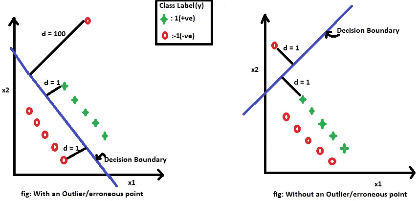

因此，为了避免这个问题，我们需要另一个比最大化符号距离更鲁棒的函数。我们这里使用的函数称为 sigmoid 函数，定义为

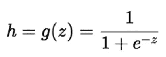

在哪里，

因此，我们需要最大化 sigmoid 函数，其定义为

> *因此，我们采用线性方程的输出(z)并给出函数 g(x ),该函数返回压缩值 h，值 h 将位于 0 到 1 的范围内。为了理解 sigmoid 函数如何压缩范围内的值，让我们来看一下 sigmoid 函数的图形。*

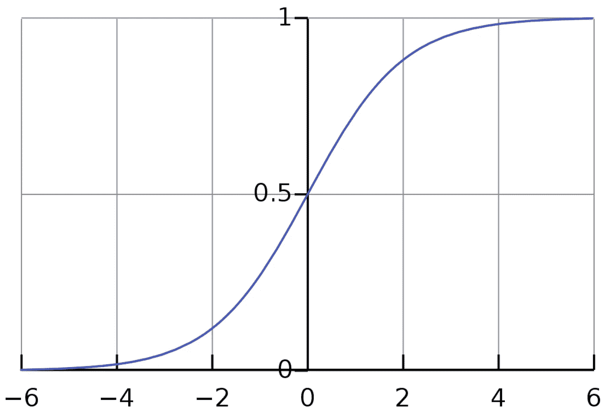

> *从图中可以看出，对于 x 的正值，sigmoid 函数渐近线变为 y=1，对于 x 的负值，sigmoid 函数渐近线变为 y = 0。*

***面试官:*线性回归中用到的成本函数在 logistic 回归中能起作用吗？**

***你的答案:*** 线性回归中使用的代价函数 J(θ)不能与 logistic 回归一起使用。在线性回归中，我们使用平方误差机制。不幸的是，对于逻辑回归来说，这样的成本函数会产生一个非凸空间，对于优化来说并不理想。将存在许多局部最优值，在找到真正的最小值之前，我们的优化算法可能过早地收敛于这些局部最优值。

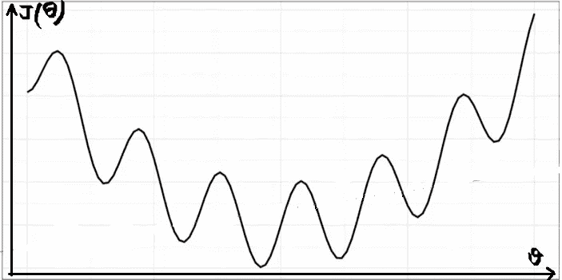

这种奇怪的结果是由于在逻辑回归中我们有 sigmoid 函数，它是非线性的(即不是一条线)。结果，梯度下降算法可能陷入局部最小点。使用来自统计学的最大似然估计，我们可以获得下面的成本函数，该成本函数产生有利于优化的凸空间。这个函数被称为**二元交叉熵损失**。这些成本函数为不正确的预测返回高成本。

我们在线性回归中使用的成本函数是:

对于逻辑回归，成本函数定义为:

在 y=1 的情况下，当 hθ(x)接近 1 时，产出(即支付成本)接近 0。相反，当 hθ(x)接近 0 时，支付成本增长到无穷大。你可以在下图左侧清楚地看到它。这是一个令人满意的特性:当算法预测的值与实际值相差很远时，我们需要更大的惩罚。如果标签是 y=1 但算法预测 hθ(x)=0，结果就完全错了。

相反，当 y=0 时，同样的直觉也适用，如下图右侧所示。当标签为 y=0，但算法预测 hθ(x)=1 时，惩罚更大。

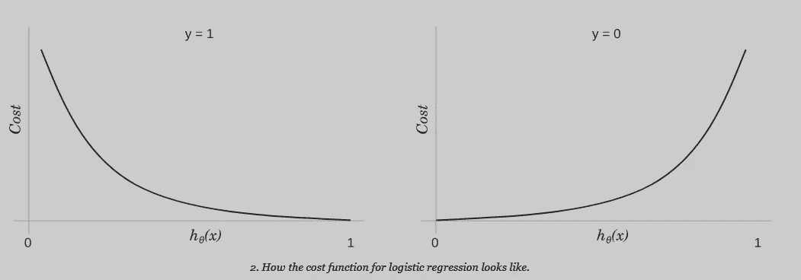

简而言之，成本函数可以写成:

因为当 y=1 时第二项将为零，而当 y=0 时第一项将为零。将该成本代入我们的总成本函数，我们得到:

***采访者:*逻辑回归语境下的挤压是什么？**

***你的答案:*** 挤压函数将整个实轴映射到有限区间。

随着 Zi 从-∞到+∞，f(Zi)从 A 到 b。

Sigmoid 函数:

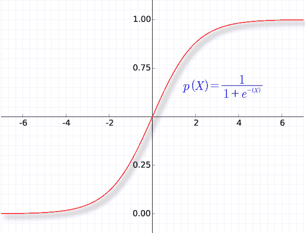

我们将使用 sigmoid 函数来压缩 0 和 1 之间的值。

通常，分类问题中的预测是概率值。所以我们不希望我们的模型预测概率值低于 0 或高于 1。乙状结肠功能有助于实现这一点。

***面试官:*什么是机器学习背景下的过拟合和欠拟合？**

***你的答案:*** 当模型在数据中记忆目标类中的复杂模式，而不是对它们进行归纳时，就会发生过拟合。模型开始记忆训练集，当输入看不见的数据时，训练集实际上不起作用。

欠拟合是指模型既不能对训练数据建模，也不能推广到新数据。

考虑以下训练数据，具有如下绘制的 3 个不同的决策边界:

在第一张图中，这条线并不完美(没有将数据分成两个类)。这是一个欠拟合(高偏差)的例子。这通常发生在 w 的值很小时。

在第三张图中，如果我们添加了许多高阶多项式特征，那么 LR 回归会努力寻找一个决策边界，以完美地分离训练集中的类。如果我们用这个边界来分类一个新的点，那么这看起来不是一个很好的假设。这是一个过度拟合(高方差)的例子。因此，如果我们添加许多多项式要素，由于其权重(w)增加，模型将过度拟合。

因此，第二个数字具有低偏差和低方差是合适的。

***面试官:*我们如何避免回归模型中的过度拟合？**

***您的回答:*** 正则化技术可以用来避免回归模型中的过拟合。基本的想法是惩罚复杂的模型，也就是说，增加一个复杂的项，这会给复杂的模型带来更大的损失。

假设我们有一个由以下等式给出的决策边界:

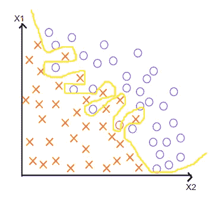

正如我们可以清楚地看到，该模型是过度拟合。所以我们想去掉 w3 和 w4。那么等式就变成了:

现在，这个方程的边界可能如下所示:

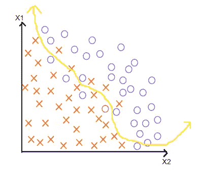

所以我们以一个本质上很好的二次函数结束。在这个具体的例子中，我们看到了惩罚 2 个参数的效果。

现在，如果我们考虑具有以下参数的数据集:

功能:X1，X2，X3，…，…，X500

重量:w0、w1、w2、……w500

在这种类型的问题中，我们实际上不知道为了得到更平滑的曲线，我们应该惩罚哪个权重。所以我们实际上惩罚了所有的重量。

那么优化方程变成，

在套索正则化的情况下，以及

在脊正则化的情况下，

其中λ=正则化参数(超参数)。

正则化参数将控制两个不同目标之间的折衷。第一个目标是我们希望通过添加多项式特征来拟合训练数据，第二个目标是我们希望保持较小的权重，这使得假设更简单。

***面试官:*脊和套索正则化的关键区别是什么？**

**岭回归**将系数的*平方值*作为惩罚项添加到损失函数中，而**拉索回归**(最小绝对收缩和选择算子)将系数的*绝对值*作为惩罚项添加到损失函数中。

与从不将系数值设置为绝对零的岭相比，Lasso 回归倾向于将系数设置为绝对零。这些技术之间的关键区别是 Lasso 将不太重要的特征的系数缩小到零，因此，它完全删除了一些特征。因此，在我们有大量特征的情况下，这对于**特征选择**很有用。

在 L1 正则化(lasso)的情况下，系数与其绝对值成比例地拉向零，它们位于红色曲线上。
在 L2 正则化(ridge)的背景下，系数与其平方(蓝色曲线)成比例地拉向零。

***结论:*** 这是从逻辑回归可以问出的几个基本问题。请注意，我已经详细解释了几个问题，以便让你清楚概念，更好地理解。回答面试官的问题时要具体。只回答你被问到的问题。自信一点，回答的潇洒一点。祝你好运！如有任何疑问，您可以通过 LinkedIn 联系我。

*如果你觉得这很有帮助，别忘了点击*👏图标*。这将有助于其他像你一样的年轻有志之士看到这个故事。谢谢大家！*😊