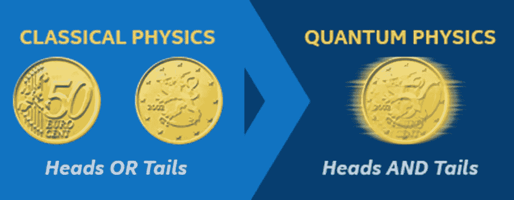

# 一个量子至上的世界

> 原文：<https://medium.com/analytics-vidhya/into-a-world-of-quantum-supremacy-73e77d6fcbf2?source=collection_archive---------17----------------------->

计算难以想象的事情

让我们以传统的方式开始，剑桥词典将[量子](https://dictionary.cambridge.org/dictionary/english/quantum)定义为某种东西的最小数量或单位，尤其是能量。如果你在谷歌上搜索量子这个词，你会发现它的使用在最近几年有所增加。这已经成了最近的流行语。那么这种量子优势在 21 世纪意味着什么呢？

根据维基百科的说法，**量子至上**的目标是证明一个可编程的量子设备可以解决一个经典计算机无法在任何可行的时间内解决的问题。量子优势是利用量子计算机实现的。这些量子计算机不同于我们的经典计算机，它们使用量子物理进行运算。

量子物理学是物理学的一个分支，研究微观层面的自然现象。用外行人的话来说，量子物理学处理的是光子和电子尺度的原子级粒子。量子计算机通过控制这些粒子的行为来运行，这与我们传统计算机的工作方式非常不同。量子物理学依赖于一个名为叠加的概念，这意味着在一个特定的时刻，一个粒子可以以多种形式存在。例如，在杨氏双缝实验中，观察到电子同时以粒子形式和波形存在。

这与计算机世界有什么关系，可以通过两个例子来理解。让我们考虑我们正在旋转一枚硬币，当它静止时，有两种可能的结果，要么正面要么反面，但是在旋转时，我们不确定结果可能是其中之一。在经典计算机中，我们的结果是位，0 或 1(为了便于理解，我把 0 映射到正面，1 映射到反面)。但是在量子计算机中，结果可以是 0 或 1，或者是两者的组合。在经典计算机中，二进制结果由一个比特表示，而在量子计算世界中，结果由一个量子比特表示，也称为 [**量子比特**](https://en.wikipedia.org/wiki/Qubit) **。**

让我们考虑另一个例子，假设我们有一个 4 比特系统，该 4 比特系统可以被映射到范围从 0000 到 1111 的 16(2 的 4 次方)个不同的值。在这 16 个值中，我们只能有一个基于一些测量和比较计算的输出。然而在量子计算机中，一个量子位可以同时有 16 个值。所以这 16 个值可以同时用于计算。所以对于一个 4 位系统，量子计算机比我们的经典计算机快 16 倍。

# **量子计算机能做什么？**

尽管我们还处于判断这些机器能做什么或不能做什么的早期阶段，而且这不仅仅是高效地做事情，量子计算机在这里做的事情太复杂了，经典计算机无法完成。这里列出了使用量子计算可以实现的事情。

## **人工智能**

基于人工智能的系统通过经验学习，也就是说它们的准确性与反馈成正比。给出的反馈是基于许多可能结果的概率。因此人工智能被认为是量子计算的理想候选。

## 药

如今，制药公司要花 10 多年时间，通常还要花费数十亿美元才能发现一种新药并将其推向市场。使用量子计算，我们可以合成新元素并研究它们的特性，这可以加快药物开发过程。

## 网络安全

由于每天都有越来越多的网络攻击发生，互联网世界变得非常脆弱。量子计算与机器学习能力相结合，有助于开发各种加密算法，用于应对网络安全威胁。这个量子计算的世界被称为**量子密码**。

## 天气预报

天气预报被认为是一个棘手的问题。没有一个预测是 100%准确的。然而，需要提供温和天气的预警，以防止灾难性事件。以目前的技术，很难观察整个地球来预测灾难性事件。为了在天气预报领域获得更高的准确率，我们需要更多的计算能力。这可以通过量子计算来实现。

## 金融

金融领域的量子计算可以用来设计更好的投资组合。金融部门包含许多由算法运行的交易。使用量子计算机，我们可以提高这些交易的速度，让组织有一个更顺畅的工作流程。

量子计算的时代开始于 1980 年，但直到今天它仍然是不确定的。原因是量子计算机很难设计、制造和操作。这些机器对干扰极其敏感。一个轻微的环境噪音就能把一个量子比特从叠加态撞出来。结果，量子计算机被保存在这样的设施中，与任何种类的电干扰隔离。它们被保存在比太空还冷的绝对零度。

谷歌的量子怪兽

到今天为止，最好的量子计算机有 53 个量子比特，这似乎太强大了，但他们离最终目标还很远。根据一项研究，在一台量子计算机中，我们至少需要几十万个量子比特才能实现它们。为了破解 RSA 加密，我们需要数百万个量子位。

IBM Q

许多公司在量子计算机的研发上投入了数百万美元，其中谷歌和 IBM 处于领先地位。谷歌声称在 2019 年 10 月实现了量子霸权，方法是在名为“Sycamore”的 53 量子位量子计算机处理器上对逻辑门进行基准测试。据该团队称，他们能够在 200 秒内完成计算，而这需要世界上最快超级计算机 10000 年才能完成。尽管 IBM 声称他们的超级计算机在 2.5 天内完成了同样的计算。

尽管许多研究人员在开发量子计算机将使用的算法方面取得了很大进展，但这些机器本身仍需要大量工作。

*“20 年后，量子计算将不仅仅是一个选项。从能量的角度来看，这可能是我们唯一的选择，更不用说从计算的角度来看了-* ***马科斯·洛佩斯·德·普拉多博士***

*图片来源- [谷歌图片](http://images.google.com)*