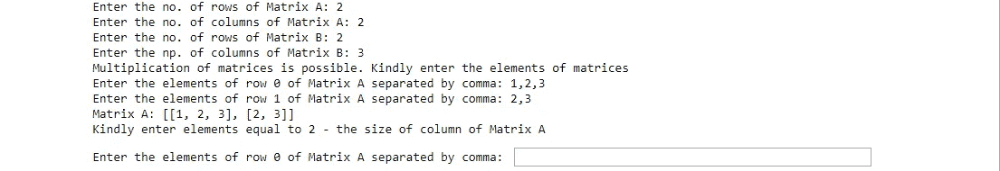

# 使用列表在 Python 中编程时矩阵乘法的复杂性

> 原文：<https://medium.com/analytics-vidhya/intricacies-of-matrix-multiplication-while-programming-in-python-using-lists-7528d0369375?source=collection_archive---------9----------------------->

## Python 编程/矩阵乘法

## Python 编程语言中矩阵乘法的详细分析。


矩阵乘法是通过两个矩阵相乘产生一个矩阵的过程。它发生的主要条件是第一个矩阵的列必须等于第二个矩阵的行。矩阵乘法是十二年级学生的必修课。使用 C/C+计算矩阵乘法的作业对于计算机科学的大学生来说是普遍存在的。然而，当用 Python 编写程序时，与矩阵乘法相关的复杂性也经常被忽略。

如果你搜索‘矩阵乘法 python’这个词，谷歌会给你提供大量指定硬编码矩阵乘法代码的页面。那些网站中列出的几乎每个代码都方便地忽略了单行矩阵和多行矩阵之间发生乘法的情况。让我们更深入地探讨一下。

Python 中一个简单的矩阵乘法硬编码程序很容易类似于下面的代码:

```
def matrix_mul(MatrixA, MatrixB):
    """
    Function to create a matrix resulting from multiplication of two matrices
    """
    global r1, c1
    global r2, c2
    global MatrixC
    for i in range(r1):
        for j in range(c2):
            for k in range(r2):
                MatrixC[i][j] += MatrixA[i][k] * MatrixB[k][j]MatrixA = [[1, 2], [3, 4]]
MatrixB = [[1, 2, 3, 4, 5], [5, 6, 7, 8, 9]]
r1 = 2
c1 = 2
r2 = 2
c2 = 5
MatrixC = [[0, 0, 0, 0, 0], [0, 0, 0, 0, 0]]
matrix_mul(MatrixA, MatrixB)
aster = '*'
print(aster * 68)
print('The resultant matrix is:')
print(aster * 68)
print(MatrixC)
print(aster * 68)
```

当您运行代码时，它将给出以下输出:

```
********************************************************************
The resultant matrix is:
********************************************************************
[[11, 14, 17, 20, 23], [23, 30, 37, 44, 51]]
********************************************************************
```

代码首先初始化 matrix a(2 x2 阶)和 matrix b(2 X5 阶)的值。然后使用要相乘的矩阵作为参数来调用 matrix_mul 函数。该函数通过第一个矩阵的行与第二个矩阵的列的点积来执行矩阵乘法(点积是匹配元素的乘法)。结果矩阵的行等于第一个矩阵的行，列等于第二个矩阵的列。

当矩阵 A(1×3 阶)与另一个矩阵 B(3×1 阶)相乘时，代码的缺陷(很像各种网站上的大多数在线代码)就会显现出来。运行代码时，会发生 TypeError。

**type error**:“int”对象是不可订阅的

```
**---------------------------------------------------------------------------**
**TypeError**                                 Traceback (most recent call last)
**<ipython-input-26-a342be5c878d>** in <module>**()**
     16 MatrixB **=** **[[4],** **[5],** **[6]]**
     17 MatrixC **=** **[0]**
**---> 18** matrix_mul**(**MatrixA**,** MatrixB**)**
     19 aster **=** **'*'**
     20 print**(**aster ***** **70)****<ipython-input-26-a342be5c878d>** in matrix_mul**(MatrixA, MatrixB)**
      9         **for** j **in** range**(5):**
     10             **for** k **in** range**(2):**
**---> 11** MatrixC**[**i**][**j**]** **+=** MatrixA**[**i**][**k**]** ***** MatrixB**[**k**][**j**]**
     12 
     13 **TypeError**: 'int' object is not subscriptable
```

为了更好地理解这个错误，让我们考虑一个包含三个元素的列表

```
list1 = [1, 2, 3]
print(list1[0][0])
```

如果我们运行这段代码，会出现同样的类型错误。原因是代码试图访问的列表的索引超出了范围。如果 list1 是一个列表列表(如下面给出的代码所示)，那么输出应该是 1。

```
list1 = [[1], [2], [3]]
print(list1[0][0])
```

在程序中，函数 matrix_mul(MatrixA，MatrixB)在下面几行代码中执行矩阵乘法。

```
for i in range(r1):
        for j in range(c2):
            for k in range(r2):
                MatrixC[i][j] += MatrixA[i][k] * MatrixB[k][j]
```

TypeError 的根本原因就源于这一行代码。原因是程序员不了解下面两种涉及单行矩阵的情况:

**场景 1** : **当第一个矩阵的行和第二个矩阵的列是一个**。1x3 阶的 MatrixA 和 3x1 阶的 MatrixB 就是典型的例子。在这种情况下，MatrixA 和 MatrixC(零矩阵)都是列表(而不是列表的列表)。因此，当计算 MatrixC[I][j]+= MatrixA[I][k]* matrix b[k][j]时，matrix c 和 matrix a 的索引超出范围，因为它们是单行矩阵。因此**类型错误**:‘int’对象是不可订阅的。

**场景二** : **当第一个矩阵的行为 1，第二个矩阵的列不等于 1 时。1x2 阶的 MatrixA 和 2x2 阶的 MatrixB 就是这种情况。就像前面的例子一样，MatrixA 和 MatrixC 是单行矩阵。因此出现了类型错误。**

让我们纠正这些问题，并努力创造一个程序，纳入矩阵乘法的所有方面。同时，让我们赋予最终用户(运行代码的人)权力，使他/她能够决定矩阵的顺序并在运行时输入相应的值，从而使代码更加通用。

上面的代码在运行时接收用户输入，并验证用户是否输入了正确的数据。该代码检查用户在输入过程中可能犯的所有错误。首先，程序检查接收到的矩阵阶数的输入是否为整数。为此，Python 异常处理(try，except)用于引发 ValueError。

```
Enter the no. of rows of Matrix A: 2.5
Please enter a valid integer greater than zero
```

如果第一个矩阵的列不等于第二个矩阵的行，则会出现错误消息。

```
Enter the no. of rows of Matrix A: 2
Enter the no. of columns of Matrix A: 3
Enter the no. of rows of Matrix B: 4
Enter the np. of columns of Matrix B: 2
Kindly change the order of matrices. For multiplication of matrices, the no. of columns of first matrix must be equal to no. of rows of second matrix.
```

如果第一个矩阵的顺序是 2x2，并且用户为第一行输入四个元素，则程序显示一条错误消息“请输入等于 2 的元素—矩阵 A 的列的大小”。



该程序考虑了前面讨论的单行矩阵的两种场景**。让我们考虑**场景 1** 当第一个矩阵的行数和第二个矩阵的列数为 1 时(例如，matrixA 的阶数为 1×3，MatrixB 的阶数为 3×1)，matrixC 将是 1×1 矩阵。和 matrixC 一样，MatrixA 将是一个单行矩阵。在这种情况下，使用以下代码行完成矩阵乘法:**

```
if(r1 == 1)&(c2 == 1):  #(1x3)*(3x1)=(1x1)
        for i in range(r1):
            for j in range(c2):
                for k in range(r2):
                    matrixC[i] += matrixA[k] * matrixB[k][j]
```

**场景 2** 处理第一个矩阵的行数为 1，第二个矩阵的列数不为 1 的情况(例如，matrixA 的阶数为 1x2，matrixB 的阶数为 2x2)。就像场景 1 一样，matrixA 和 matrixC 都是单行矩阵。区别在于矩阵乘法的值的计算方式。在场景 1 中，matrixC 迭代 I 的值(matrixA 的行)，而在场景 2 中，matrixC 迭代 j 的值(matrixB 的列)。

```
elif(r1 == 1)&(c2 != 1): #(1x2)*(2x2)=(1x2)
        for i in range(r1):
            for j in range(c2):
                for k in range(r2):
                    matrixC[j] += matrixA[k] * matrixB[k][j]
```

在场景 1 和场景 2 中，matrixC 的计算方式是它将成为单行矩阵。

```
if(r1 == 1)|(r1 == c2 == 1): 
        for i in range(r1):
            matrixC = []
            for j in range(c2):
                matrixC.append(0)
```

在所有其他情况下，矩阵乘法由通常的代码完成:

```
else: #all other cases
        for i in range(r1):
            for j in range(c2):
                for k in range(r2):
                    matrixC[i][j] += matrixA[i][k] * matrixB[k][j]
```

matrixC 是一个多行矩阵，计算公式如下:

```
for i in range(r1):
            row_matrixC = []
            for j in range(c2):
                row_matrixC.append(0)            
            matrixC.append(row_matrixC)
```

所有这些情况在 C++中都可以作为一个单独的例子来处理(一个解决方案适合所有的方法)。用 C++完成的矩阵乘法:

Github 链接

[](https://github.com/pbipin/Matrix_Multiplication) [## pbi pin/矩阵乘法

### Python 程序对所有阶的矩阵执行矩阵乘法。代码在运行时接收用户输入…

github.com](https://github.com/pbipin/Matrix_Multiplication) 

编码快乐！！！