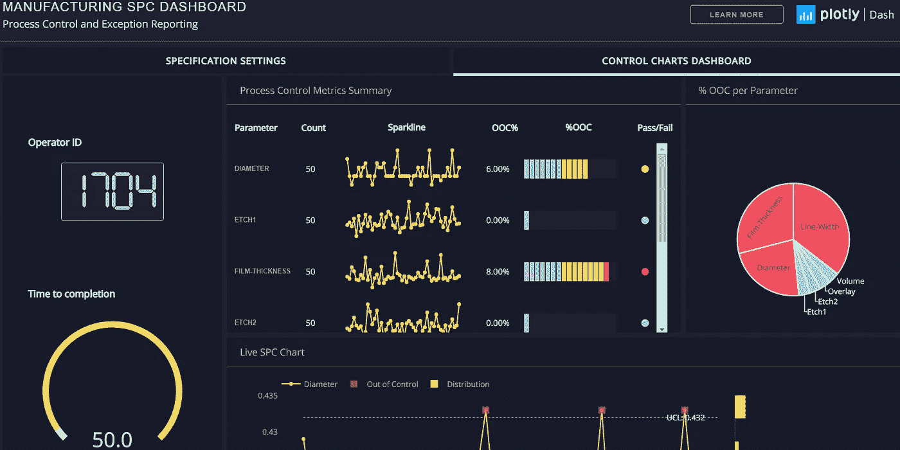

# Python 的 Dashboarding 简介

> 原文：<https://medium.com/analytics-vidhya/intro-to-dashboarding-with-dash-for-python-b62c071b4641?source=collection_archive---------0----------------------->

Dash 网站上的仪表板示例

数据科学家最重要的技能之一是能够有效地将项目结果传达给更广泛的受众。虽然已经有一些基于网络的工具(如 [Tableau](https://www.tableau.com/) )可以使数据可视化变得容易，但有时更定制的外观或功能是必要的。这是一个理想的用例为[破折号阴谋](https://plot.ly/dash/)；一个开源的仪表板(数据可视化)框架…