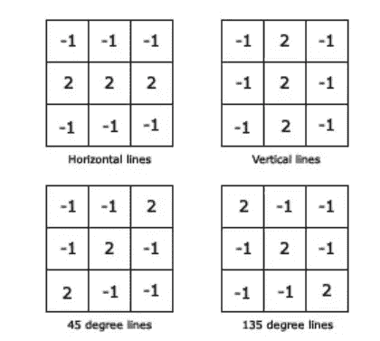
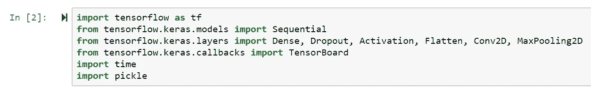
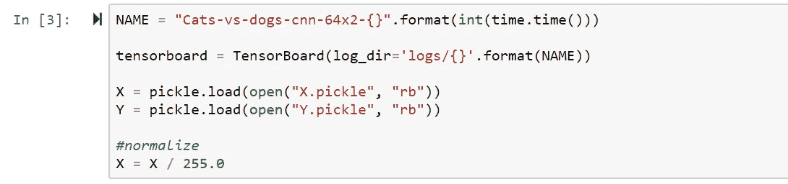
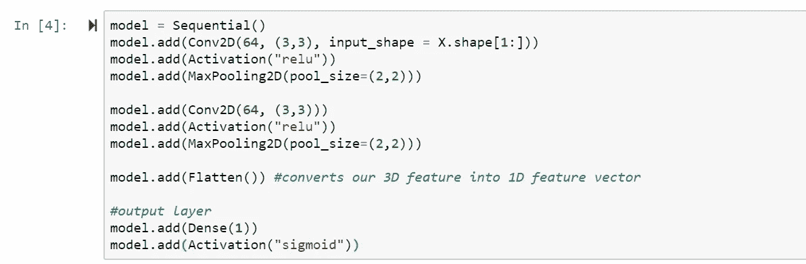
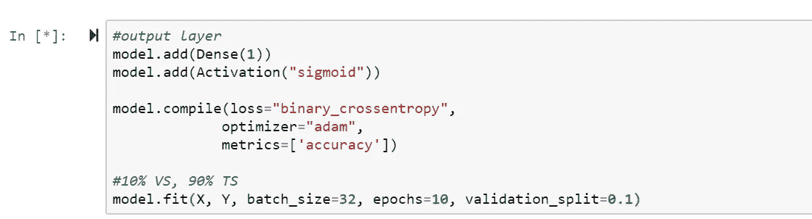

# 深度神经网络介绍——真的那么难吗？

> 原文：<https://medium.com/analytics-vidhya/intro-to-deep-neural-networks-is-it-really-that-hard-94b74e6da790?source=collection_archive---------12----------------------->

神经网络的概念受到我们大脑学习、理解和保留信息的方式的启发。

在技术领域，“机器学习”(ML)、“人工智能”(AI)和“深度学习”(DL)已经成为吸引雇主、投资者和技术极客的完美流行语！虽然这些概念最初很难理解，但是有了正确的指导和可靠的文档，它会变得更容易！

也就是说，巩固深度神经网络的基础很重要(DNN)。这包括定义、某些算法、概念和各种类型的模型。同样重要的是能够应用各种技术来训练和增强所选择的数据。在这篇文章中，我们将做到这一点，完善的基础！

内容的灵感来自伊恩·古德菲勒、约舒阿·本吉奥和亚伦·库维尔在麻省理工学院出版社出版的关于深度学习*的书。*

# *1.定义*

***什么是深度学习？***

*深度学习是机器学习领域下的一项研究，它侧重于向计算机模型教授任务的技术；人类天生的任务。DL 方法的一些流行应用包括图像识别、语音搜索和声控智能助理、地震预测和用于脑癌检测的神经网络等等。*

*这些算法是由我们大脑的功能激发的，准确地说是被称为*人工神经网络*。具体来说，神经网络的结构非常类似于我们的神经系统的结构，其中复杂的系统由数百万个**神经元**组成，每个神经元相互之间来回通信，以学习、识别和理解各种任务。*

**

*图一。幻灯片由 [*吴恩达*](https://www.slideshare.net/ExtractConf) 制作，版权所有。*

*最初，可能不清楚为什么具有一堆层和数百(如果不是数千)个神经元的这种复杂网络更好。然而，将它们与旧算法进行比较有助于理解为什么。如图*图 1* 所示，随着要处理的数据量的增加，旧模型开始接近饱和点并停止改进，而深度学习模型则开始处理更大的数据集。*

***拆分数据***

*在机器学习中，你所拥有的全部数据被分成 3 类，分别是训练集、验证集和测试集。这种分割是为了避免 ML 的根本问题，即过度拟合和欠拟合——将在本文后面讨论。顾名思义，训练集用于训练算法，该算法在可用的总数据中占最大部分。而一旦模型被完全训练，测试数据被用于使用一些性能度量来评估模型的性能。重要的是，训练集和测试集是互斥的，以避免记忆而不是泛化。最后，验证集用于调整称为*超参数*的变量，这些变量控制模型如何学习。*

**

*图二。3 个类别之间的分裂可视化，[塔朗沙阿](https://towardsdatascience.com/train-validation-and-test-sets-72cb40cba9e7)，版权所有。*

# ***2。然而，我们真正在“学习”什么呢？***

*“一个计算机程序被称为从关于某类任务 *T* 和性能测量 *P* 的经验 *E* 中学习，如果它在 *T* 中的任务的性能，如 *P* 所测量的，随着经验 *E 的增加而提高。**

*一)**任务，*T****

*ML 任务通常根据 ML 系统应该如何处理示例来描述，其中示例是从我们希望系统处理的一些对象或事件中定量测量的特征的集合。一些最常见的 ML 任务包括:*

*   *有/无缺失输入的分类*
*   *回归*
*   *抄本*
*   *异常检测*
*   *合成和取样*
*   *去噪*
*   *密度估计或概率质量函数估计*

*b) **绩效衡量， *P****

*为了评估最大似然算法的能力，我们必须设计其性能的定量测量。我们可以评估两个主要因素:*

*   *准确(性)*
*   *出错率*

*实际上，我们通常想知道我们的算法在以前没有见过的数据上的表现如何，因此评估我们在数据的*测试集*(独立于*训练集*)上的表现是正确的方法。*

*c) **经验， *E****

*根据在学习过程中允许的经验种类，机器学习算法可以大致分为*无监督的*或*有监督的*。这是一个重要的话题，值得另写一篇文章。*

# ***3。过拟合和欠拟合模型***

*有两个关键因素决定了 ML 算法的性能。也就是说，它能够:*

*   *使训练误差变小*
*   *使训练和测试误差之间的差距变小*

*然而，机器学习算法的一个反复出现的问题是:*

*a)过度拟合*

*当模型捕捉到数据的噪声时，就会出现这种(频繁的)问题。换句话说，当模型“太好地”符合训练数据，或者只学习数据中特定于模式的模式，并且“记住”其输出，以至于影响模型在新的、看不见的数据上的性能时，就会发生这种情况。简单来说就是训练误差和测试误差差距过大的时候。*

*解决这个问题的一个常见方法是简化模型，特别是通过删除或减少隐藏层中的元素数量来减少网络容量。另一种可能的解决方案是添加权重正则化层，从而为大权重的损失函数增加成本，并通过迫使模型仅学习训练集中的相关模式来简化模型。例如，看看多伦多大学的研究人员发表的这篇文章，这篇文章解释了如何使用 T2 辍学来防止神经网络中的过度拟合。*

*b)装配不足*

*当模型无法捕获基本的、潜在的训练数据模式时，就会出现这种问题。与过度拟合相反，当模型不能很好地拟合训练数据时，就会发生这种情况，从而导致对测试集或验证集的预测不佳。换句话说，就是模型不能在训练集上获得足够低的误差值。*

*解决这个问题的一个简单方法是简单地获取更多的训练数据，并让它学习更多的数据。*

*显然，对于这两种情况，一些共同的改变可能会产生更好的解决方案。比如:*

*   *改变初始权重/偏差*
*   *使用不同的激活功能*
*   *切换层的顺序(架构)*
*   *交叉验证*

# *4.它实际上是如何工作的？一个简单的 CNN 例子。*

*深度学习模型有很多种。例如，举几个例子，递归神经网络、递归神经网络和残差神经网络(ResNet)。然而，对于 ML 从业者来说，最常见的一种是卷积神经网络(CNN)。*

*我们将通过一个简单的 CNN 架构示例，使用图表和 Python 代码来理解其功能。*

***建筑概述***

*CNN 是一种专门的神经网络，用于处理具有已知网格状拓扑的数据，例如时间序列数据和图像数据。本质上，它们接受输入，为网络的各个部分分配权重/偏差，最后根据定义的类别对图像进行分类。当然，我们跳过了中间发生的许多有趣的事情。*

*CNN 中使用了一些基本层。尽管它们的排列顺序不同，但它们的核心功能和重要性不会改变。我们将讨论以下几层:卷积层、池层和全连接层。*

*附注:我将使用这篇文章中的图片和 GIF，因为它很好地展示了这些层是如何工作的。*

***卷积层***

*在数学上，卷积是两个函数( *f* 和 *g* 产生第三个函数( *h* )的运算，其中 *h* 表示 *f* 和 *g* 之间的关系以及它们如何相互影响。类似地，在 CNN 中，卷积层基于滤波器/内核大小遍历整个输入，并且对于每个遍历的矩阵，它在每个空间位置计算与滤波器矩阵的点积，从而在输出矩阵上产生 1 个单元。(看*图 4。)**

*以下是不同类型的可能特征的示例，这些特征用于检测和提取低级模式，如边、圆和其他多边形，具体取决于特征图。*

**

*图三。特征地图的例子。*

*下面的 GIF 示例展示了卷积图层如何遍历输入图像，并基于具有特定特征的点积生成输出。*

**

*图 4。特征/内核大小为 3x3，输入为 6x6，生成 4x4 矩阵， [Sumit Saha](https://towardsdatascience.com/a-comprehensive-guide-to-convolutional-neural-networks-the-eli5-way-3bd2b1164a53) ，版权所有。*

*与输入相比，得到的矩阵可以在维度上减少(如上所示),或者维度可以增加或保持不变(应用填充)。*

***汇集层***

*池层是 CNN 中另一个经常使用的层，其主要目的是减少大小以降低进一步处理所需的计算能力。不仅如此，它在提取给定输入中的主要特征时非常有用。*

*最常用的池类型是 *max-pooling* ，其中给定步长 *s，*它滑过特征尺寸为 *n* 的输入，并将当前 n *x n* 输入矩阵中的最大值写入输出矩阵，如下所示。*

**

*图五。输入大小 5x5 矩阵，最大 3x3 池， [Sumit Saha](https://towardsdatascience.com/a-comprehensive-guide-to-convolutional-neural-networks-the-eli5-way-3bd2b1164a53) ，版权所有。*

***全连接/分类层***

*最后，在应用了卷积层和池层的组合之后，网络通常以完全连接的层结束，在那里它们捕获网络中的高级推理。它是一个层，其中一层中的每个神经元都与另一层中的每个神经元相连。通常，展平的矩阵经过完全连接的层来分类图像。*

*下图显示了卷积网络的典型架构。*

**

*图六。CNN 有两个组成层，两个池层和一个全连接层来帮助分类图像， [Sumit Saha](https://towardsdatascience.com/a-comprehensive-guide-to-convolutional-neural-networks-the-eli5-way-3bd2b1164a53) 。保留所有权利。*

# ***5。我们来玩 Python 吧！***

*到目前为止，你可能只是想“是的，是的，我得到了所有这些理论上的东西，但是我们如何编码呢？”。*

*我们将使用 Tensorflow 和 Keras API 来运行一个非常基本的 CNN 网络，该网络具有顺序模型，ReLU 作为激活函数，Adam 作为反向传播优化器。*

*首先，需要导入某些库。为了让生活更简单，我在 Anaconda3 Naviagtor 上运行 Jupyter。*

*我已经使用[send ex](https://www.youtube.com/user/sentdex)Youtube 频道开始使用。*

**

*对于这个例子，我使用的是猫狗 64 x 2 CNN 数据集，可以从[这里](https://www.kaggle.com/c/dogs-vs-cats)下载。*

******