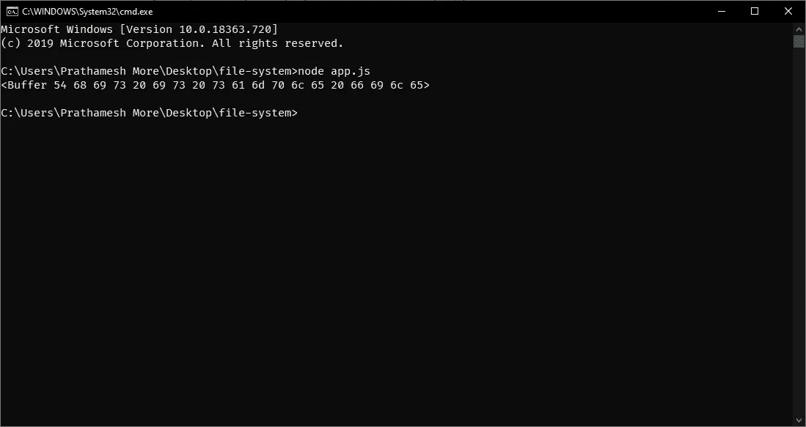

# NodeJS 中的文件系统介绍。

> 原文：<https://medium.com/analytics-vidhya/intro-to-file-system-in-nodejs-8fc3fe6f0eb1?source=collection_archive---------8----------------------->

`fs`模块为我们提供了与操作系统(服务器)的文件系统交互的 API。


照片由[阿诺德·弗朗西斯卡](https://unsplash.com/@clark_fransa?utm_source=medium&utm_medium=referral)在 [Unsplash](https://unsplash.com?utm_source=medium&utm_medium=referral) 拍摄

`fs`模块提供与操作系统文件系统交互的 API。所有文件操作可以是同步或异步的 I/O 操作。异步方法将第一个参数作为错误，将最后一个参数作为[回调](https://developer.mozilla.org/en-US/docs/Glossary/Callback_function)。

在本教程中，我们将学习基本操作和一些更多的`fs`模块的概念。

## 基本输入/输出操作

1.  读取文件
2.  写入文件
3.  打开文件
4.  删除文件
5.  重命名文件
6.  复制文件

为了开始使用文件系统，我们必须在项目中导入`fs`模块。

```
const fs = require('fs');
```

## 正在读取文件:

异步读取文件的全部内容。

方法:`fs.readFile(path[, options], callback)`

`path` —文件路径

`options` —采用编码等额外选项。该参数是可选的

`callback` —回调函数接受两个参数— err 和 data

输出:返回原始缓冲区。



读取文本文件

## 写入文件:

异步写入文件内容，并替换已存在的文件。

方法:`fs.writeFile(file, data[, options], callback)`

`file` —文件位置

`data` —可以是字符串或缓冲区。

`options` —采用额外的选项，如编码、模式和标志。该参数是可选的

`callback` —回调函数采用两个参数— err 和 data

输出:文件已创建


文件已创建

## 打开文件:

异步文件打开。

方法:`fs.open(path[, flags[, mode]], callback)`

`path` —文件路径

`flags` —文件系统[标志](https://nodejs.org/api/fs.html#fs_file_system_flags)

`mode` —设置文件模式默认可读和可写

`callback` —回调函数采用两个参数— err 和 fd

输出:


文件已打开

## 删除文件:

异步移除文件或符号链接。

方法:`fs.unlink(path, callback)`

`path` —文件路径

`callback` —回调函数采用 err 参数

输出:


文件已删除

## 重命名文件:

将`oldPath`处的文件异步重命名为提供的路径名`newPath`。在`newPath`已经存在的情况下，它将被覆盖。

方法:`fs.rename(oldPath, newPath, callback)`

`oldPath` —重命名文件的文件路径

`newPath` —新文件名

`callback` —回调函数采用 err 参数

输出:


文件已重命名

## 复制文件:

将`src`异步复制到`dest`。默认情况下，如果已经存在，`dest`将被覆盖。

方法:`fsPromises.copyFile(src, dest[, flags])`

`src` —要复制的源文件名

`dest` —要存储的目标文件名

`flags` —复制操作的修饰符。**默认:** `0`。

`return` —退货承诺

*   `fs.constants.COPYFILE_EXCL`:如果`dest`已经存在，复制操作将失败。
*   `fs.constants.COPYFILE_FICLONE`:复制操作将尝试创建写入时复制引用链接。如果平台不支持写入时复制，则使用回退复制机制。
*   `fs.constants.COPYFILE_FICLONE_FORCE`:复制操作将尝试创建写入时复制引用链接。如果平台不支持写入时复制，则操作将失败。

输出:


文件已复制

在本教程中，我们介绍了一些基本操作。可以在 NodeJS 的[官方文档上探索操作。](https://nodejs.org/api/fs.html)

谢谢大家！

编码快乐！

随时联系我！

[pprathamesmore . github . io](http://pprathameshmore.github.io)