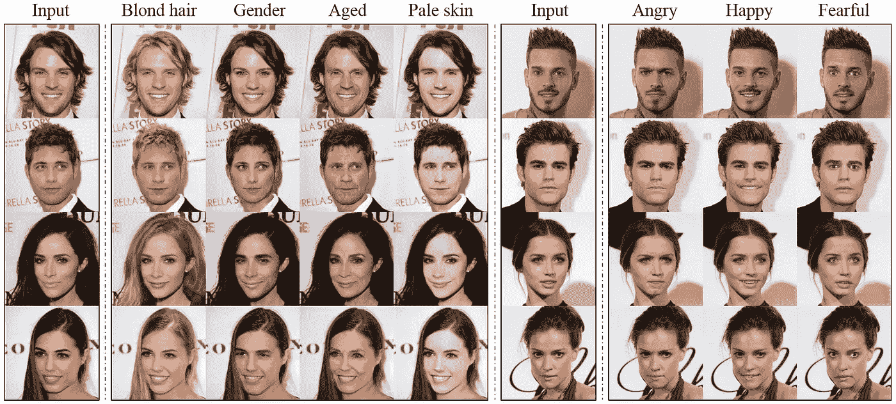
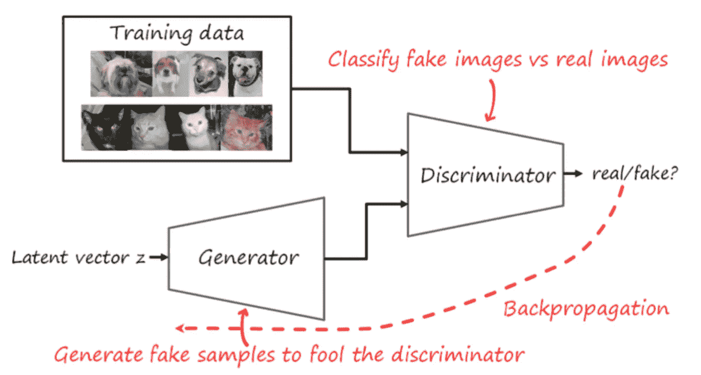
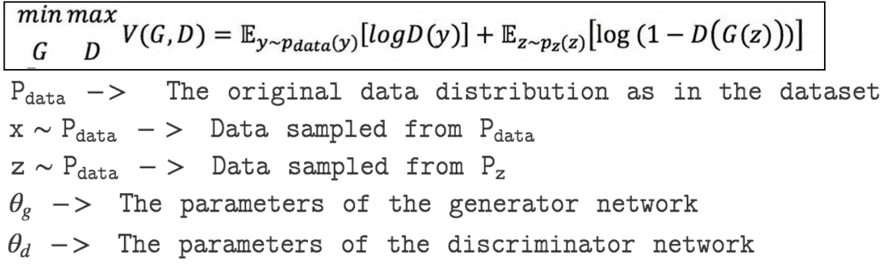
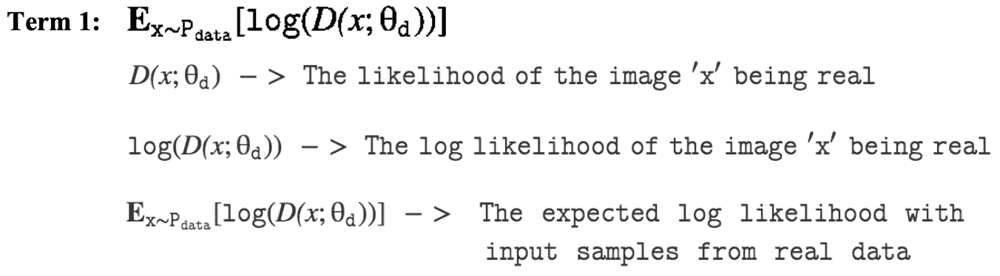
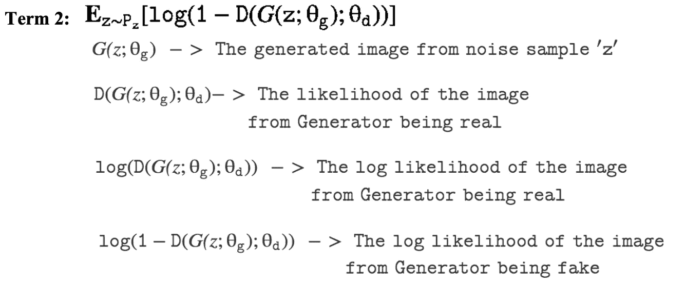

# 生成性对抗网络导论

> 原文：<https://medium.com/analytics-vidhya/intro-to-generative-adversarial-networks-ca1b14e524f4?source=collection_archive---------34----------------------->

来源: [StarGAN:用于多领域图像到图像翻译的统一生成对抗网络](https://arxiv.org/pdf/1711.09020.pdf)

一般来说，生成网络是无监督的学习技术，旨在学习一些数据的分布(例如，语料库中的单词或猫图像中的像素)。

简而言之，GANs 由两个目标相反的网络组成，在它们之间进行的某种游戏中寻求平衡。

1.  “**生成器**将从所谓的“潜在空间”采样的一些输入转换成包含我们想要生成的内容的“输出空间”。
2.  “**鉴别器**是一个简单的分类器，它接收真实图像和来自生成器的输出，并被训练来确定它所观察的输入是合成生成的还是真实的。

其思想是，当两个网络都以最佳方式运行时，生成器会创建图像，这些图像以与鉴别器的实际输入相同的方式分布在各自的输出空间中。

现在让我们为 GAN 定义一个**优化函数。生成器试图最大化其将图像正确分类为真或假的概率。另一方面，鉴别器试图最小化生成器将图像正确分类为真或假的机会。**

数学上，我们将目标函数定义为

D(x)表示输入图像是真实的概率。因此，鉴别器必须最大化 D(x)和 log(D(x))。因此，项 1 必须最大化。

生成器必须最大化鉴别器被生成的图像愚弄的机会。也就是说，生成器应该想最大化 D(G(z))。也就是说，它应该最小化(1-D(G(z))，从而最小化 log(1-D(G(z))。

一些流行的对抗性网络体系结构有:

**a .条件 gan**，在给定成对输入的情况下学习输出图像的分布，用于图像到图像的翻译等应用。

**b .深度卷积 gan**，也用于生成逼真的图像

**c .自我注意 GANs，**帮助模型聚焦于画面中的某一部分，也解决了大面积区域检测的问题。

请阅读我的下一篇博客[以获得关于这些架构以及我如何在 CIFAR-10 数据集上训练这些模型的详细解释。](/@shrutibendale/dcgan-cgan-and-sagan-the-cifar-10-dataset-206cbb851327)