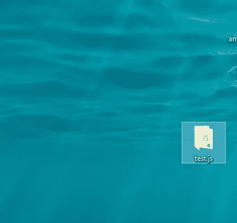
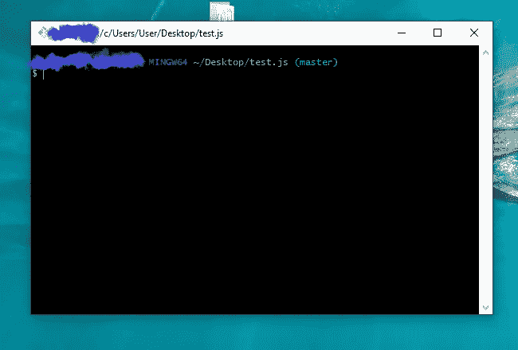

# Git 和 Github 初学者入门(教程)

> 原文：<https://medium.com/analytics-vidhya/intro-to-git-github-for-beginners-tutorial-70946b1cc6b1?source=collection_archive---------21----------------------->


我知道作为一个初学者尝试管理应用程序是很痛苦的，但当你读完这篇文章时，你会觉得自己站在世界之巅，因为你以前的困境将会结束。

另外，在这篇文章的最后会有一个**奖励提示**给你，所以 ***敬请期待吧伙计们！***

# 什么是 Git 和 Github？


Git 是一个免费的开源分布式版本控制系统，旨在快速高效地处理从小到大的项目。

GitHub 是一个 Git 存储库托管服务，但是它增加了许多自己的特性。
基本上， **Git** 是一个跟踪文件的版本控制系统。

**Git** 帮助你将你的代码存储在一个叫 **Github** 的神奇的时间机器和存储设备中。长谈够了。

我知道你们想要这份报告的要点，所以我不会占用你们太多时间。让我们开始这个派对吧！！
对了伙计们，我是 Agbejule Kehinde Favour。


# 正在下载 Git

所以首先让我们下载 git
**在 windows 上下载，使用下面的链接**

[http://](http://git-scm.com/download/win)git-scm.com/download/win

**要在 mac 上下载，请使用下面的链接**

[](http://git-scm.com/download/mac) [## Git -下载包

### 在 macOS 上安装 Git 有几种选择。请注意，任何非源代码分发都是由第三方提供的…

git-scm.com](http://git-scm.com/download/mac) 

git 下载页面

*继续单击“下一步”按钮，直到到达 windows 上的此配置阶段


*为此配置阶段选择第三个选项

***最后点击安装**

> 现在我们完成了下载过程

# 创建 Github 帐户

您需要创建一个 git hub 帐户。
所以步骤是这样的:
*去 Github.com


*点击注册
*输入所有必需的详细信息
*然后点击注册。

现在您已经创建了您的 Github 帐户。

我们将把您计算机上现有编码项目的代码推送到 git hub。

# 初始化 git 储存库

#右键单击文件夹。



#点击 git bash。


#然后会弹出一个 git 命令行。



类型；

```
git init
```

并按回车键

如果没有错误，它已经初始化了您的本地 git 存储库

# 配置方法

因此，在开始这个过程之前，我们必须将我们的姓名和电子邮件地址添加到 git 中。我们为此使用 git 配置方法。
为名

```
git config --global user.name ' your name'
```

对于电子邮件

```
git config --global user.email ' your email address'
```

# 检查存储库的状态

```
git status
```

这段代码检查您的 repo 中是否有一个文件。

任何用红色**写的文件**都没有添加到您的本地回购中。

并且任何在**绿色**中的文件已经被添加到您的本地 repo 中。

# 将文件添加到您的存储库中

要将单个文件添加到您的 repo 中，请键入以下内容:

```
Git add *name of file*
```

比如说；

```
git add test.js
```

## **添加同一类别的文件**

**HTML 文件**

```
git add *.html
```

**JavaScript 文件**

```
git add *.js
```

如果您想将文件夹或应用程序中的所有文件添加到您的 repo 中，请键入以下内容；

```
git add .
```

# 提交文件

要将文件提交到本地存储库中，请键入以下内容:

```
git commit -m 'comment'
```

这段代码主要用于提交所有尚未提交的文件。

“注释”可以是您想要放置的任何注释，作为您提交该文件的原因的描述。
例如；
如果您提交一个 CSS 文件，您在报价中的注释应该类似于“添加的前端”或“添加的前端功能”。
这说明了您提交文件的原因

```
git commit -m 'added frontend functionality'
```

# 。gitignore 和自述文件

**。gitignore files** 用于当你想将所有文件提交到 repo 时，排除一些不必要的文件。
例如 log.txt 文件

## 如何创建和使用. gitignore 文件

*创建一个名为**的文件。gitignore 文件夹中的'**'。
在那个文件夹里面，写下你想要不想包含的文件的名字

```
log.txt
```

* **排除整个目录**

在。gitignore 文件，类型；

```
/ hello
```

**你好**是目录的名称

确认这是否有效；

*   使用 git bash 添加文件
*   然后检查你的 git 状态
*   你只会看到**。gitignore** 作为一个添加的文件，你不会看到被排除的文件或目录。

# 自述文件。医学博士

自述文件基本上是一个描述你的项目或应用的文件

**MD** 是 **Mark Down** 的简称

## 创建您的自述文件

*创建一个名为 **readme 的文件。MD** 在你的文件夹
里你其实在这个文件里写了一种语法( **mark down 语法** )
不要慌！这相当容易。这实际上就像编写任何其他文件一样，但是它有自己的语法

 [## 降价教程

### Markdown 是一种为网络编写内容的方式。它是用人们喜欢称之为“明文”的文字写的，确切地说是…

www.markdowntutorial.com](https://www.markdowntutorial.com/) 

# **将您的文件从本地存储库推送到您的远程存储库**

由于你已经在 github 上有了一个帐户，请按照以下步骤操作:
*前往 github.com
*登录或登入你在 github 上的帐户。

*   进入后，转到页面的右上角，单击加号图标。


*   会出现一个下拉菜单。


*点击创建新的存储库。

然后你会看到下面的页面。


*键入您的存储库名称
*如果您愿意，您可以给出一个描述，因为它是可选的
*那么您有公共的或私有的
***公共的；任何人都可以看到它
私人；您可以选择谁看到它并提交*和**

***然后按下创建储存库。**

现在让我们去参加我们的饭桶聚会吧

类型:

```
git remote 
```

然后按回车键。

**这段代码会列出你所有的远程存储库，如果你有的话。**

但是现在我们没有。

然后在你的 github 页面上你会看到这个。


*Git 远程添加源' URL 链接'

```
git remote add origin 'URL link'
```

*将上面代码中的 url 链接复制并粘贴到 git bash 中。
所以现在如果你输入:

```
git remote
```

它会返回
***原点***

## 把我们的代码放到我们的远程仓库里

键入此代码:

```
git push -u origin master
```

*   然后它会弹出一个对话框，你必须登录 github 进行验证。

如果它没有显示任何错误，这意味着您的代码已经被成功推送。

> ***你也可以刷新你的 github 页面。
> 如果你的代码弹出来，说明已经成功了。
> 它将显示 1 次提交，因为这是您第一次将代码推入 repo。
> 当您不断提交代码并将代码推入回购时，提交的数量会继续增加。***

> 总之，
> 
> git init=初始化本地 git repo
> 
> git add <file>或 git add。=向索引添加一个或多个文件</file>
> 
> git status =检查您的回购状态
> 
> git 提交提交您的 repo 中的更改
> 
> git push 推送到远程回购

***感谢各位的配合！***

***砸碎拍手按钮如果这给你带来了很多价值并且如果***

***你很享受这个内容。***

这将有助于博客的发展，也让我继续前进。

如果你在寻找价值，很有可能其他人也在寻找价值，所以如果你按下那个按钮，它一定会到达那个人那里，那将是令人惊奇的。

请务必跟随我获取更多这些超值包装的内容。

**奖励提示:**

如果你想提高你的 ***git & github 技能***

[**跳到这里，**](https://favouragbejule.medium.com/git-github-4-hacks-to-learn-kickass-with-git-github-beginners-guide-2a2966ff6737) **你不会后悔的**

感谢各位的宝贵时间，一如既往，我们将在下一篇文章中再见！

***下次见伙计们！***

**Agbejule Kehinde 恩宠。**