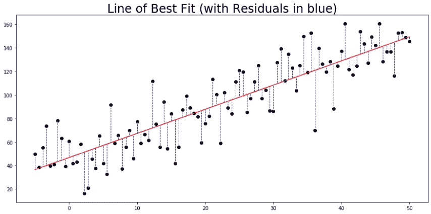
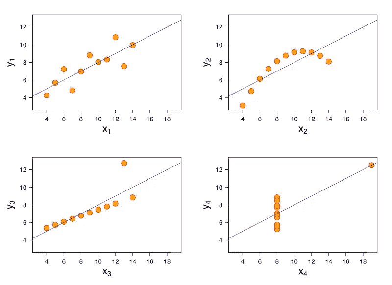

# 线性回归简介

> 原文：<https://medium.com/analytics-vidhya/intro-to-linear-regression-eadc111a4596?source=collection_archive---------21----------------------->

线性回归是所有预测模型的始祖。两个世纪过去了，它的魅力在很大程度上被它的后代所掩盖，但它的相关性并没有减少——或者说用处没有减少。那么什么是线性回归呢？

首先，它看起来有点像这样

线性回归通过用线性方程拟合数据来模拟变量之间的关系。这种熟悉的可视化是通过散点图绘制的“最佳拟合线”。该线是“最佳拟合”的，因为它尽可能地接近散点图中的所有点，同时仍然符合线性方程(形式为 y = a + bx)。

有许多不同类型的线性回归，它们在如何定义“尽可能接近散点中的所有点”上有很大的不同，但原始和最重要的形式是**普通最小二乘法(OLS)** 。

OLS 通过找到最小化均方误差(MSE)的线性方程来计算直线。MSE 正是 tin 上显示的内容:对于每个点，到最佳拟合线的垂直距离就是误差(或“残差”)，MSE 的计算方法是取这些误差中的每一个，对它们求平方，然后求平均值。当你找到能给出最低 MSE 的线性方程时，你就有了线性回归。幸运的是，这个过程很容易自动化，很少需要手动完成。

然而，线性回归确实需要对数据进行某些假设。可以用手助记线+I 来记住这些假设:

*   线性:数据需要看起来像一条线，或者即使是最佳拟合的线也不会拟合得很好。
*   误差的独立性:误差(点与线的垂直距离)不能有任何明确的趋势或彼此之间的关系。
*   误差的正态性:误差应服从正态分布；也就是说，他们不应该有这样或那样的偏见。
*   方差相等:误差在图中应该有大致相同的方差。如果它们随着你的前进而一致变大，你就有问题了。
*   预测因子的独立性:这一条只适用于多元线性回归(使用多个变量作为预测因子的回归)，因此+I .它只是意味着用作预测因子的变量不能彼此相关。这个假设几乎总是至少有一点被违反(事实上，真空中不存在任何东西)，但它越成立越好。

虽然您仍然可以在不满足假设的情况下进行线性回归，但这通常是一个非常糟糕的想法。要知道为什么，看看这四个情节，著名的安斯科姆四重奏:

休斯顿，我们有麻烦了

这里的问题应该很清楚。尽管四个数据集具有几乎相同的汇总统计数据，并返回相同的最佳拟合线，但该线只是第一个数据集的合理近似。其他三个违反了各种线假设(这里没有+I，因为它只是一个简单的线性回归)，线性回归返回的结果是误导性的——比没有更糟。

仅仅因为回归工作并不意味着它给你任何有用的东西！然而，请记住 LINE+I 假设，线性回归非常有效。它存在了两百年是有原因的，尽管它可能不像神经网络那样耀眼，但我们将它弃之不顾是非常不妥的。有时候，越简单越好。