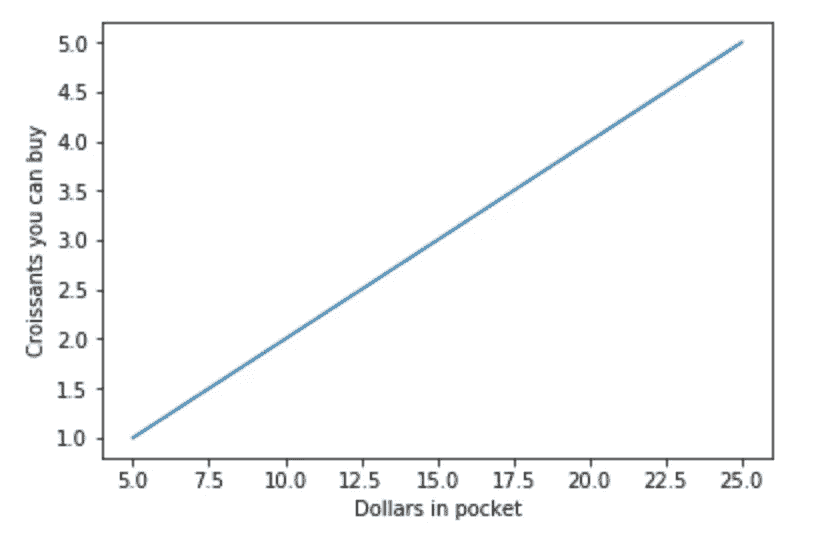

# Sklearn 线性回归简介

> 原文：<https://medium.com/analytics-vidhya/intro-to-linear-regression-using-sklearn-9b280f1649b2?source=collection_archive---------1----------------------->

## 通过真实的例子和代码学习线性回归

线性回归模拟了输入(或多个输入)变化时输出如何变化。并假设这种关系遵循直线。

Scikit-learn 是一个易于使用的 Python 机器学习库，所以我们将使用它来说明我们讨论的例子。