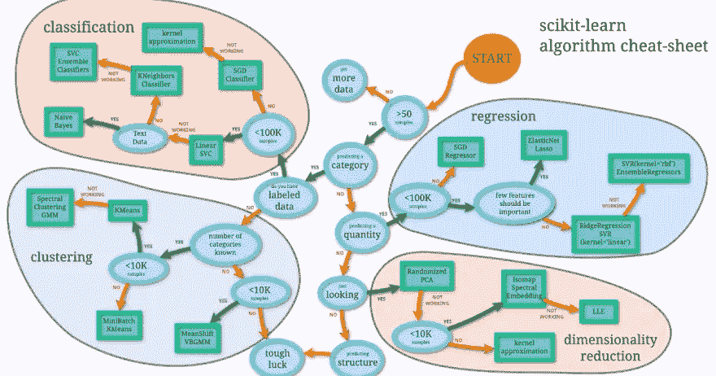
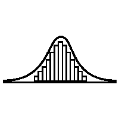

# Python 中的机器学习简介:第一部分

> 原文：<https://medium.com/analytics-vidhya/intro-to-machine-learning-in-python-part-i-ae109dcd4eb0?source=collection_archive---------12----------------------->

在真正了解了数据框管理的来龙去脉以及 Python 中数据科学的其他方面之后，我一直不愿意进入机器学习领域，担心没有时间投入其中并达到我想要的效果。就像有时候你必须做的事情一样。所以我们开始吧。

# 出发点

我开始的地方是监督学习，这基本上意味着有已知的输入和输出，你只是修改模型的参数来预测未来的结果。这方面的一个例子是正面和负面的电影评论

我在 Jupyter 中用 Python 中的 scikit-learn 库做这项工作，它已经有了算法，这使得拟合模型、分割测试和训练数据等变得更加容易。

# 线性回归

线性回归是相关性之后的一步，它是当我们试图通过拟合模型来预测一个值，从而对两个变量之间的关系进行建模。

在机器学习中，有一些基本的算法，很难决定哪种模型最适合你的数据。这张备忘单给了你一个很好的指南，告诉你应该根据你的数据做什么。

图片由 sci-kit learn 提供

# 使用我们的数据

所以第一件事是我们需要数据来建立一个模型。当你有现成的数据时，首先要做的是分析你正在处理的东西。

第一步是获取数据并将其设置到数据框中。我们可以通过使用“pd.read_csv('YourData ')”或任何类型的文件来读取数据。创建此数据框将使我们能够更深入地了解我们需要对模型做些什么。

# 分析我们的数据

首先查看数据的一个好方法是使用。描述()和。columns 方法来查看列名和关于它们的一些附加信息。

通过导入 Python 中的 Seaborn，我们可以使用“SNS . pair plot(YourDataFrame)”
来很好地了解数据的分布情况。

正态分布数据示例(图片由作者提供)

之后，我们可以通过使用“sns.heatmap(df.corr()，annot=True)”来查看我们数据的热图以及它们之上的相关性，从而查看我们数据的相关性。1 表示它们彼此完全相关。

最后，在分析我们的数据时，我们需要选择我们想要预测的内容，这样我们就可以选择我们想要预测的列，并使用“SNS . distplot(YourDataFrame[' column name '])”来绘制该列的分布图。应该是像我上面说的正态分布。

# 结论

在这篇文章中，我主要谈论了我在机器学习中的第一天，主要是线性回归和分析你的数据，为拟合它做准备。我的下一个帖子应该更多地是关于实际的 ML 和训练，测试和拟合我们的模型！

*最初发布于 2020 年 11 月 11 日*[*https://dev . to*](https://dev.to/berett21/machine-learning-in-python-day-1-22m0)*。*