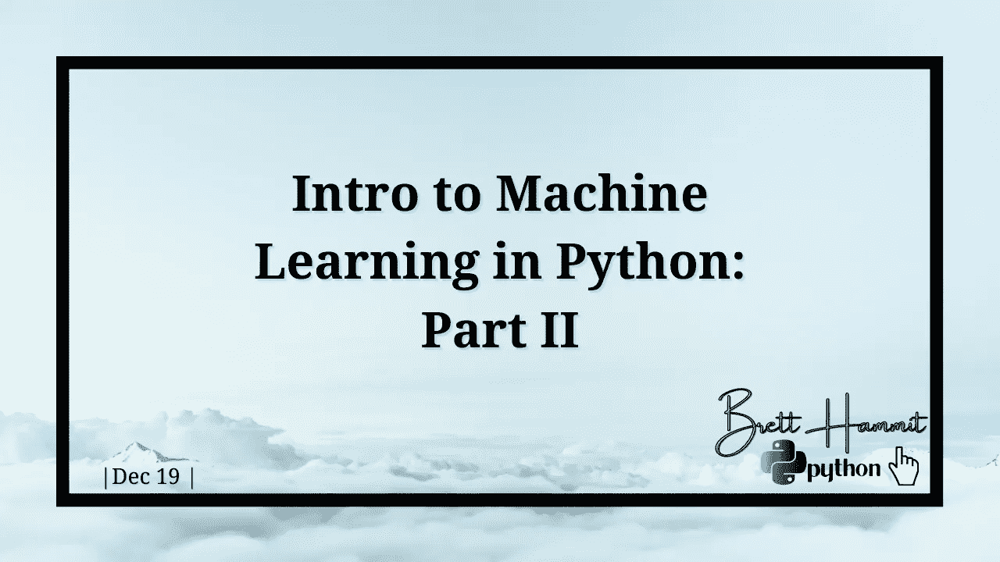
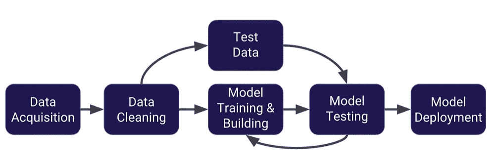

# Python 中的机器学习简介:第二部分

> 原文：<https://medium.com/analytics-vidhya/intro-to-machine-learning-in-python-part-ii-d91adb74324f?source=collection_archive---------27----------------------->



作者图片

# 目录

1.  机器学习摘要
2.  拆分数据
3.  培训和测试数据
4.  创建和训练模型
5.  专心致志的

在《Python 中的机器学习导论:第一部分》中，我们讨论了什么是线性回归，如何分析我们拥有的数据，然后如何绘制一些可视化图形，让我们更好地理解数据及其相关性。在这篇文章中，我们将讨论什么是机器学习，以及如何分割、训练、测试数据并拟合我们的模型。让我们开始吧！

# 机器学习摘要

简单地总结一下机器学习，你可以说我们给 AI 提供了大量的数据，它使用统计数据根据我们给它的数据做出预测。这是通过我们在第一篇文章中讨论的各种算法实现的。机器学习以各种不同的方式使用，其中一个例子是赌博网站使用机器学习模型来设置不同赌注的界限，使它们尽可能准确。

机器学习的步骤通常是首先收集数据，清理数据，将大部分数据放入训练数据中，然后将其余数据放入测试数据中，从那里我们进入模型测试，最后将模型部署到现实世界的应用程序中。看起来像这样:



作者图片

既然我们对什么是机器学习有了一个概念，我们就可以进入如何做线性回归的第一步，即拆分数据。

# 拆分数据

正如我在第一部分中提到的，我正在 Python 中使用 scikit-learn 包。因此，为了能够分割数据，我们需要首先将数据设置为 x 和 y 数组。y 数组将包含我们试图预测的内容，而 x 数组将包含我们数据框中的所有其他非文本数据。线性回归不适用于文本数据，除非是自然语言处理，这是我希望在机器学习之后进入的领域。您可能想很好地查看所有的列名，所以为了方便起见，我调用了一个排序列表来查看所有的列名。要在代码中完成所有这些工作，代码应该是这样的:

```
sorted(df)

y=df['ColName']
X=df['ColName','ColName','ColName','ColName']
```

既然我们已经将数据分成了适当的数组，我们就可以开始训练和测试我们的数据了。

# 培训和测试数据

训练和测试我们的数据非常简单，我们只需要从 scikit 学习包中导入 train_test_split 方法。完成此操作后，我们将测试和训练如下所示的数据:

```
from sklearn.model_selection import train_test_split

X_train, X_test, y_train, y_test = train_test_split(X, y, test_size=0.3, random_state=101)
```

这是为了确保我们同时训练和测试 x 和 y 数组中的数据。test_size 参数是放入测试数据的数据量。通常，30%用于测试数据，70%用于训练数据，但这可能会因模型而异。为了更清楚起见，例如在上面的代码中，我们给出了 1.0 中的 0.3，这意味着 0.7 将进入训练数据。random_state 参数是我们的数据中随机分裂的数量。

我们现在已经成功拆分了数据，然后对其进行了训练和测试。下一步是开始训练我们的模型！

# 创建和训练模型

为了创建和训练模型，我们将:

*   从 sklearn 导入线性回归
*   将线性回归转换为 lm，以便于我们调用
*   拟合模型，同时将我们的训练数据传递给它

执行这些任务时，代码将如下所示:

```
from sklearn.linear_model import LinearRegression

lm = LinearRegression()

lm.fit(X_train,y_train)
```

拟合模型所做的是，我们给模型提供数据，以便它明确地知道它正在处理的内容和要使用的工具。拟合后，它显示了机器学习算法的估计器参数以及它们的设置。这些可以被改变来微调你正在制作的模型。如果您想真正微调您的模型或了解更多关于线性回归的深度，这个[链接](https://scikit-learn.org/stable/modules/generated/sklearn.linear_model.LinearRegression.html)将带您到 scikit-learn 的线性回归文档。

# 专心致志的

恭喜你。我们现在已经完成了创建线性回归模型的所有框架！复习我们所学的内容:什么是机器学习，如何分割训练和测试数据，以及如何创建和拟合线性回归模型！现在我们已经创建了我们的模型，我们需要分析和评估我们创建的模型，这将在本系列的第三部分中分享！

感谢你抽出时间来阅读这篇文章，如果你喜欢它，请给我一个赞或评论，告诉我你喜欢或不喜欢什么，或者有任何问题或话题，你可能想听听接下来的内容！