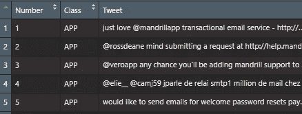

# 使用 R 的朴素贝叶斯简介

> 原文：<https://medium.com/analytics-vidhya/intro-to-naive-bayes-using-r-5b6f7072a399?source=collection_archive---------12----------------------->

在这篇文章中，我将使用约翰·w·福尔曼的精彩著作[‘数据智能’](https://www.amazon.com/Data-Smart-Science-Transform-Information/dp/111866146X/)中的数据来提出一个文本分类问题。他的书向你展示了使用 Excel 的基础数据科学算法的每一步，但是他在最后有一章解决了 R 中的一些问题，第三章中的 Tweet 分类在 R 中没有显示，所以我将在这里使用基本的 R 代码一步一步地进行，这样你就可以理解 naive bayes 中正在发生的事情，而不是仅仅使用一个包并期望最好的结果。如果你是机器学习的学生，试着不要只依赖软件包。相反，练习分解算法，甚至编写自己的算法。这将使您对算法的来龙去脉有更深入的了解，并阐明算法的不同之处，不同的参数代表什么，以及为什么有些算法运行更快或精度更高。

# 基础知识

朴素贝叶斯是一种简单有效的事物分类方法。如果你在 twitter 上搜索“美洲虎”，你会得到与这种动物、一支足球队和汽车制造商等许多其他主题相关的推文。你可以使用朴素贝叶斯来区分关于美洲虎和其他动物的推文，就像一个决定垃圾邮件和非垃圾邮件的邮件过滤器。您可以分析电影评论的文本，并确定评论者是否会推荐它。请记住，朴素贝叶斯并不仅限于两个分类组。

我将使用的数据集来自出版商的网站，Wiley.com。它有包含“山魈”一词的推文。目标是区分关于 Mailchimp 公司的应用程序的推文和关于其他任何东西的推文。人们显然在推特上谈论一个叫 Mandrill 的乐队和 Megaman 中一个叫这个名字的角色。


图片来自维基百科用户 Katma0601

在不进行推导的情况下，我们将用来计算一个单词在某个组中的概率的基本等式是:

p(app)* p(word 1 | app)* p(word 2 | app)…

我们将为我们的两个小组这样做:app 和其他。哪个概率更高将是我们如何做出分类决定。我们将采用概率的自然对数，因为它们可能是非常小的数字。推文中使用了许多不同的词，其中很少会重复。取自然对数将允许我们对概率求和。

你可能听说过贝叶斯定理，并想知道“幼稚”的部分从何而来。增加这个术语是因为我们假设单词是相互独立的。这样，我们在思考这个过程时，就好像我们把每个单词都写在一张便笺上，然后随机选择。就像上面提到的美洲虎这个词，例如:足球队被称为杰克逊维尔美洲虎队，所以有很多例子表明“美洲虎”跟在“杰克逊维尔”后面。我们暂时忽略这一点，并作出独立的天真假设。佛罗里达州杰克逊维尔可能有美洲虎经销商，但根据维基百科，美洲虎从史前时代就没有在佛罗里达州出现过，所以如果你看到杰克逊维尔这个词，你可以相当肯定这是关于足球队的。即使有了我们的独立性假设，这也应该是可行的，只是与忽略独立性假设或使用两个词的组合相比，效率要低一些。所有这些简化使得算法易于编程并且运行非常快。

# 家政

载入文本数据后的第一件事是清除标点符号之类的东西。我们也将把一切都变成小写，因为像'电子邮件'和'电子邮件'没有不同的意思。在 Data Smart 一书中，作者删除了少于四个字符的单词，作为一种快速删除“停用词”的方法，如 the、a、In 等。这当然仍会保留“with”和“these”等单词，这些单词似乎不会为我们的分类决策添加太多信息。决定是否删除停用词，然后如果你决定删除，那么决定哪些是进一步完善你的程序的方法。

开始时，我将数据集分成三个文件:TweetsOnMandrill.csv、TweetsNotMandrill.csv 和 tweetstoevidentificamandrill . CSV

```
IsMandrill<-read.csv("TweetsOnMandrill.csv", header = FALSE)
IsMandrill[,1]<-tolower(IsMandrill[,1]) #convert all words to lowercaseIsMandrill[,1]<-gsub("[.] ", "", IsMandrill[,1], fixed = TRUE) #remove a period with space after
IsMandrill[,1]<-gsub("[.]", "", IsMandrill[,1], fixed = TRUE)  #remove period
IsMandrill[,1]<-gsub(": ", "", IsMandrill[,1], fixed = TRUE) #remove a colon with space after
IsMandrill[,1]<-gsub("?", "", IsMandrill[,1], fixed = TRUE) #remove ?
IsMandrill[,1]<-gsub("!", "", IsMandrill[,1], fixed = TRUE) # remove !
IsMandrill[,1]<-gsub(";", "", IsMandrill[,1], fixed = TRUE) #remove ;
IsMandrill[,1]<-gsub(",", "", IsMandrill[,1], fixed = TRUE) #remove ,
IsMandrill<-gsub("\"", "", IsMandrill) #turns dataframe into a character vector
IsMandrill<-gsub(",", "", IsMandrill)IsMandrill<-as.vector(strsplit(IsMandrill, split=" ")) #split by spaces we now have a list of tweets
IsMandrill<-as.data.frame(sort(table(IsMandrill), decreasing = TRUE))
#he drops words of length 0,1,2, and 3 as an easy stop word filter
IsMandrill<-IsMandrill[which(nchar(as.character(IsMandrill[,1]))>3),]
```

我现在有一个“单词袋”。一长串单词，很难区分一条推文在哪里结束，另一条在哪里开始。此时，我想做的就是计算某些单词出现的次数。有了单词的总和，就可以计算出每个单词的概率。由于我们采用自然对数，我们将对每个单词加 1 计数，这样以后如果我们遇到一个计数为零的单词，我们就不会因为采用零对数而出现错误。

```
IsMandrill$Freq<-IsMandrill$Freq+1 #upping each count by 1 in preparation for taking the log
IsMandrill$Prob<-IsMandrill$Freq/sum(IsMandrill$Freq)
IsMandrill$LnProb<-log(IsMandrill$Prob)
```

回去对包含关于曼德拉的推文*而不是*的文件做同样的处理。您将清理测试推文，但不需要创建数据帧，因为我们将逐个分析每个推文。为清晰起见，我将我的数据框命名为“IsNotMandrill”和“TestMandrill”。确保检查您的测试 tweets 文件，以防您需要删除标识它们属于哪个类的列。

# 开始计算

此时，我们有显示单词、计数和相关概率的数据框。例如,“伊斯门迪尔”数据框如下所示:


以及来自测试 mandrill 数据集的清理过的 tweets:



为了进行计算，我们将遍历每个测试 tweet，将其分解为每个单词，然后在 IsMandrill 和 IsNotMandrill 数据帧中查找概率。然后，我会找出这条推文的每种可能性的总体概率，并将其提交到一个数据框架中。下面，您将看到一个 if 语句循环中的循环示例，该语句处理测试 tweet 中的单词没有出现在某个查找数据帧中的情况。

```
#loop through the 20 labelled test tweets, break into separate words and form together as a list of words

TestMandrillList<-list() #initializing a list
for (i in 1:20){TestMandrillList[i]<-as.vector(strsplit(TestMandrill[i,3], split=" "))}probs<-matrix(data=0, ncol= 2)
PredvTruth<-data.frame()for (j in 1:20){ probs<-matrix(data=0, ncol=2, nrow = length(TestMandrillList[[j]]))
    for (i in 1:length(TestMandrillList[[j]])){
  row<-which(IsMandrill$IsMandrill==TestMandrillList[[j]][i]) 
  if (length(row) == 0L) #this if loop takes care of the situations in which the word in the test tweet is not in the lookup table, for example the 7th and 11th words in the first test tweet.
    probs[i,1]=log(1/2419) else probs[i,1]=IsMandrill[row,4] #this looks up the lnProb of the test tweet word
} 
    for (i in 1:length(TestMandrillList[[j]])){
  row<-which(IsNotMandrill$IsNotMandrill==TestMandrillList[[j]][i]) 
  if (length(row) == 0L) 
    probs[i,2]=log(1/2021) else probs[i,2]=IsNotMandrill[row,4]    
} 
  if (abs(sum(probs[,1]))>abs(sum(probs[,2]))) PredvTruth[j,1]="OTHER" else PredvTruth[j,1]="APP"
}#if a word is not found, it is given a count of 1,
#which would correspond to a probability of 1/(sum of counts), then categorized if app or not
#sum(IsMandrill$Freq) is 2419, so log(1/2419) or 
#sum(IsNotMandrill$Freq) is 2021, so so log(1/2021) will be the log odds used for words that don't show up.
```

最后，我们有了我们的预测。我们将把该列数据绑定到测试 tweets 文件中给我们的类别。然后，我们可以计算该行匹配的次数，这表明预测是正确的。

```
PredvTruth<-cbind(PredvTruth, TestMandrill$Class)
colnames(PredvTruth)<-c("Prediction","Reality")paste("Accuracy is", length(which(PredvTruth$Prediction == PredvTruth$Reality))/.20, "%")paste("Here is the tweet where we did not get it correct:")
TestMandrill[which(PredvTruth$Prediction != PredvTruth$Reality), 3]
```

输出告诉您准确率为 95%(20 个中有 19 个正确)，与书上的一样。你也看到了被错误分类的推文:

> 2 岁的小山魈 jj 在想什么呢？http://ow.ly/jfrqf 在推特上加上你的说明。

这被错误地归类为关于应用程序，而它只是关于一只山魈的照片。

这个程序的进一步改进可能是尝试停用词删除或实现停用词删除列表。您也可以尝试探索使用两个单词组合对准确性的影响。