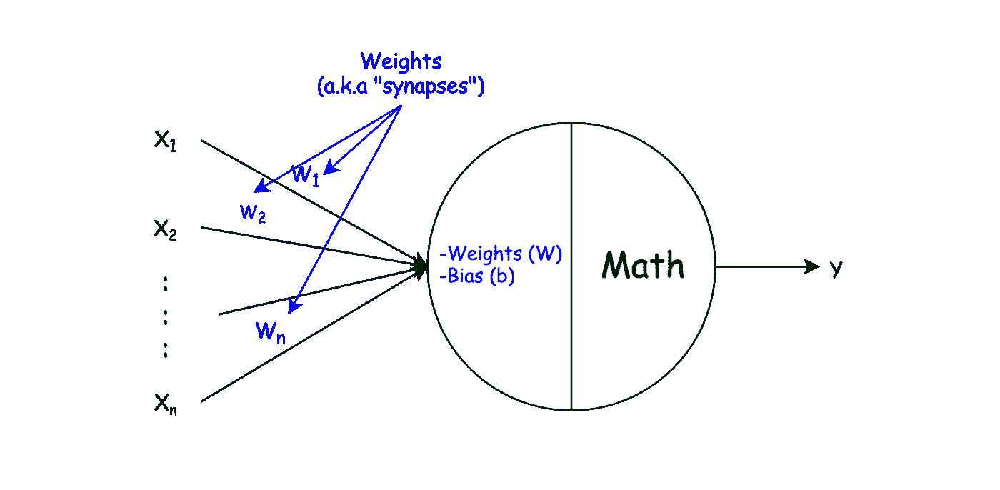

# 神经网络导论

> 原文：<https://medium.com/analytics-vidhya/intro-to-neural-networks-a12e7309e57a?source=collection_archive---------34----------------------->

学习神经网络通常看起来很困难，因为里面使用了大量的数学和术语。然而，要开始，最好先理解基本概念，而不要深究底层数学和神经网络的不同变体。在本文中，我们将通过这些基本概念来了解什么是神经网络，为什么我们需要它，以及它是如何工作的。

# 为什么要使用神经网络？

通常，软件工程师使用算法方法解决问题。

然而，有时很难甚至不可能为某些类型的问题编写算法，如图像分类、语音识别等。神经网络出现了。

## **算法方法**

你指定规则(算法)，然后得到结果(答案)

算法逼近

## **神经网络方法**

您提供现有的结果(示例)来获取规则

神经网络方法

> 在引擎盖下，神经网络仍然使用许多不同的算法来完成它的工作。

# 神经网络入门

为了了解什么是神经网络，让我们先了解一下我们的大脑活动是如何工作的。

人类大脑活动如何运作的一般概念

> 许多深度学习专家不喜欢“大脑”和“神经网络”的比较，因为人脑是一个复杂得多的系统，即使现在也没有完全理解。
> 
> 然而，为了便于理解，我们将使用这个非常简单的比较。

神经网络如何工作的一般概念

显然，类似于大脑的神经网络是由单个神经元组成的。

让我们更深入地了解一下什么是单个神经元。

# 什么是神经元？

## 生物神经元

生物神经元简化视图

我们感兴趣的生物神经元的关键特征是:

*   **树突**——接收电信号
*   **胞体** —改变/修改信号
*   **轴突**——将信号传递给其他神经元
*   ***突触***——一个神经元的轴突连接到另一个神经元的树突的连接点

> “普通人的大脑大约有 860 亿个神经元和更多的神经胶质细胞”**——**[https://human-memory.net](https://human-memory.net/brain-neurons-synapses/)

因此，根据突触中的连接强度，来自一个神经元的信号在传递到另一个神经元时会增加或减少。

## 人工神经元

神经网络中的神经元表示

> 值得一提的是，神经元只是一个概念，神经网络的底层实现可能不包含作为对象/类的确切神经元。

所以如果把它比作生物神经元，那么:

*   **X**——和输入数据(也称为树突接收的信号)
*   **权重&偏向**——神经元之间连接的强度(又称突触)
*   **数学** —修改 X、权重和偏差的算法，以获得一些输出 Y(也称为细胞体)
*   **Y** —一个输出值(也称为传递给 axon 的信号)

与生物神经元相比，人工神经元只是一个单元，它:

*   有一个名为**的数字数组，对应于每个输入(x)的权重**
*   有一个常数**偏差**
*   有一个底层的数学算法**，它决定如何将输入数据转化为输出数据**

# 什么是神经网络？

令人惊讶的是，神经元的上述表示本身就是最小的可能的神经网络，称为**感知器**。感知器甚至可以对简单的线性模式进行分类。

然而，对于更复杂的问题，例如检测图像中是否包含猫，需要更多的神经元。

> 然而，准备输入数据和解释输出数据仍然是你身上的一堆算法。
> 
> 例如，图像识别首先通过将图像转换成像素阵列(向量)来完成。然后你通过神经网络运行你的像素，得到一些输出数据，然后你把这些数据解释为一些有意义的答案:

神经网络示例

第一个问题是，我们的神经网络如何知道如何改变输入，以便获得正确的输出？答案是，最初不会。

为了得到正确的答案，我们需要训练一个神经网络。

# 训练神经网络

简而言之，神经网络的整个训练过程就是为每一层中的每个神经元找到正确的 ***权重*** 和 ***偏差*** 值，从而开始得到正确的结果。

为了训练，首先，我们需要一些例子。在我们的例子中，我们需要大量的猫和非猫的图片。

神经网络训练过程

*   **参数初始化** —初始化**权重**和**偏差**。通常，这是一个随机的初始化，需要一点数学计算。
*   **正向传播**——使用一些数学知识猜测答案的过程
*   **反向传播** —根据猜测答案和正确答案使用某种数学方法调整参数的过程

> 除非你要发明**参数初始化**、**前向&后向传播**的新技术，否则所有的数学都是一堆公式&算法，在 google 里都能找到。
> 
> 此外，几乎所有的深度学习框架，如 [TensorFlow](https://www.tensorflow.org/) ，都已经有很多预定义的实现，你不必自己编写数学部分。然而，为了更好地理解神经网络，建议尝试实现自己。

除了上述步骤之外，神经网络的性能(答案的正确性)还取决于以下因素:

*   初始化算法
*   层数
*   每层的激活函数(算法)
*   每层中的单元(神经元)数量
*   培训示例的数量
*   训练过程中的迭代次数(“向前”和“向后”传播的次数)
*   学习率，在每次迭代的参数更新步骤中使用的常数
*   和其他特定于神经网络架构的决策

# 使用神经网络

在神经网络训练之后，你最终得到的所有信息，例如有多少层，每层有多少个单元(神经元)，每层使用哪个激活函数，调整后的权重和偏差，一起被称为**模型**。

所以，使用具有真实数据的神经网络只是取那个模型并运行通过 ***前向传播*** (猜测)以便得到并输出(答案)。

# 更进一步

以上只是对神经网络及其工作原理的概述。

然而，有不同类型的神经网络，不同的架构和基础算法。每种类型都有自己的优缺点，用于解决不同类型的问题。以下是一些常见的例子:

*   **卷积神经网络**(**CNN**)——通常用于分类问题，如图像处理、计算机视觉、语音识别等
*   **递归神经网络** ( **RNN** ) —在上下文重要时使用，如翻译、文本到语音、语法检查等自动建议
*   和许多其他人…

# **总结**

所以，**神经网络**就是改变输入来获得一些输出。然而，我们并不为如何改变输入编写规则，而是向神经网络展示大量的例子，并依靠数学来获得规则。然后我们用真实的例子来使用后者。

希望你已经对神经网络有了大致的了解。然而，为了成为深度学习专家并解决现实世界的问题，你需要一点耐心，至少需要基本的微积分知识，最重要的是在练习解决问题的同时保持学习。

越来越多的文章与这个话题相关。

关注以获得通知:

*   从头开始构建感知机
*   从头开始构建深度神经网络