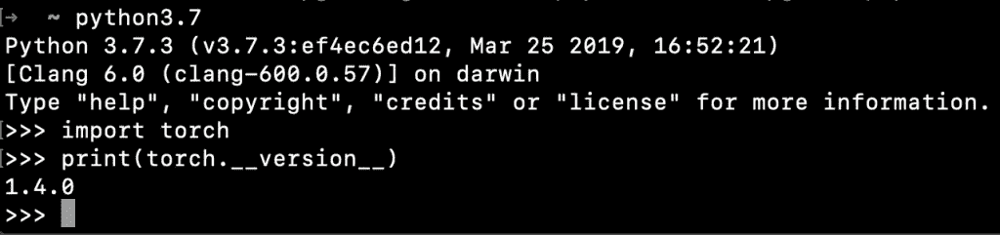

# PyTorch(广泛使用的深度学习平台)简介

> 原文：<https://medium.com/analytics-vidhya/intro-to-pytorch-widely-used-deep-learning-platform-d03fe804ac4e?source=collection_archive---------21----------------------->

# 让我们看看 PyTorch 是什么？

PyTorch 是一个基于 python 的科学计算包。它允许我们使用图形处理单元(GPU)来提高数学计算的速度，否则将在 CPU 上完成。与 TensorFlow 相比，PyTorch 的速度非常快。python 中有许多其他库可以改变深度学习和计算机视觉任务的性能，但 PyTorch 优于所有这些库。

# PyTorch 的历史

PyTorch 于 2016 年推出。它是由脸书经营的。脸书还运营 Caffe2(用于快速整合资源的卷积架构)。将 PyTorch 定义的模型转换成 Caffe2 是一个挑战。为此，脸书和微软在 2017 年 9 月发明了开放式神经网络交换(ONNX)。简单来说，ONNX 是为了在帧之间转换模型而开发的。Caffe2 于 2018 年 3 月在 PyTorch 合并，这有利于构建极其复杂的神经网络。

这个特性很快使一个库变得可访问。在研究工作中，她向 TensorFlow 提供了强有力的竞争。PyTorch 的发明者希望创建一个高度强制性的库，可以轻松地执行所有的数值计算，并最终发明了 PyTorch。对于深度学习科学家、机器学习开发者和神经网络调试器来说，实时执行和测试一些代码是一个巨大的挑战。PyTorch 完成了这个挑战，并允许他们实时执行和测试他们的代码。因此，他们不必等着看它是否有效。

# 装置

PyTorch 官网链接:【https://pytorch.org/ 

**在窗户上安装 py torch**

PyTorch 网站为 windows 系统提供了以下命令。PyTorch 支持 Windows 7 或更高版本，使用 Python 3 或更高版本。使用 Anaconda 安装它非常简单，几分钟就可以完成。

下一步是将下面的命令粘贴到 Anaconda 提示符中并运行它。

`conda install pytorch torchvision cpuonly -c pytorch`

提示符将列出所有将与 PyTorch 一起安装的依赖项。如果可以继续，请在命令行中键入 yes。

Anaconda 现在继续安装。您可以稍后通过 Python 解释器或 Jupyter 笔记本来检查安装。

**在 Linux 上安装 py torch**

如果您从 Linux 机器上打开相同的安装页面，您会注意到生成的命令将是不同的。

下一步是将命令复制并粘贴到您的终端中，然后运行它。

`conda install pytorch torchvision cpuonly -c pytorch`

终端会询问您是否允许安装/更新软件包。你需要按下 **yes** 作为回应。

安装程序现在会继续将 torch 和 **torchvision** 包安装到您的环境中。

# 在 Mac OS 上安装 PyTorch

我们将使用 PIP 在 Mac OS 中安装 PyTorch。我们只需要在 PyTorch 主页上选择适当的选项来获得安装命令。

因此，我们必须运行以下命令在 Mac OS 上安装 PyTorch 和 torchvision 库。

`$ pip3.7 install torch torchvision`

下面是执行上述命令时终端的输出。

输出的最后一行清楚地表明 torch 和 torch-vision 包都已成功安装。

让我们启动 Python 3.7 解释器并打印 torch 版本以确认安装成功。

# PyTorch 最佳参考书/课程

1.  PyTorch 深度学习(伊莱·史蒂文斯、卢卡·安提卡和托马斯·维赫曼著)
2.  PyTorch 深度学习实践(Sherin Thomas 和 Sudhanshu Passi 著)
3.  用 Python(Udemy)进行深度学习的 PyTorch
4.  使用 PyTorch 的深度神经网络(Coursera)
5.  PyTorch 机器学习简介(Udacity)

# PyTorch 中的卷积神经网络项目

我们在这个系列中使用 PyTorch 处理的第一个项目是构建一个卷积神经网络，用于对手写数字数据集中的图像进行分类。

手写数字分类

MNIST 数据库包含 60，000 幅训练图像和 10，000 幅测试图像。我们将使用 PyTorch 构建一个卷积神经网络，它可以在给定一个数字的输入图像的情况下准确预测正确的数字，敬请关注！

让我们准备好推进深度学习和神经网络。我们在那里见！

# 参考

1.  [https://en.wikipedia.org/wiki/PyTorch](https://en.wikipedia.org/wiki/PyTorch)
2.  [https://pytorch.org/deep-learning-with-pytorch](https://pytorch.org/deep-learning-with-pytorch)
3.  [https://www.kaggle.com/rahulsingh731/pytorch-basics](https://www.kaggle.com/rahulsingh731/pytorch-basics)