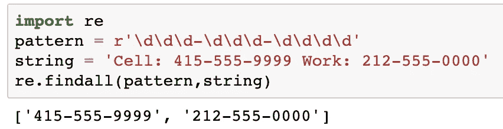

# Python 中的正则表达式和强密码检测简介

> 原文：<https://medium.com/analytics-vidhya/intro-to-regexes-strong-password-detection-in-python-2138fc3cf8bf?source=collection_archive---------4----------------------->

照片致谢:[恶意软件字节数](https://blog.malwarebytes.com/security-world/technology/2018/08/explained-regular-expression-regex/)

## 从头开始构建一个密码检测器

正则表达式(或称 Regexes)不仅对软件用户，而且对程序员和数据科学家来说都是巨大的省时工具。科技作家科利·多克托罗认为，即使在学习编程之前，我们也应该学习正则表达式:

> “了解[正则表达式]可能意味着用三个步骤解决一个问题和用 3000 个步骤解决一个问题的区别。当你是一个书呆子时，你会忘记，你用几个按键就能解决的问题，可能会让其他人花上几天冗长乏味、容易出错的工作去费力完成。”

正则表达式是一种用于指定文本模式的小型语言。在本文中，我将简要介绍如何在 Python 中使用正则表达式，并将其应用于创建密码检测器的实际问题。

为了演示掌握正则表达式的基本知识可以节省多少时间，让我举一个例子，说明使用和不使用正则表达式从一串文本中提取电话号码的代码。为了简单起见，让我们假设一个电话是有效的，如果它是 ddd-ddd-dddd 格式的。

不使用正则表达式在文本字符串中打印电话号码的代码。

上面的代码显示了简单地打印一个字符串中的所有电话号码需要多少努力。现在让我们看看正则表达式是如何简化这个问题的:

使用正则表达式在文本字符串中打印电话号码的代码。

太棒了。仅用 3 行代码，我们就成功完成了同样的任务！

希望现在您已经注意到了，让我们来探索如何在 Python 中使用正则表达式。

# Python 中的正则表达式

在我们继续之前，我想解释一下 ***原始琴弦*** 和普通琴弦的区别。

原始字符串和普通字符串的区别

在 Python 中，在字符串开始之前，使用“r”指定原始字符串。它将反斜杠(\)视为文字字符。回想一下 Python 中转义字符使用反斜杠(\)。字符串值' \n '表示单个换行符，而不是后跟小写 n 的反斜杠。

为了指定一个反斜杠后跟一个小写的 n，需要输入转义符' **\\** '来打印一个反斜杠，后跟' **n** '。因此，' **\\n** '是表示反斜杠后跟小写字母' n '的字符串。但是，通过在字符串的第一个引号前插入一个' **r** '，可以将该字符串标记为不转义字符的原始字符串。

Python 有一个内置模块来处理名为 ***re*** 的正则表达式。现在让我们探索一下 *re* 模块中的一些常用方法:

*   ***re.match(pattern，string)*** :匹配在字符串的**开头**处指定的模式，如果模式存在则返回 match 对象。否则，它返回“无”。

由于 re.match 的输出是一个 match 对象，我们可以使用 *group()* 方法返回匹配的表达式。

或者，您也可以使用将模式作为参数的***re . compile(pattern)***函数单独指定一个模式。

*   ***re.search(pattern，string)*** :只匹配字符串中第一次出现**的模式**。

*   ***re.findall(pattern，string)*** :返回字符串中搜索到的模式的所有出现**(列表格式)。**

这比前两种方法更有效，也是我更喜欢使用的一种方法。

*   ***re(pattern，replacement，string):*** 返回通过用*替换*替换字符串中出现的模式而获得的字符串。如果没有找到模式，则返回原始字符串。

# 元字符和特殊序列

一般来说，正则表达式可以使用 ***元字符*** 和 ***特殊序列*** 的组合来指定。

[元字符是正则表达式引擎以特殊方式解释的字符](https://www.programiz.com/python-programming/regex)。以下是常用元字符的列表:

**【】。^ $ + ?{} () \ | .**

## 方括号[abc]

方括号匹配字符串中括号之间的任何字符(如 *a、b 或 c* )。

在上面的三个示例中，字符串 1 返回两个匹配项，字符串 2 返回四个匹配项，最后一个字符串没有匹配项(因为字符串 3 中没有字母 a、b 或 c)。

请注意:

*   元字符，如" **[]。^ $ + ?{} () \ | ."**失去方括号内的含义。例如，[(*+)]将匹配文字字符'['，'('，' * '，'+'，')'或']'的任何实例。

## 句号(。)

句点匹配任何一个字符，除了换行符(\n)字符(类似于一个 [*通配符*](https://en.wikipedia.org/wiki/Wildcard_character) 字符)。

## 脱字符号(^)

脱字符号检查字符串**是否以某个字符开始**。

## 美元

美元符号检查字符串**是否以某个字符结束**。

超时，在插入符号和美元符号之间，很容易忘记哪个先出现。我发现一个很有用的助记法是“胡萝卜要 10 美元！”。

## 星号(*)

开始符号匹配其左侧零个或多个出现的图案。

## 加号(+)

加号匹配其左侧模式的一个或多个出现。

## 大括号{}

采用模式 ***r{x，y}*** 这将匹配模式‘r’的至少 x 个和最多 y 个重复。

## 交替|

交替或“或”运算符。假设 A 和 B 是正则表达式，那么 A|B 将匹配包含表达式 A 或 B 的实例。

## 分组()

parantheses()将包含在其中的表达式组合在一起。例如，表达式 *(a|b|c)xy* 将匹配所有包含字符“a”或“b”或“c”，后跟“xy”的实例。

## 问号？

问号符号匹配其左侧零个或一个出现的图案。

## 反斜杠\

反斜杠用于转义各种字符，包括所有讨论过的元字符。通过‘escape ’,我们的意思是它将调用下一个字符。例如，$a 将匹配带有“$”后跟“a”的实例，并且不会被 regex 引擎以特殊方式解释。

但是，有一些特殊的序列*，正则表达式引擎会以一种特殊的方式进行解释。特殊序列使得常用的模式更容易编写。其中一些是:*

*`\d`*

*匹配从 0 到 9 的任何数字；这相当于`[0-9]`类。*

*`\D`*

*匹配 0 到 9 之间的任何非数字字符；这相当于`[^0-9]`类。*

*`\s`*

*匹配任何空格、制表符或换行符(即空白字符)；这相当于`[ \t\n\r\f\v]`类。*

*`\S`*

*匹配任何非空白字符；这相当于`[^ \t\n\r\f\v]`类。*

*`\w`*

*匹配任何字母、数字或下划线字符(即字母数字字符)；这相当于`[a-zA-Z0-9_]`类。*

*`\W`*

*匹配任何非字母数字字符；这相当于类`[^a-zA-Z0-9_]`。*

*更详细的特殊字符列表可以在[这里](https://docs.python.org/3/library/re.html)看到。*

*注意:*

*   *方括号元字符中接受特殊序列。例如，[\w]将匹配“单词”字符(字母、数字或下划线字符)的任何实例。*

# *复习练习*

*现在让我们使用正则表达式从一串文本中提取一个购物清单。在查看我使用的方法之前，我鼓励您首先使用下面给出的字符串进行尝试:*

**

*使用正则表达式从字符串中提取杂货清单。*

# *密码检测程序*

*利用我们的正则表达式知识，我们现在将构建一个小程序来检测输入密码的强度。*

*密码检测程序*

*密码强度基于 4 个主要检查(如果您愿意，可以随意添加更多检查):*

1.  *密码应该至少有 8 个字符。*
2.  *密码应至少包含一个小写字符。*
3.  *密码应至少包含一个大写字符。*
4.  *密码应至少包含一位数字。*

# *摘要注释*

*到目前为止，本文已经介绍了很多内容。下面简要回顾一下在 Python 中使用正则表达式的[步骤:](https://automatetheboringstuff.com/chapter7/)*

1.  *用`import re`导入 ***正则表达式模块*** 。*
2.  *用`***re.compile()***`函数创建一个`***Regex***`对象。(记得使用原始字符串。)*
3.  *将您想要搜索的字符串传递到`***Regex***`对象的`***search()***`方法中。这将返回一个`***Match***`对象。*
4.  *调用`***Match***`对象的`***group()***`方法来返回实际匹配文本的字符串。*

**

*步骤 1–4 的摘要*

*请注意”。group()"方法没有返回字符串中所有匹配的电话号码。要返回与搜索模式对应的所有匹配文本，我们可以使用" **findall()** "方法:*

**

*findall 方法通过传入两个参数来工作:要搜索的模式和要在其中搜索模式的字符串。*

*请注意，您也可以选择跳过步骤 2、3 和 4，而是直接使用 ***findall()*** 方法。*

*以下是从[这里](https://automatetheboringstuff.com/chapter7/)摘录的这篇文章中所学符号的精彩回顾:*

*   *`?`匹配零个或一个前面的组。*
*   *`*`匹配零个或多个前面的组。*
*   *`+`匹配前面的一个或多个组。*
*   *`{n}`与前一组的 *n* 完全匹配。*
*   *`{n,}`匹配前一组的 *n* 或更多。*
*   *`{,m}`匹配前一组的 0 到 *m* 。*
*   *`{n,m}`与前一组的至少 *n* 最多 *m* 匹配。*
*   *`{n,m}?`或`*?`或`+?`执行前一组的非 greedy 匹配。*
*   *`^spam`表示字符串必须以 *spam* 开头。*
*   *`spam$`表示字符串必须以 *spam* 结尾。*
*   *`.`匹配除换行符以外的任何字符。*
*   *`\d`、`\w`和`\s`分别匹配数字、单词或空格字符。*
*   *`\D`、`\W`和`\S`分别匹配除数字、单词或空格字符以外的任何内容。*
*   *`[abc]`匹配括号之间的任意字符(如 *a* 、 *b* 或 *c* )。*
*   *匹配不在括号内的任何字符。*

# *正则表达式实践*

*如果你想实践在本文中学到的概念，一些有用的资源是 [regex101](https://regexone.com) 和 [regexone](https://regex101.com) 。*

*这篇文章的 Jupyter 笔记本可以在[这里](https://github.com/Akeelahamed17/Articles/tree/master/Regexes)找到。*

*希望你喜欢学习正则表达式，并度过美好的一天！*

*资源:*

* [## Python 正则表达式

### 正则表达式(RegEx)是定义搜索模式的字符序列。比如上面的代码…

www.programiz.com](https://www.programiz.com/python-programming/regex)  [## 用 Python 自动化枯燥的东西

### def is phone number(text):❶if len(text)！= 12:对于范围(0，3)中的 I，返回 False:如果不是文本[i]，则返回❷。isdecimal(): return…

automatetheboringstuff.com](https://automatetheboringstuff.com/chapter7/)  [## 重新正则表达式操作- Python 3.7.4 文档

### 这个模块提供了类似于 Perl 中的正则表达式匹配操作。无论是图案还是字符串…

docs.python.org](https://docs.python.org/3/library/re.html)*