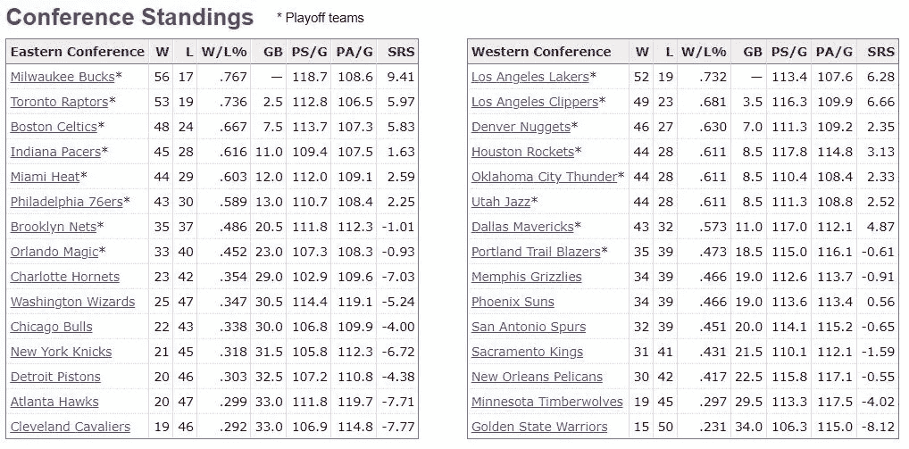

# 收集篮球参考数据简介

> 原文：<https://medium.com/analytics-vidhya/intro-to-scraping-basketball-reference-data-8adcaa79664a?source=collection_archive---------1----------------------->

关于如何用 python 从 https://www.basketball-reference.com/的[](https://www.basketball-reference.com/)**(或任何其他 sports-reference.com 网站)抓取数据的简短教程**

**

*照片由[埃德加·恰帕罗](https://unsplash.com/@echaparro?utm_source=medium&utm_medium=referral)在 [Unsplash](https://unsplash.com?utm_source=medium&utm_medium=referral) 上拍摄*

*Sports-Reference.com 正是体育迷和数据科学汇聚的地方。这是一个巨大的、结构化的干净体育数据仓库。因此，它通常是学术数据科学项目的起点。*

*从体育参考网站，如 basketball-reference.com，很容易抓住一个表。不需要编程，可以复制粘贴甚至“导出为 CSV”。比如你可以从这个页面获取上赛季的 NBA 积分榜:[https://www . basketball-reference . com/league s/NBA _ 2020 _ standings . html](https://www.basketball-reference.com/leagues/NBA_2020_standings.html)*

**

*但是，这并不是很多数据。如果您想从多个页面中聚合数据，以得出关于团队在 5 年、10 年或 50 年中的排名的有意义的结论，该怎么办？(或者以我的情况来说，坦克战是否有助于一支球队进入决赛？)嗯，你可以用 python 和三个库做到这一点。*

*为了说明这一点，我将列举两个例子:*

1.  *抓取一页*
2.  *抓取许多页面并聚合数据*

# *简单的例子:从一个页面抓取数据*

## *导入库并定义您的 URL:*

```
*# needed libraries
from urllib.request import urlopen
from bs4 import BeautifulSoup
import pandas as pd# URL to scrape
url = "[https://www.basketball-reference.com/playoffs/](https://www.basketball-reference.com/playoffs/)"*
```

## *收集 HTML 数据并创建漂亮的汤对象:*

```
*# collect HTML data
html = urlopen(url)

# create beautiful soup object from HTML
soup = BeautifulSoup(html, features="lxml")*
```

## *将列标题提取到列表中:*

```
*# use getText()to extract the headers into a list
headers = [th.getText() for th in soup.findAll('tr', limit=2)[1].findAll('th')]*
```

## *从表中提取行:*

```
*# get rows from table
rows = soup.findAll('tr')[2:]
rows_data = [[td.getText() for td in rows[i].findAll('td')]
                    for i in range(len(rows))]# if you print row_data here you'll see an empty row
# so, remove the empty row
rows_data.pop(20)# for simplicity subset the data for only 39 seasons
rows_data = rows_data[0:38]*
```

## *增加“年数”一栏:*

```
*# we're missing a column for years
# add the years into rows_data
last_year = 2020
for i in range(0, len(rows_data)):
    rows_data[i].insert(0, last_year)
    last_year -=1*
```

## *最后，创建数据帧并导出到 CSV:*

```
*# create the dataframe
nba_finals = pd.DataFrame(rows_data, columns = headers)# export dataframe to a CSV 
nba_finals.to_csv("nba_finals_history.csv", index=False)*
```

# *复杂示例:从多个页面抓取数据*

## *创建循环函数:*

```
*# import needed libraries
from urllib.request import urlopen
from bs4 import BeautifulSoup
import pandas as pd# create a function to scrape team performance for multiple years
def scrape_NBA_team_data(years = [2017, 2018]):

    final_df = pd.DataFrame(columns = ["Year", "Team", "W", "L",
                                       "W/L%", "GB", "PS/G", "PA/G",
                                       "SRS", "Playoffs",
                                       "Losing_season"])

    # loop through each year
    for y in years: # NBA season to scrape
        year = y

        # URL to scrape, notice f string:
        url = f"[https://www.basketball-reference.com/leagues/NBA_{year}_standings.html](https://www.basketball-reference.com/leagues/NBA_{year}_standings.html)"

        # collect HTML data
        html = urlopen(url)

        # create beautiful soup object from HTML
        soup = BeautifulSoup(html, features="lxml")

        # use getText()to extract the headers into a list
        titles = [th.getText() for th in soup.findAll('tr', limit=2)[0].findAll('th')]

        # first, find only column headers
        headers = titles[1:titles.index("SRS")+1]

        # then, exclude first set of column headers (duplicated)
        titles = titles[titles.index("SRS")+1:]

        # next, row titles (ex: Boston Celtics, Toronto Raptors)
        try:
            row_titles = titles[0:titles.index("Eastern Conference")]
        except: row_titles = titles
        # remove the non-teams from this list
        for i in headers:
            row_titles.remove(i)
        row_titles.remove("Western Conference")
        divisions = ["Atlantic Division", "Central Division",
                     "Southeast Division", "Northwest Division",
                     "Pacific Division", "Southwest Division",
                     "Midwest Division"]
        for d in divisions:
            try:
                row_titles.remove(d)
            except:
                print("no division:", d)

        # next, grab all data from rows (avoid first row)
        rows = soup.findAll('tr')[1:]
        team_stats = [[td.getText() for td in rows[i].findAll('td')]
                    for i in range(len(rows))]
        # remove empty elements
        team_stats = [e for e in team_stats if e != []]
        # only keep needed rows
        team_stats = team_stats[0:len(row_titles)]

        # add team name to each row in team_stats
        for i in range(0, len(team_stats)):
            team_stats[i].insert(0, row_titles[i])
            team_stats[i].insert(0, year)

        # add team, year columns to headers
        headers.insert(0, "Team")
        headers.insert(0, "Year")

        # create a dataframe with all aquired info
        year_standings = pd.DataFrame(team_stats, columns = headers)

        # add a column to dataframe to indicate playoff appearance
        year_standings["Playoffs"] = ["Y" if "*" in ele else "N" for ele in year_standings["Team"]]
        # remove * from team names
        year_standings["Team"] = [ele.replace('*', '') for ele in year_standings["Team"]]
        # add losing season indicator (win % < .5)
        year_standings["Losing_season"] = ["Y" if float(ele) < .5 else "N" for ele in year_standings["W/L%"]]

        # append new dataframe to final_df
        final_df = final_df.append(year_standings)

    # print final_df
    print(final_df.info)
    # export to csv
    final_df.to_csv("nba_team_data.csv", index=False)*
```

## *在过去的 30 个赛季中测试它！*

```
*scrape_NBA_team_data(years = [1990, 1991, 1992, 1993, 1994,
                              1995, 1996, 1997, 1998, 1999,
                              2000, 2001, 2002, 2003, 2004,
                              2005, 2006, 2007, 2008, 2009,
                              2010, 2011, 2012, 2013, 2014,
                              2015, 2016, 2017, 2018, 2019,
                              2020])*
```