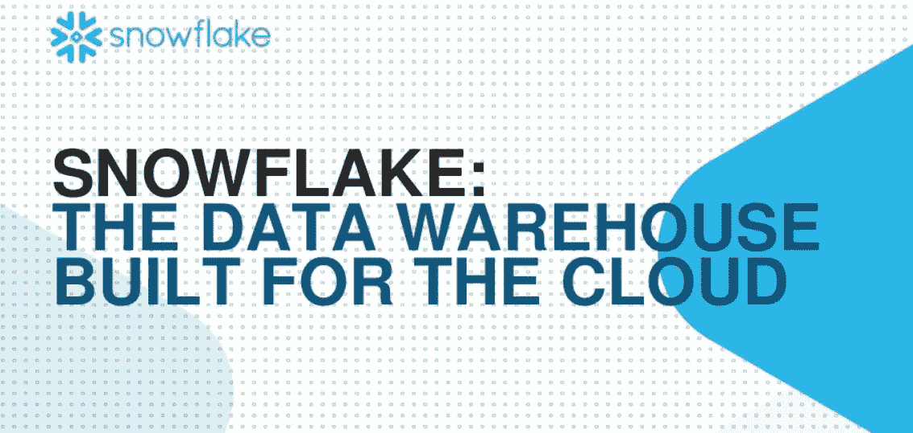
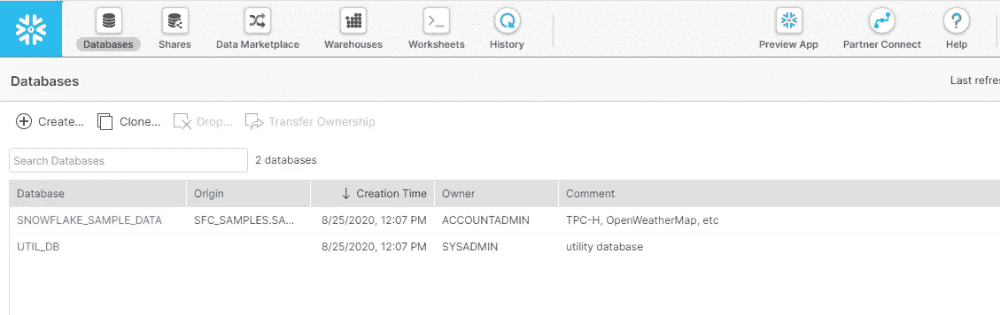
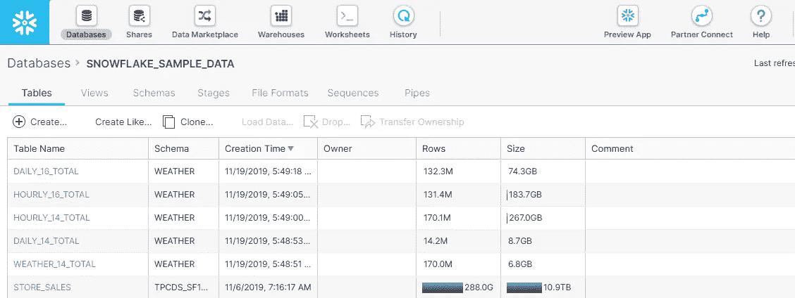
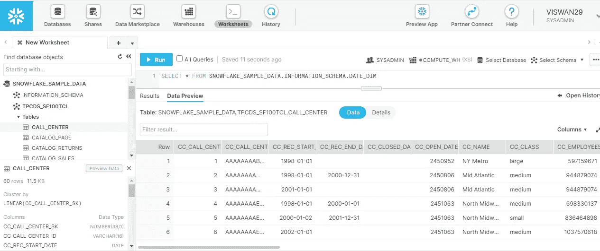
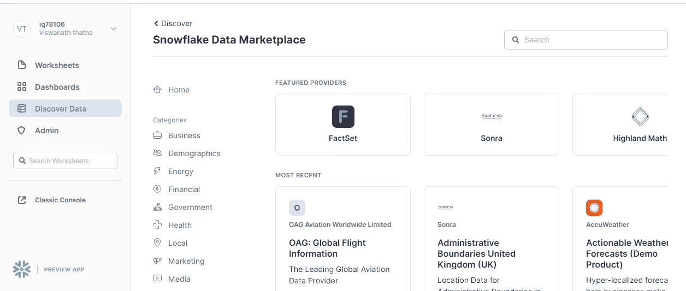
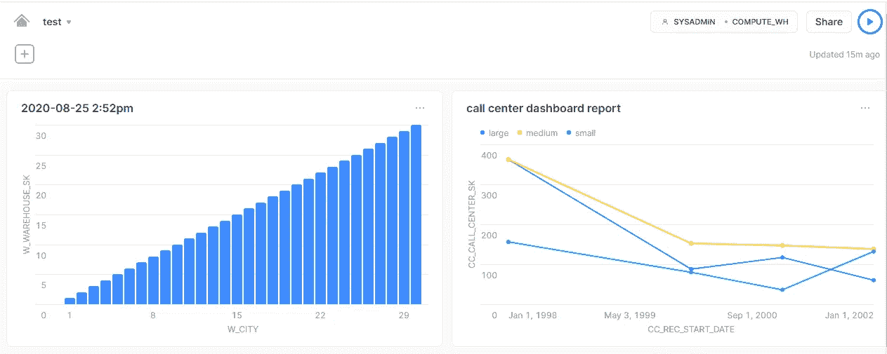

# 雪花数据仓库简介

> 原文：<https://medium.com/analytics-vidhya/intro-to-snowflake-data-warehouse-aa887abaf1ed?source=collection_archive---------21----------------------->

雪花——建立在亚马逊网络服务(AWS)之上的分析和云数据仓库。因此，我们不需要任何硬件来安装、配置和管理(节省了太多时间！).我们可以创建一个帐户，提供 30 天免费 400 美元的信用，之后根据数据使用情况收费。

**让我们进入雪花**

雪花提供了许多令人兴奋的特性。让我们深入研究一下

雪花提供的所有功能都在上面。开始这项工作有三个重要特征。我们需要创建仓库，数据库，模式。默认情况下，每个都有默认的仓库和数据库。数据市场还有其他令人兴奋的特性来创建交互式仪表板。工作表是我们可以执行查询的地方。让我们首先浏览默认数据库，并查看表列表:

雪花提供了两个默认数据库。我们可以很容易地创建一个新的数据库，通过点击创建按钮，我们可以很容易地授予权限。我们可以创建模式、视图和表格。让我们看看提供的几个默认表。

我们可以看到表名、模式、创建时间、所有者、行数、表的大小。

**雪花共享**可用于消费与组织共享的数据，也可向其他人提供数据。

**雪花工作表:**

工作表用于查询表格。检查元数据信息超级容易。查询时，我们需要提供**database . schema . table _ name**。下面是雪花工作表的样子

检查数据库的信息很容易。我们只需点击一下表格就可以预览数据。我们只需点击一下就可以查看元数据(详情)。我们可以创建多个工作表，并保存它们以供将来参考。

**雪花数据市场**

这是一个非常好的部分，我们可以在表中创建仪表板。我们有一个名为“发现数据”的部分，其中有由特色提供商提供的数据(商业数据、人口统计数据、能源、金融…).

创建交互式仪表板非常容易。我们不需要任何以前的知识，如果你想与云数据库交互，它是一个必不可少的工具。简单仪表板示例如下所示:

还打算写一篇如何用 Python 和 Java 连接雪花数据库的文章。

感谢阅读。如果你有任何问题就开枪打我。