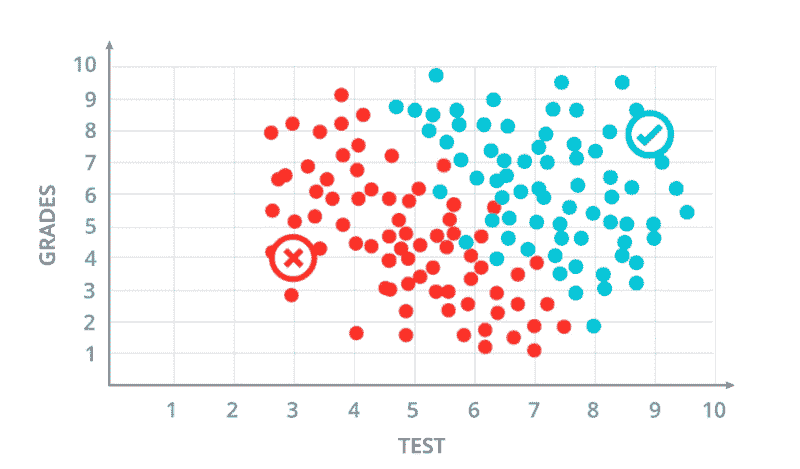
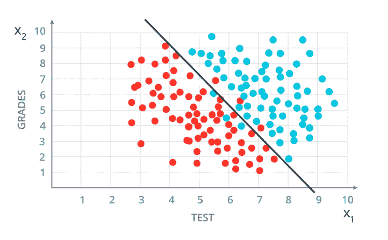
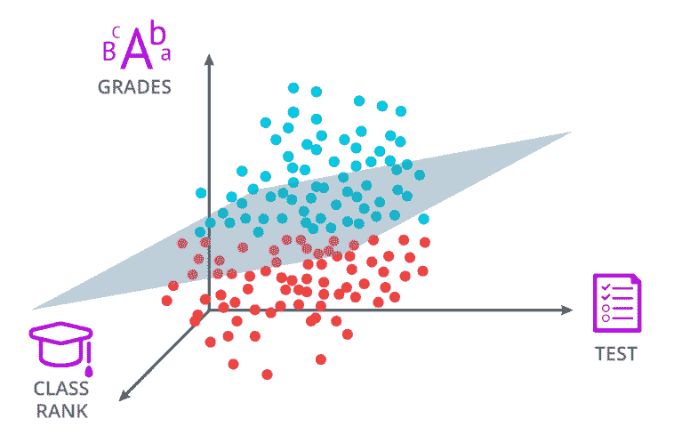
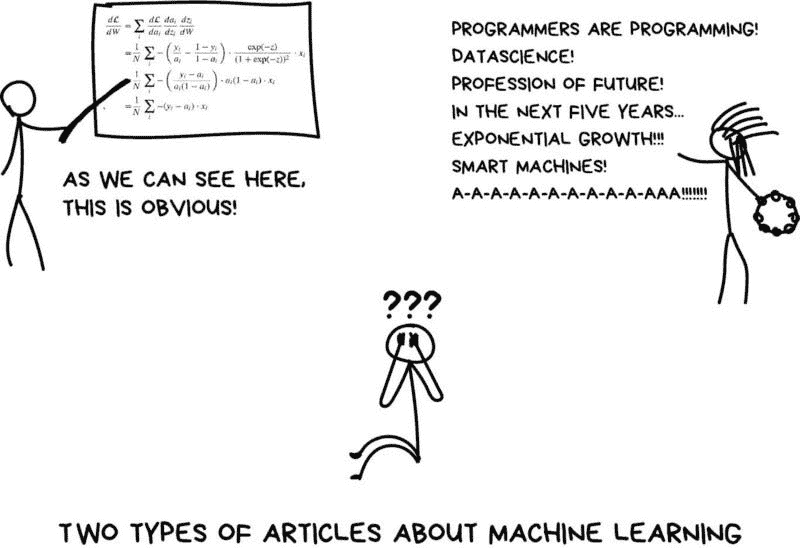

# 机器学习数学简介

> 原文：<https://medium.com/analytics-vidhya/intro-to-the-machine-learning-math-b120a66b0a79?source=collection_archive---------23----------------------->

这比你想象的要容易得多。

*以下大部分内容基于脸书·艾的《PyTorch 深度学习导论》课程。如果您想了解更多，请参加该课程，或者只看一下* [*这里*](https://www.udacity.com/course/deep-learning-pytorch--ud188) *。*

下面是一张决定一个学生是否会被大学录取的图表。使用了两个数据:分数和测试，每一个都是 0-10 分。被接受的申请人用蓝色表示，被拒绝的用红色表示。

比方说，一个参加了 7 级考试和 6 级考试的学生想知道他是否会被录取。你能确定他是否会被接受吗？

**答案是肯定的。**

你是怎么知道的？当你看这个图的时候，你可能在寻找点(7，6)。看到它周围有许多蓝点，你可以假设这个学生被录取了。

你可能不知道，但你正在做的正是许多机器学习算法努力做的。查看数据点，并根据以前的趋势和模式，确定新数据点的标签。

但是中心周围的黑暗区域呢？很难判断一个成绩和考试分数都是 6 分的学生是被录取还是被拒绝。所以**我们来定一个明确的界限。**

# 找到方程式

那好多了。尽管这条线并不完美，但它让我们很好地了解了一个学生是否合格。因此，我们可以充满信心地说，线右边的学生将被接受，而左边的学生将不会被接受。但也许更有价值的是，这条线给我们的是一个方程。

**在这种情况下，这条线的方程是 *2x₁ + x₂ -18 = 0。***

令人兴奋的是，通过使用线性方程，我们实际上可以提取一个数学公式来确定学生是否被录取。这简单地意味着用来确定一个学生是否成功的等式是 2 *测试+成绩-18。如果得到的数字等于或大于 0，那么恭喜你被录取了！如果没有，祝你下次好运。

我们称这条线为**决策边界**。记住这一点的一个好方法是，这个边界将两个不同决策之间的算法分开。

所以让我们重温一下我们的老问题，一个成绩和测验分数都是 6 分的学生被接受还是被拒绝。井 2 * 6+6–18 = 0。0 等于 0，这是获得录取的最低分数，意味着这个学生确实被录取了。

所有的线性方程都会遵循这种格式 ***W₁x₁ + W₂x₂ + b.*** 复杂？一点也不。让我们回到方程式 ***2x₁ + x₂ -18 = 0。***

在这个等式中，*是 2，你要乘的数是*或者在这个例子中是测试。***w 叫做权重，*** 你要做的就是用它乘以 x₁***。在本例中，x 是我们示例中的输入*** 学生的考试分数和成绩。**

**同理，*我们在前面的等式中*之前没有数字，因为权重为 1，所以我们可以简单地将 ***x₂表示为 x₂*** 。****

**最后但同样重要的是，我们有 ***b，它代表偏差。*** b 既可以是正数也可以是负数，在我们的例子中，这个数是-18。**

****

**祝贺你走了这么远！这是一幅连环漫画。**

# **维度问题**

**回到正题，如果我们多一条数据，比如班级排名，会怎么样？好吧，我们将使用三维来可视化数据，而不是用二维来可视化数据点。因此，等式将不再是 ***W₁x₁ + W₂x₂ + b，*** 而是 if 将是***w₁x₁+w₂x₂+w₃x₃+ b .*****

**记住，这是因为我们多了一个输入(x₃)或者，在我们的例子中，阶级等级。现在这似乎不是一个大问题，但是如果我们有 4 个不同的数据，或者 5 个、20 个甚至 1，000 个。那我们该怎么办？**

****

**三种不同的数据类别(成绩、测试和班级排名)**

**好吧，一个已经达成一致的常见解决方案是将 ***W₁x₁ + W₂x₂ + b*** 方程简化为向量方程 ***Wx + b.*** 在这个方程中，w 代表 W₁ …，Wn-₁，Wn， *x* 代表 x₁ …，xn-₁，xn。其中 n 是维数。这意味着 w 和 x 分别代表方程中的每一个单个 w 和 x***w****₁****x****₁****+w****₂****x****₂***..w***n****x****n****+b*****

**这是非常方便的，因为 Wx + b 能够很容易地表达无限数量的维度。**

**对于多维度，另一个需要注意的是决策边界。在 2D 形状中，我们使用了一维决策边界。在上面的 3D 示例中，我们使用了二维决策边界。注意到模式了吗？决策边界总是比它所在的空间低一个维度。我们称之为**超平面。****

**机器学习的应用实际上是无限的。虽然理解背后的数学很复杂，但绝对值得。希望这篇文章能提供一些关于机器学习数学的见解，并教会你一些新的东西！**

****

**不知道我是前者还是后者。**

# **关键要点**

*   **判定边界的线性方程可以用作方程**
*   **两个类别之间的分离被称为**决策边界****
*   **2D 判决边界的等式遵循 ***W₁x₁ + W₂x₂ + b*** 的格式**
*   **n 维决策边界的方程遵循格式 *W₁x₁ + W₂x₂ …..Wnxn +b***
*   **W₁x₁ + W₂x₂ …..Wnxn + b 可以表示为 *Wx +b***
*   **决策边界是**超平面****