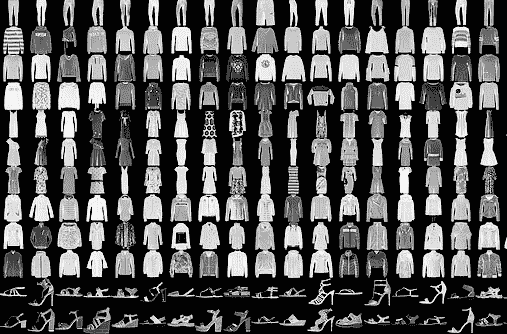
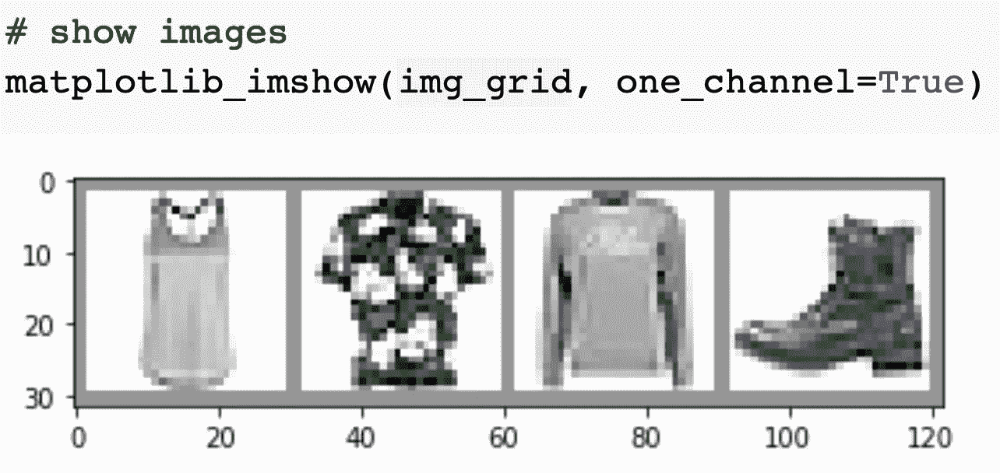
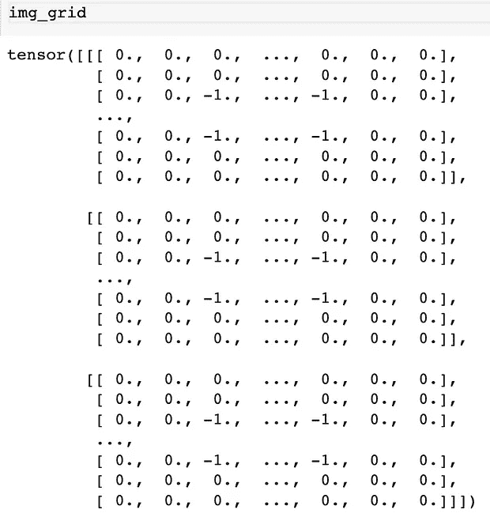

# Visual RecSys 简介

> 原文：<https://medium.com/analytics-vidhya/intro-to-visual-recsys-12d54976c521?source=collection_archive---------21----------------------->

## 现代 RecSys

## 在本章中，我们将探索视觉模型的“hello world”数据，即来自 Zalando、PyTorch、Tensorboard 和 Colab 的 [FashionMNIST](https://github.com/zalandoresearch/fashion-mnist) 数据集。

这是我的现代视觉 RecSys 系列的一部分；在文章的最后，您可以随意查看该系列的其余部分。

# 时尚主义者和视觉挑战



来源:[时尚达人](https://research.zalando.com/welcome/mission/research-projects/fashion-mnist/)by[卡什夫·拉苏尔](https://research.zalando.com/welcome/team/kashif-rasul/) & [晓寒](https://hanxiao.io/about/)

数据包括:

*   60，000 幅图像的训练集和 10，000 幅图像的测试集。
*   每张图片都是 28x28 灰度，分为 10 类:t 恤/上衣、裤子、套头衫、连衣裙、外套、凉鞋、衬衫、运动鞋、包、短靴。

我们的目标是获得对两个关键概念的直观理解:**嵌入**和**距离**，因为它们是下一章*卷积神经网络(CNN)的基本构件。*

# 什么是嵌入，为什么我们需要它们？



左图:来自 FashionMNIST 的图片。右图:图像的数字表示

传统上，我们将图像表示为一个巨大的整数数组(RGB 图像的 3D 数组和灰度图像的 1D 数组)。这些阵列非常庞大，并且呈指数级增长，我们将需要跟踪数百万个数字来分析数百张高分辨率图像！使用整数数组来缩放任何建模都是不可能的；因此，现代的嵌入方法产生了。

嵌入概念的一个很好的例子是 Will Koehrsen 的“[神经网络嵌入解释](https://towardsdatascience.com/neural-network-embeddings-explained-4d028e6f0526)”中的例子。传统上，我们利用像一键编码这样的技术来表示矩阵中的项目。例如，给定三本书，我们将有一个 3x3 矩阵，其中每一项都由一个由**个离散的**个数字组成的数组来表示，这个数组的**随着每增加一个新项而增长** (4x4 有 4 项，5x5 有 5 项……)。此外，**没有相似感，也没有距离感**，因为这些项目没有任何形式的关系。

```
**# One Hot Encoding Categoricals****books = ["Harry Potter and The Philosopher's Stone",
         "Harry Potter and The Chamber of Secrets", 
         "The Lean Startup"]****books_encoded = [[1, 0, 0],
                 [0, 1, 0],
                 [0, 0, 1]]****Similarity (dot product) between First and Second = 0
Similarity (dot product) between Second and Third = 0
Similarity (dot product) between First and Third = 0**
```

一旦我们应用一个转换将对象转换成嵌入，我们现在**在一个连续的尺度上限制数组中表示每个项目的元素的数量(在这个例子中限制是 2)**，并且这些值具有基于关系的含义。基于相似性(点积)彼此接近的对象是高度相关的。

```
**# Idealized Representation of Embedding****books = ["Harry Potter and The Philosopher's Stone",
         "Harry Potter and The Chamber of Secrets", 
         "The Lean Startup"]****books_encoded_ideal = [[0.53,  0.85],
                       [0.60,  0.80],
                       [-0.78, -0.62]]****Similarity (dot product) between First and Second = 0.99
Similarity (dot product) between Second and Third = -0.94
Similarity (dot product) between First and Third = -0.97**
```

> 嵌入是离散变量的矢量表示，而不是分析每幅图像的数百万个离散变量。对于深度学习，我们通常利用神经网络嵌入来将分类变量的维度降低到可管理的程度


Tensorboard 上的 FashionMNIST 嵌入投影—有关详细信息，请参见“代码”部分

因为我们可以控制向量表示的大小，所以我们可以将一个巨大的图像数组缩小成一个由更少的数字组成的小向量。从上图中的 FashionMNIST 对象可以看出结果，其中对象被投影到 3D 矢量空间。通过嵌入过程，**相似的图像向量将被投影到彼此靠近的位置**。因此，当我们有嵌入时，我们可以:

*   将对象投影到向量空间中，并为可视化和简单推荐制定距离和邻居的概念(本章)。
*   利用嵌入来训练深度学习模型(下一章)

让我们看看如何构建这样的嵌入。

# 工具

我们将在编码部分使用的工具的快速概述:

*   [**py torch**](https://pytorch.org/)vs . tensor flow:它们是深度学习领域的两大主导框架。PyTorch [在研究](https://thegradient.pub/state-of-ml-frameworks-2019-pytorch-dominates-research-tensorflow-dominates-industry/)中的势头越来越大，因为它的简单性和 python 特性使得它更容易集成到 python 工作流中。甚至像 OpenAI 这样的组织也在转向 PyTorch。我发现 Tensorflow 使用起来冗长而混乱，因为 Tensorflow 2.0 中的变化用新的函数名和参数打破了旧的代码。PyTorch 的简单符合我们的工作流程。我们将在所有代码示例中使用 PyTorch。我在进一步阅读部分添加了 PyTorch 学习材料(书籍和教程)。
*   [**tensor board**](https://www.tensorflow.org/tensorboard):tensor board 曾经是 Tensorflow 的一个关键差异化因素。现在 [Tensorboard 原生支持 PyTorch](https://pytorch.org/tutorials/intermediate/tensorboard_tutorial.html)，我们可以在 py torch 中编码并在 Tensorboard 中可视化。
*   [**【Colab**](https://colab.research.google.com):谷歌的 Colab 将 Jupyter 笔记本免费托管在有 GPU 访问的云端。这是我们分享代码和探索深度学习框架的绝佳方式，没有设置 GPU 环境的麻烦和成本(你只需要一个免费的 Google 帐户)。

# 代码

你可以预览下面的大部分代码，但是你需要启动 Colab 来与 Tensorboard 交互(本章最重要的部分)。

[启动 Colab](https://colab.research.google.com/gist/thiakx/cd734300abe9dbf3db425ec026f80ffe/intro-to-visual-recsys.ipynb)

# 我们学到了什么

在这一章中，我们学习了嵌入，它们是如何工作的，以及它们为什么重要。我们还研究了 PyTorch 中的代码，尝试了 Tensorboard 中的可视化，以便直观地理解如何通过嵌入来实现推荐。

在下一章，我们将在所有这些理解的基础上开发一个基于卷积神经网络(CNN)的推荐器。

# 探索现代视觉 RecSys 系列的其余部分

[](/@thiakx/modern-visual-recsys-part1-introduction-1241c02f76d6) [## 现代视觉推荐系统:推荐器是如何工作的？[基础]

### 在这一系列文章中，我将介绍视觉推荐系统的现代方法。我们从一个案例开始…

medium.com](/@thiakx/modern-visual-recsys-part1-introduction-1241c02f76d6) [](/@thiakx/modern-visual-recsys-part2-the-recsys-design-framework-30d2352fff34) [## 现代视觉 RecSys:如何设计推荐器？[基础]

### 对于这一章，我将通过亚马逊的案例研究来介绍 RecSys 设计框架。

medium.com](/@thiakx/modern-visual-recsys-part2-the-recsys-design-framework-30d2352fff34) [](/@thiakx/modern-visual-recsys-part4-convolutional-neural-networks-recommender-c4174644ab0d) [## 现代视觉系统:卷积神经网络推荐器

### 我们将通过利用 ResNet 的迁移学习来构建推荐器，并返回视觉上相似的产品…

medium.com\](/@thiakx/modern-visual-recsys-part4-convolutional-neural-networks-recommender-c4174644ab0d) [](/@thiakx/modern-visual-recsys-part4b-covid-19-case-study-with-cnn-5f07fd93a11a) [## 现代视觉再现系统:CNN 的新冠肺炎案例研究

### 我们将使用迁移学习、Spotify 的……通过 CNN RecSys 流程，根据严重程度对新冠肺炎 x 光图像进行聚类

medium.com](/@thiakx/modern-visual-recsys-part4b-covid-19-case-study-with-cnn-5f07fd93a11a) [](https://towardsdatascience.com/building-a-personalized-real-time-fashion-collection-recommender-22dc90c150cb) [## 构建个性化的实时时尚收藏推荐器[Pro]

### 我们将利用 PyTorch 中的迁移学习、近似最近邻和嵌入质心检测来实现

towardsdatascience.com](https://towardsdatascience.com/building-a-personalized-real-time-fashion-collection-recommender-22dc90c150cb) [](https://towardsdatascience.com/temporal-fashion-recommender-59c26313fa25) [## 时尚推荐者

### 建立一个随季节变化的推荐器

towardsdatascience.com](https://towardsdatascience.com/temporal-fashion-recommender-59c26313fa25) [](/@thiakx/the-future-of-visual-recommender-systems-four-practical-state-of-the-art-techniques-bae9f3e4c27f) [## 视觉推荐系统的未来:四种实用的最新技术

### visual RecSys 的未来令人振奋。让我们探索一些最前沿的技术和想法…

medium.com](/@thiakx/the-future-of-visual-recommender-systems-four-practical-state-of-the-art-techniques-bae9f3e4c27f) 

系列标签:

*   基础:一般知识和理论，需要最低限度的编码经验。
*   核心:更具挑战性的材料与代码。
*   亲:困难的材料和代码，与生产级工具。

# 进一步阅读

*   [神经网络嵌入解释](https://towardsdatascience.com/neural-network-embeddings-explained-4d028e6f0526)
*   [PyTorch 教程](https://pytorch.org/tutorials/index.html)
*   [用 TensorBoard 可视化模型、数据和训练](https://pytorch.org/tutorials/intermediate/tensorboard_tutorial.html)
*   [深度学习用 PyTorch 书(官方，免费)](https://pytorch.org/deep-learning-with-pytorch)
*   [fast.ai 实用深度学习 for Coders，v3](https://course.fast.ai/)