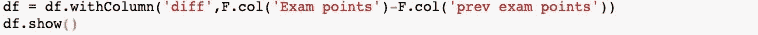

# pyspark 中的窗口函数介绍及实例

> 原文：<https://medium.com/analytics-vidhya/intro-to-window-function-in-pyspark-with-examples-3a839b6e1cac?source=collection_archive---------7----------------------->

作为数据科学家/数据工程师，大数据转型是一个非常重要的方面。Spark framework 目前最常用于执行这些转换，无论是构建数据管道还是准备数据集来训练机器学习模型。

本文讨论了 windows 函数，如何使用它和它的不同应用。所以让我们开始吧！！！

1.  **聚合**

窗口函数可用于直接聚合，如均值、中值、众数等。这里我们举一个学生的数据集的例子，包括他们的科目和分数。

假设我们想找到每个学生的学科平均分数，使用窗口函数可以这样做

上述语法的工作原理是首先 partitionBy 函数创建不同的数据块(分区),每个数据块由传递相同键值(列)的数据组成，例如，一个分区将包含考试名称=哲学的所有数据，其他数据包含数学等。

为了找到考试的平均值，我们使用 pyspark.sql.Functions，F.avg()，指定在我们要计算平均值的窗口上。

在执行上面的语句时，我们得到

**排名**

假设对于上面的数据集，我们想要每个科目的第二高分。这可以通过将 rank 和 orderBy 函数与窗口相结合来实现。

在这里，我们再次为每个考试名称创建分区，这次按照每个学生的分数降序排列每个分区。然后，我们简单地计算我们已经划分的窗口的等级。示例输出将如下所示

现在，如果我们想要每个科目第二好的学生，可以通过

我们得到的结果是

正如我们使用排名函数 F.rank()一样，我们也可以使用 dense_rank()，ntile，percent_rank 根据我们的要求进行排名。

**解析**

最常见的分析应用之一是累积分布。对于那些不明白什么是累积分布的人来说，它是一个取值小于或等于的概率。对于上面给出的例子，假设我们想计算考试分数的累积分布。

它给出了

如您所见，等级越高，累积分布越多。

**滞后()和超前()**

类似地，lag()和 lead()函数也可用于在数据帧中创建滞后/领先列。这两个功能在涉及时间序列数据的转换中有广泛的应用。

假设我们希望每个学生的分数都与在该科目中排名仅次于他的学生的分数不同。这可以通过使用 lag 函数和窗口划分来实现。

它将给出一个包含“prev exam points”列的输出，其中学生的分数排在他的后面。这可以被验证为以前的考试点和考试点将在对角线上相同。

对于差来说，很简单，只需要两列的差

我们得到了

使用 lead()函数以及升序排序也可以做到这一点。

**指定窗口边界**

这本身就是一个广泛的话题，需要单独的一篇文章。这里只涉及几个广泛使用的关键概念。

Window 对象有一个 rowsBetween()函数，可用于指定边界。让我们通过一个例子来研究这个问题，假设我们想要当前排的学生和比他低 5 排的学生在这个问题上的移动平均分数。这可以按如下方式完成

在 rowsBetween(-5，0)中，-5 指定起始位置在当前行之前 5 行，0 指定当前行。

现在，如果要求我们计算从当前行到窗口分区开始的移动平均值，在这种情况下，我们不能给出数值-5，因为这将是一个大小不同的窗口。对于这个 windows 对象有一个属性叫做`Window.unboundedPreceding and Window.unboundedFollowing.`

**window . unbounded preding 表示分区的第一行，Window.unboundedFollowing 表示分区的最后一行**。所以对于我们手头的问题，命令是

**结论**

除此之外，还有一些高级主题，如在窗口分区上应用 UDF，以及关于窗口边界的更深入的讨论，这些超出了本文的范围，将在后续文章中讨论。

感谢阅读！！！