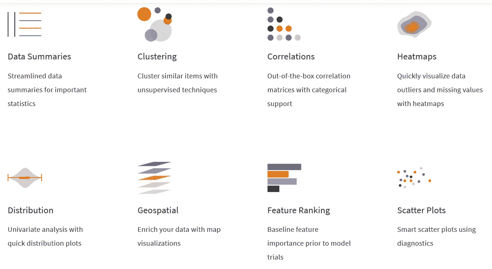
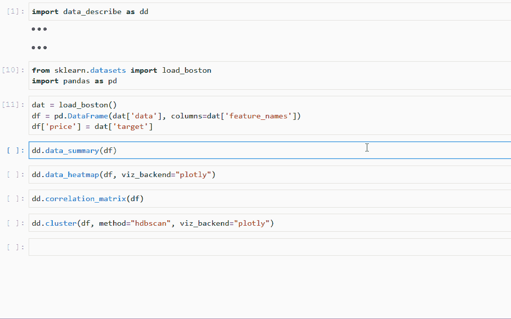

# 引入数据描述——一种更好的 EDA 方法

> 原文：<https://medium.com/analytics-vidhya/introducing-data-describe-a-pythonic-accelerator-for-eda-4e8f9bff2547?source=collection_archive---------15----------------------->


我们很高兴推出一个新的开源包，致力于使探索性数据分析(EDA)更好更快。[数据描述](http://data-describe.ai)不仅仅是另一个花哨的绘图仪或报告生成器；相反，它是一个加速和提升数据分析标准的发射台。



数据描述的主要特征

## 差距

为了摄取和处理数据，大多数人求助于熊猫。

在构建传统的机器学习管道/模型时，大多数使用 scikit-learn。

但是 EDA 靠什么包呢？如果您像大多数数据科学家一样，您可能会混合使用临时分析和随时间编译的精选脚本。虽然 EDA 总是需要一定量的创造性的即席分析，但它不需要那么难！

data-describe 试图通过提供一个包来填补这一空白，这个包非常专注于使 EDA 少一些编码，多一些理解。

## 为什么是数据描述？

> 但是**有**针对 EDA 的 Python 包。是什么让数据描述与众不同？

作为数据科学家为数据科学家*打造的*包，以下是让数据描述独一无二的原因:**

1.  **不仅仅是一个宠物项目** : data-describe 是在经验丰富的开源贡献者的领导下开发的，他们中的一些人[领导了 Tensorflow、XGBoost、Kubeflow 和 MXNet 等成功的项目，或者为这些项目做出了重大贡献](https://github.com/terrytangyuan)。
2.  **精选特征集**:Data-describe 的特征经过精选，对数据科学家分析真实数据集非常有用。您在这里找不到通用的报告或仪表板功能—选择每个功能是为了回答有关数据的特定问题。
3.  **超越基础**:机器学习领域正在快速发展，你的 EDA 也应该如此。data-describe 内置了对文本分析、维度缩减和敏感数据(如 PII)检测等功能的支持，并计划推出更多功能，如整合地理空间映射和预先训练的语言模型。有新的或更好的 EDA 方法的好主意吗？让我们实现它吧！
4.  **可扩展的&模块化组件** : data-describe 从一开始就被设计为可扩展的，因此特性不会被锁定在特定的计算后端或可视化框架中。对于开源社区，这意味着 data-describe 接受插件来利用其他框架，如 Bokeh 或 Altair。
    此外，所有的中间处理步骤都是公开的，这样用户可以根据自己的需要调整和调整输出，而不是因为不喜欢某些东西的实现方式而被迫从头开始。
5.  **大数据支持**:典型的 EDA 方法在处理大型数据集时会失效。data-describe 致力于在任何数据集上实现 EDA，早期支持 [Modin DataFrames](https://github.com/modin-project/modin) 以及更多即将推出的产品。
    *目前仍处于试验开发阶段*

## 安装数据-描述

data-describe 可以使用 pip 安装，conda 支持即将推出:

```
pip install data-describe
```

## 数据入门-描述

```
import data_describe as dd
dd.data_summary(df)
```



数据描述使得超越 EDA 的基本图变得容易

有关在数据集上使用数据描述的完整示例，请参见我们的[快速入门指南](https://data-describe.github.io/data-describe/docs/master/_notebooks/quick_start.html)。

数据描述今天公开测试版的发布。虽然这只是对该项目的第一步的简要介绍，但我们希望你能和我们一起制作数据——描述 EDA 的未来！

## 重要链接

[Github 资源库](https://github.com/data-describe/data-describe)
[文档](https://data-describe.github.io/data-describe/docs/master/)
[快速入门指南](https://data-describe.github.io/data-describe/docs/master/_notebooks/quick_start.html)