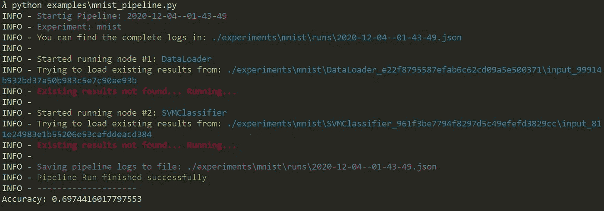
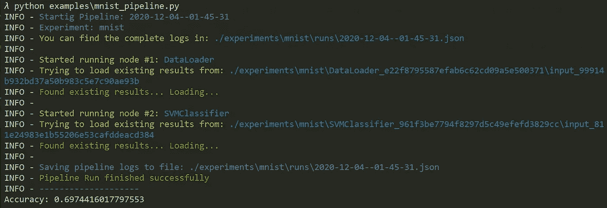
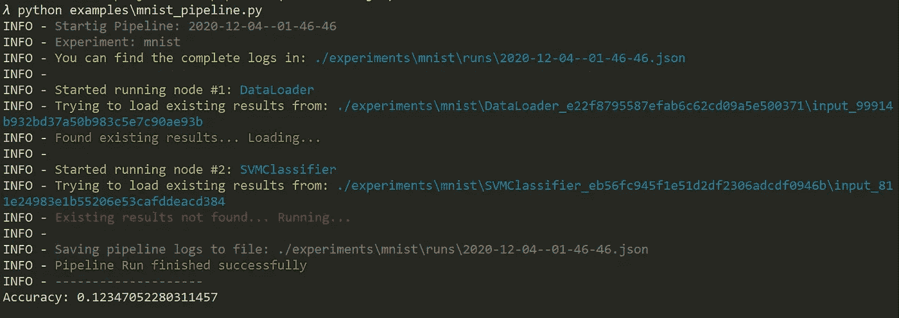
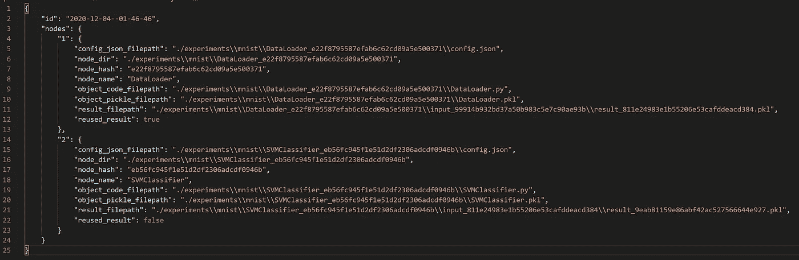

# ML 快速管道简介

> 原文：<https://medium.com/analytics-vidhya/introducing-fastpipeline-for-ml-913746a89cd1?source=collection_archive---------13----------------------->


**TLDR；**快速简单的管道，可自动检测重复运行并重复使用中间结果。以下是相关链接:

**文件**:【https://shashank-yadav.github.io/fastpipeline/】T4

**源代码**:[https://github.com/shashank-yadav/fastpipeline](https://github.com/shashank-yadav/fastpipeline)

如果你是一名数据科学家，你可能在某些时候使用过 [sklearn 管道](https://scikit-learn.org/stable/modules/generated/sklearn.pipeline.Pipeline.html)。使用管道使您的工作流易于阅读和理解。它有助于将一个大任务分成逻辑块，同时使您的工作具有可重复性。然而，在我的工作流程中使用 sklearn 管道时，我发现了几个问题:

1.  **限制性 API:** sklearn 管道由变压器组成，可以使用现有的，也可以自己创建。但是，它迫使您只能处理类似数组的数据，并遵循 fit-transform 范式。例如，不可能将除 X 和 y 以外的数据从一个步骤传递到另一个步骤。简而言之，该 API 过于严格，并且与 sklearn 结构紧密耦合
2.  **浪费的重新运行:**假设您的管道有 5 个步骤，在第 3 步发生了一些故障。现在，如果您在进行所需的更改后重新运行管道，它将从头开始(即使在使用内存参数进行序列化时)。这使得实验既烦人又耗时。
3.  **记录中间数据:**根据定义，管道的每个步骤都会生成一些数据，您可能希望查看这些数据以进行调试。然而，当使用 sklearn 时，您需要自己手动存储和版本化大部分数据。

我尝试了其他几种解决方案，如 Luigi 和 Airflow，它们似乎主要是为了生产，而不是为了快速实验。像 MLFlow 这样的其他工具似乎是一个很大的买入。

# **要求:**

由于上述原因，我决定构建一个简单的框架，它允许我更快地进行实验，同时利用管道的优势。有 5 个主要要求:

1.  应该是实验过程的一部分，而不是一个障碍
2.  应该允许检查运行期间生成的所有内容
3.  应该尽可能自动重用结果
4.  应该为每次运行生成可用的日志
5.  不应该限制太多，允许使用不同的库

这个过程产生了 [**快速管道**](https://shashank-yadav.github.io/fastpipeline/) 。它在合理的程度上满足了上述所有要求。

# 示例:

让我们使用快速管道在 MNIST 上空训练一个 SVM 分类器:

*   使用`pip install fastpipeline`安装软件包
*   创建一个文件`mnist_pipeline.py`
*   进行必要的导入，并创建一个类`DataLoader`，该类从 fastpipeline 包中扩展了`BaseNode`类。这是我们称之为`Node`的东西

```
# Import datasets, classifiers and performance metrics
from sklearn import datasets, svm, metrics
from sklearn.model_selection import train_test_split
import numpy as np# Import pipeline and node constructs
from fastpipeline.base_node import BaseNode
from fastpipeline.pipeline import Pipeline# Node for loading data
class DataLoader(BaseNode):
    def __init__(self):
        super().__init__()

    def run(self, input = {}):
        # The digits dataset
        digits = datasets.load_digits() # To apply a classifier on this data, we need to flatten the image, to
        # turn the data in a (samples, feature) matrix:
        n_samples = len(digits.images)
        data = digits.images.reshape((n_samples, -1))
        return {
            'data': data,
            'target': digits.target
        }
```

*   创建另一个`Node`，其输入是`DataLoader`的输出，并训练一个 SVM 分类器

```
# Node for training the classifier
class SVMClassifier(BaseNode):
    def __init__(self, config):
        super().__init__(config)
        gamma = config['gamma']
        # Create a classifier: a support vector classifier
        self.classifier = svm.SVC(gamma=gamma)

    def run(self, input):
        data = input['data']
        target = input['target'] # Split data into train and test subsets
        X_train, X_test, y_train, y_test = train_test_split(
            data, target, test_size=0.5, shuffle=False) # We learn the digits on the first half of the digits
        self.classifier.fit(X_train, y_train) # Now predict the value of the digit on the second half:
        y_pred = self.classifier.predict(X_test) return {
            'acc': np.mean(y_test == y_pred),
            'y_test': y_test,
            'y_pred': y_pred 
        }
```

*   现在让我们实例化节点并创建管道

```
if __name__ == "__main__":
    # Initialize the nodes
    dl_node = DataLoader()
    svm_node = SVMClassifier({'gamma': 0.01})

    # Create the pipeline
    pipeline = Pipeline('mnist', [dl_node, svm_node]) # Run pipeline and see results
    result = pipeline.run(input={})
    print('Accuracy: %s'%result['acc'])
```

*   使用`$ python mnist.py`运行管道。您应该会看到类似这样的内容:



正如所料，这是第一次运行，因此两个节点的输出都是通过调用它们的`run`方法来计算的。这里的日志显示了数据存储的位置

*   尝试使用相同的命令再次运行它:`$ python mnist.py`。这一次你应该会看到一些不同的东西:



因为所有的中间输出都已经计算过了，所以管道只是在每一步重新加载数据，而不是重新计算

*   让我们对`__main__`中的 config 值进行更改:

```
# svm_node = SVMClassifier({'gamma': 0.01})
svm_node = SVMClassifier({'gamma': 0.05})
```

*   再次运行管道。您会看到类似这样的内容:



这一次，它使用第一个节点的结果，并为第二个节点重新计算，因为我们对配置进行了更改。

如果你对类`SVMClassifier`做了任何改变，同样的事情会再次发生

管道运行的日志保存为 JSON 文件，格式为`yyyy-mm-dd--hh-mm-ss`。对我们来说，在最后一次运行中生成的是:`2020-12-04--01-46-46.json`



`2020-12-04--01-46-46.json`

如您所见，它会告诉您所有已保存数据的路径，还会告诉您上次运行的结果是否被重用。我们将努力使这些日志在未来变得更加丰富和有用。

更多关于内功的详细信息你可以看看这里:[https://shashank-yadav.github.io/fastpipeline/about/](https://shashank-yadav.github.io/fastpipeline/about/)

# 结论:

这个库很容易上手，不需要对你的工作流程做太多改变，你将获得可重复性、快速实验和更好的日志记录。正如帖子开头提到的，这里有一些重要的链接:

**文件**:【https://shashank-yadav.github.io/fastpipeline/ 

【https://github.com/shashank-yadav/fastpipeline】源代码 : [源代码](https://github.com/shashank-yadav/fastpipeline)

你可以在 Github repo 中找到一些例子。更多在路上。很高兴听到您的反馈！