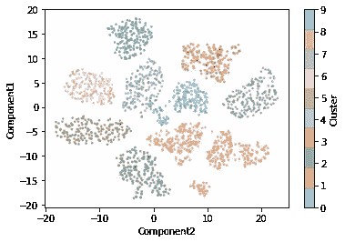
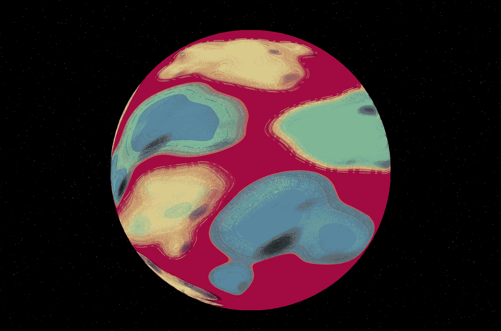

# 介绍小行星——地球化 Python 包！

> 原文：<https://medium.com/analytics-vidhya/introducing-planetoids-the-terraforming-python-package-660bfd7c3f98?source=collection_archive---------14----------------------->

## [**现实世界中的数据科学**](https://medium.com/towards-data-science/data-science-in-the-real-world/home)

## 是一个高级 Python API，用于从熊猫数据框架中的数据生成交互式、程序化的世界。

[https://www . deviantart . com/danluvisiart/art/LMS-HEX-178886965](https://www.deviantart.com/danluvisiart/art/LMS-HEX-178886965)

作为数据科学家，我们似乎将大部分注意力集中在模型&算法、框架&技术上……你知道，那些让你觉得:D*amn 很酷的东西！我该怎么利用它呢？！*

*然而，我发现我们制作的内容中缺乏的是事物的创造性。*

*由于我在地理信息科学方面的背景，我很幸运地学习了[制图学](https://en.wikipedia.org/wiki/Cartography)并且在我职业生涯的大部分时间里经常应用制图原理。*

*我非常喜欢制图学的一点是，它经常被描述为地图制作的艺术、科学和技术。*

> *让我理解一下。你上一次故意把你正在做的事情描述成 ***艺术*** 第一是什么时候；科技第二*？**

*制作地图需要很多东西，需要非常敏锐的眼光才能将原始数据转化为既有用又美观的东西。就其本质而言，地图是给人们看的，所以它们必须是美丽的。*

*所以我想，我如何能为我们的社区贡献一些有趣的东西，让数据科学家有机会尽可能简单地体验一下这个？*

# *介绍 ***小行星！****

*是一个高级 Python API，用于从熊猫数据框架中的数据生成交互式的、程序化生成的世界。*

*它能让你从这里得到数据:*

**

*对此:*

**

*通过简单地调用`.fit_terraform()`。看到我做了什么吗？😉*

# *它是怎么做到的？*

*目前，小行星能够从二维数据中[地形化](https://en.wikipedia.org/wiki/Terraforming)一颗具有可选集群属性的行星。它仍然是非常新的，并将在功能上不断增长，但现在当 terraforming 一个新的世界时，图书馆可以实现以下目标:*

*   *在*空间的某个地方生成*来渲染你的作品*
*   *基于输入数据统计生成生态(您也可以手动指定生态)*
*   *生成具有地形细节(等高线)和地貌细节(坡度)的地块*
*   *以山体阴影的形式生成照明效果*

*作为一个用户，你可以控制你生成的小行星的细节层次，并且可以选择在交互式绘图中渲染什么。完整的公共 API 记录在[这里](https://paulds8.github.io/planetoids/planetoids.m)。*

*在引擎盖下，我正在使用 [plotly](https://plot.ly/) 渲染小行星。目前，我使用的 ScatterGeo trace 没有 z 感知功能，只能处理矢量数据，所以我必须想出有趣的方法来给人以 3D 深度的错觉，就像打印地图一样。*

*安装就像`pip install planetoids`一样简单，而且 [**项目**](https://github.com/paulds8/planetoids) 已经用 Travis-CI 建立了自动化测试，用 Codacy 建立了自动化代码审查&分析，使对这个项目感兴趣的其他人更容易加入并做出贡献。我已经标记了一些 [**好的第一期**](https://github.com/paulds8/planetoids/issues?q=is%3Aissue+is%3Aopen+label%3A%22good+first+issue%22) 给任何有兴趣帮助我扩展项目的人。😁*

*它仍然处于一个 *alpha* 状态，所以随着特性的增加和完善，API 的某些方面可能会在未来的版本中发生变化。*

*网上有少数互动 [**演示** **笔记本**](https://nbviewer.jupyter.org/github/paulds8/planetoids/tree/master/examples/) 可以帮助你入门。我非常想知道人们最终会用这个库产生什么，我鼓励任何人提交演示来作为库的一部分，以展示如何在不同的领域中使用它。*

*我希望你和我到目前为止制作它一样开心。快乐的地球化！*