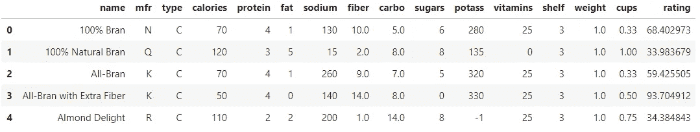
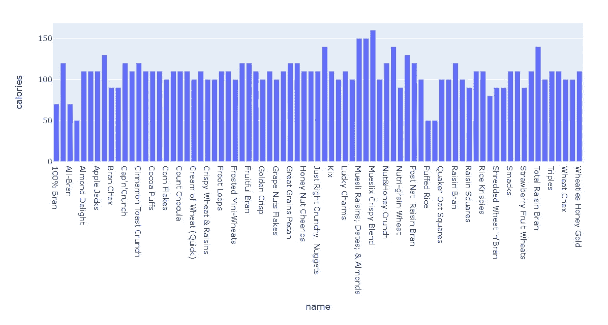
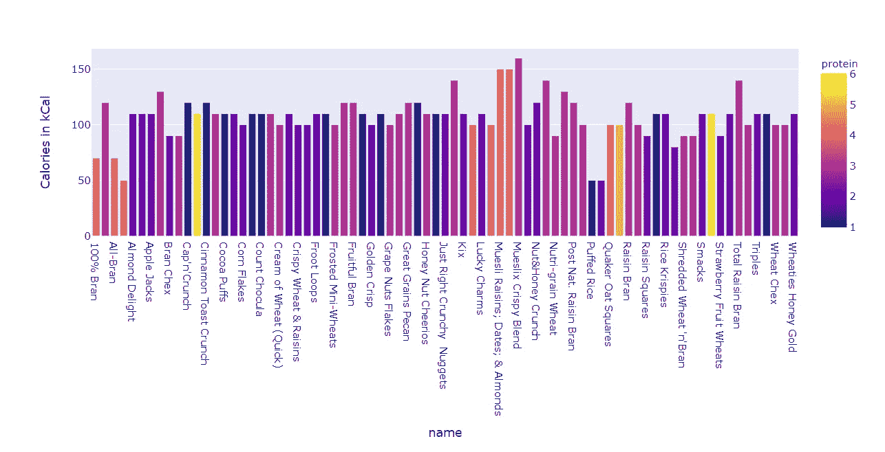
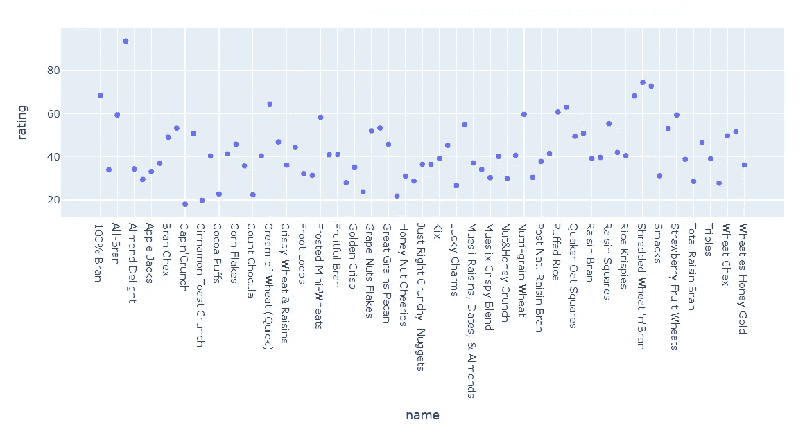
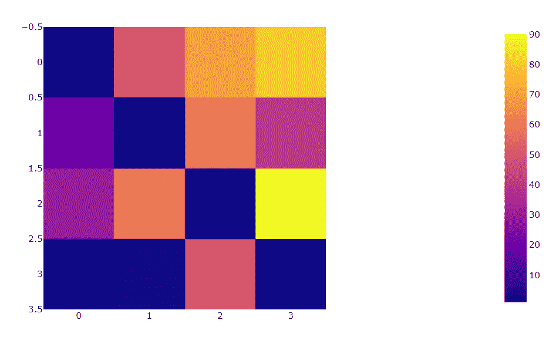
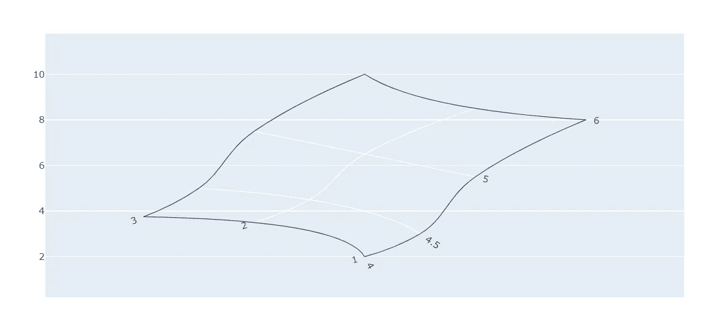
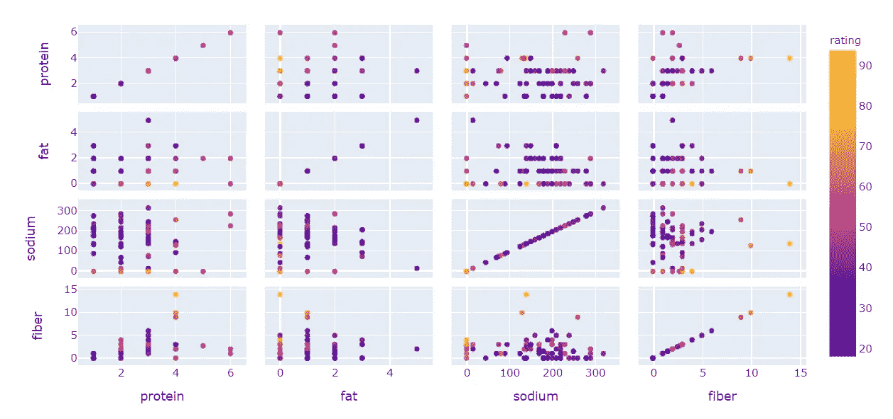
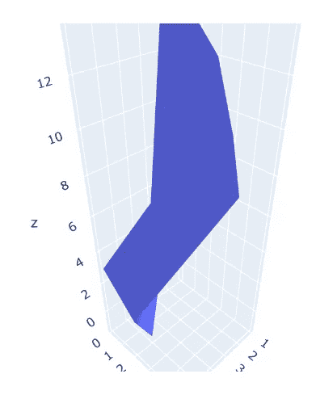

# 介绍 Plotly 用于交互式可视化

> 原文：<https://medium.com/analytics-vidhya/introducing-plotly-for-interactive-visualizations-9d08792fc90c?source=collection_archive---------25----------------------->

我一进入数据科学领域，就开始了我的可视化之旅。当您想要分析和解释数据时，图表和图形起着不可或缺的作用。可视化在通过一种大脑更容易理解的图像形式来理解复杂数据集方面发挥着关键作用。视觉效果讲述了数据的故事，传达了全面的含义。

我最近在实习时做的产品要求我将这一大块数据可视化。它有大约一百万个点。作为这个领域的初学者，这对我来说是一项艰巨的任务。

我的学长特别说，他想要数据集的交互式可视化，可以直接交付给客户。这让我陷入了困惑的境地，因为我总是使用 Matplotlib 和 Seaborn 进行数据分析，它肯定不是交互式的。

在花了大量时间研究各种数据可视化工具后，我发现了最好的，Plotly。

(免责声明:这对我的任务来说是最好的。但我向你保证，它可以很好地处理各种任务。)

首先，我建议使用 pandas 创建一个数据框，因为 pandas 提供了一组详尽的函数来处理数据，这可能非常有用。

# **创建熊猫数据框**

**安装熊猫(使用 pip) :**

```
pip install pandas
```

**创建数据帧:**

```
import pandas as pd
df = pd.read_csv('cereal.csv')
df.head()
```



它显示数据帧的前 5 个值

您的数据框架现已创建，并准备好与 Plotly 一起使用。

# **阴谋地**


Plotly 是一个 python 开源绘图库，支持 40 多种独特的图表类型，涵盖了广泛的统计、金融、地理、科学和三维用例。

## **安装**

plotly.py 可以使用 pip 安装

```
$ pip install plotly==4.7.1
```

或者公寓

```
conda install -c plotly plotly=4.7.1
```

## **条形图**

**导入库:**使用 Plotly express 接口创建图表

```
**import** plotly.express **as** px
```

**创建条形图:**我们可以用 px.bar 创建一个条形图，参数指定坐标轴。

```
fig = px.bar(df, x='name', y='calories')
fig.show()
```



条形图

**修改条形图:**

```
import plotly.express as px
fig = px.bar(df, x='name', y='calories',color='protein',labels={'calories':'Calories in kCal'})
fig.show()
```



根据谷物中存在的蛋白质含量显示条的颜色

## **散点图**

```
fig = px.scatter(df, x="name", y="rating")
fig.show()
```



散点图(谷物与评级)

## 热图

热图是数据的图形表示，它使用一个颜色编码系统来表示不同的值。

```
fig = px.imshow([[1, 50, 70, 80],
                 [20, 1, 60, 40],
                 [30, 60, 1, 90],
                 [1, 2, 50, 1]])
fig.show()
```



矩阵的热图

## 地毯图

它在二维**图**中说明了两个或多个自变量和一个或多个因变量之间的相互作用。

用 plotly.graph_objects 制作地毯图。传递参数。创造理想情节的地毯

```
import plotly.graph_objects as gofig = go.Figure(go.Carpet(
    a = [4, 4, 5, 4.5, 4.5, 4.5, 5, 5, 5, 6, 6, 6],
    b = [1, 2, 3, 1, 2, 3, 1, 2, 3, 1, 2, 3],
    y = [2, 3.5, 4, 3, 4.5, 5, 5.5, 6.5, 7.5, 8, 8.5, 10]
))fig.show(renderer="iframe")
```



地毯图

## 散点图矩阵

**散点图矩阵**是散点图的网格(或**矩阵**),用于可视化变量组合之间的二元关系。

使用 Plotly express 创建散布矩阵。传递我们希望在 dimension 参数中标识关系的列，对于颜色，我选择了另一列。

```
fig = px.scatter_matrix(df,
    dimensions=["protein", "fat", "sodium", "fiber"],
    color="rating")
fig.show()
```



## 3D 轴绘图

使用 Plotly express 创建绘图，并将 3 列作为轴的参数传递。

```
fig = go.Figure(data=[go.Mesh3d(x=df['protein'],
                   y=df['fat'],
                   z=df['sugars'])])
fig.show()
```



三维绘图

# **结论**

数据可视化有助于我们了解数据中的趋势，而这些趋势不能简单地通过读取数据来揭示。

Python 提供了强大的工具，如 Plotly、Matplotlib、Seaborn，用于推导数据中的这种关系，并推断信息。

数据“麦片. csv”可以在[Kaggle.com](https://www.kaggle.com/datasets)上找到。

有关 Plotly 的详细信息，请访问[plotly.com](https://plotly.com/)。

我是印度理工学院的物理系本科生。如果你想更多地了解我和我的工作，请登录我的网站，[*https://rochisha0.github.io/*](https://rochisha0.github.io/)