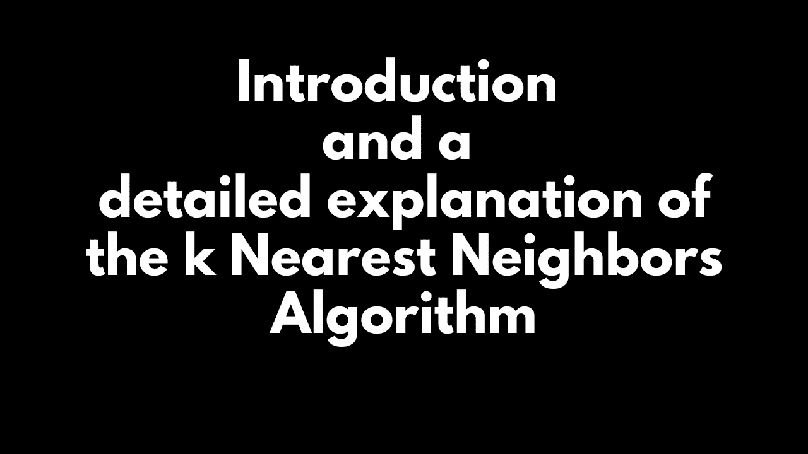

# k 最近邻算法的介绍和详细说明

> 原文：<https://medium.com/analytics-vidhya/introduction-and-a-detailed-explanation-of-the-k-nearest-neighbors-algorithm-9f958d29dd83?source=collection_archive---------12----------------------->



# kNN 是什么？

k 近邻算法是最简单的机器学习算法之一。具体来说就是一个“分类”算法。但由于其通用程序，它也可用于特征选择、异常值检测(威尔逊编辑)和缺失值插补。它也被称为*基于实例的学习*和*懒惰学习*，因为在训练时它什么也不做！在 kNN 中，超参数是“k”。

# kNN 的工作

kNN 有一个简单的工作机制。我会用 4 个步骤来解释。当一个测试点进来时，这就是我们在 kNN 中所做的，

1.  固定 k 的值
2.  通过欧几里德距离公式(或任何距离查找算法)找到 k 个最近的邻居
3.  给班级标签投票
4.  预言；预测；预告

让我用一个简单的例子来说明 kNN。让我们假设我们的数据集有 3 个类别标签(A，B，C)。让我们将 k 的值固定为 3，即我们找到 3 个最近的邻居。现在，当一个测试点进来时，我们在数据集中找到 3 个最近的邻居。假设我们的算法给出了 3 个最近的邻居 A，A，C，因为测试点必须只属于一个类，我们必须只从 A，A，C 中选择一个，我们现在引入一个投票机制，因为 A 是 2，C 是 1。“A”赢得了游戏，我们指定测试点属于类标签“A”。就这么简单！

现在，让我们用代码来看看详细的解释。

# kNN 算法解释

## 0.导入所需的库

```
**from sklearn import datasets
import pandas as pd
import numpy as np
import seaborn as sns
import random as rnd
import csv
import random
import math
import operator
%matplotlib inline**
```

让我们研究一下著名的虹膜数据集。不了解的话看看 [***虹膜数据集***](http://archive.ics.uci.edu/ml/datasets/Iris/) 。第一步是加载数据集，然后将数据集分成训练数据和测试数据。

## 1.加载数据集并分割数据集

虹膜数据集可以通过两种方式加载。一种方法是从 sklearn 库加载，另一种方法是从本地桌面加载。让我们遵循第二种方法。

```
**def loadDataset(filename, split, trainingSet=[] , testSet=[]):
  with open(filename, 'r') as csvfile:
     lines = csv.reader(csvfile)
     dataset = list(lines)
     for x in range(len(dataset)-1):
         for y in range(4):
             dataset[x][y] = float(dataset[x][y])
         if random.random() < split:
             trainingSet.append(dataset[x])
         else:
             testSet.append(dataset[x])**
```

loadDataset 是加载我们的数据集的函数。我们以读取模式打开 CSV 文件。因为我们的数据集是逗号分隔的值，所以我们使用 CSV reader。我们运行一个循环，在每次迭代中，我们转换数据类型，并根据随机函数的返回值将数据点分成训练或测试。

默认情况下，数据集中的值作为字符串读取。但是值(萼片长度、萼片宽度、花瓣长度和花瓣宽度)应该是浮点类型。所以我们把它们转换成浮点型。

现在，我们必须将数据集分成两部分。我们随机分割数据集，并填充训练和测试数据集。

让我们调用这个函数。

```
**trainingSet=[]
testSet=[]
split = 0.67
loadDataset('iris.csv', split, trainingSet, testSet)
print('Train set is ', repr(len(trainingSet)))
print('Test set is  ' , repr(len(testSet)))**
```

完成这些后，我们可以看到我们的数据集已经成功地分为训练和测试。进入下一步。

## 2.定义距离和邻域函数

```
**def euclideanDistance(instance1, instance2, length):
    distance = 0
    for x in range(length):
        distance += pow((instance1[x] - instance2[x]), 2)
    return math.sqrt(distance)****def getNeighbors(trainingSet, testInstance, k):
    distances = []
    length = len(testInstance)-1
    for x in range(len(trainingSet)):
        dist = euclideanDistance(testInstance, trainingSet[x], length)
        distances.append((trainingSet[x], dist))
    distances.sort(key=operator.itemgetter(1))
    neighbors = []
    for x in range(k):
        neighbors.append(distances[x][0])
    return neighbors**
```

我前面说过，在 kNN 算法中，我们用欧几里德原理来度量两点之间的距离。这个过程在“euclideanDistance”函数中完成。如果我们有 3 个维度，则公式变为√( x2 x1)+(y2 y1)+(z2z 1)，但在我们的数据集中，我们有 4 个维度/列(萼片长度、萼片宽度、花瓣长度和花瓣宽度)，因此我们在上面的公式中添加一个额外的项，然后返回距离。“长度”参数是数据集中的维数，即 4。

在 getNeighbors 函数中，给定一个测试点、整个训练数据、值“k”，该函数应该返回该测试点在整个训练集中的 k 个最近邻。为了实现这一点，我们对整个训练数据集运行一个循环，在每次迭代中，我们找到测试点和训练点之间的距离。计算完所有距离后，我们按升序对距离进行排序，因为我们只需要前“k”个最近的邻居。我们返回最近的邻居。

## 3.投票

```
**def getResponse(neighbors):
    classVotes = {}
    for x in range(len(neighbors)):
        response = neighbors[x][-1]
        if response in classVotes:
            classVotes[response] += 1
        else:
            classVotes[response] = 1
    sortedVotes = sorted(classVotes.items(), key=operator.itemgetter(1), reverse=True)
    return sortedVotes[0][0]**
```

和前面的例子一样，当我们有 2 个 A 和 1 个 C 时，我们选择了 A 作为测试点的类标签。在这个函数中，我们正是这样做的。在找到 k 个最近的邻居后，我们必须对类别标签进行投票。这可以通过填充 classVotes 字典轻松完成。填充完字典后，我们需要对字典进行排序，以便查看谁是赢家！我们回报胜利者！

## 4.找到我们模型的准确性

仅仅创建一个模型是不够的，模型的准确性应该相当好。现在，准确性是(我们的模型做出的总预测除以正确的预测)。检验准确性很简单。如下所述，

```
**def getAccuracy(testSet, predictions):
    correct = 0
    for x in range(len(testSet)):
        if testSet[x][-1] == predictions[x]:
            correct += 1
    return (correct/float(len(testSet))) * 100.0**
```

我们所有的预测都存储在“预测”列表中。我们的正确预测存储在我们的测试数据中。因此，我们将预测的类别标签与原始类别标签进行比较，并最终返回准确度。

## 5.测试我们的模型

重要的一步是“测试我们的模型”。我们在测试数据上测试我们的模型，并发现我们的模型的准确性。

```
**predictions=[]
k = 3
for x in range(len(testSet)):
    neighbors = getNeighbors(trainingSet, testSet[x], k)
    result = getResponse(neighbors)
    predictions.append(result)
    print('Predicted is  ' + repr(result) + ' Actual is  ' + repr(testSet[x][-1]))
accuracy = getAccuracy(testSet, predictions)
print('Accuracy: ' + repr(accuracy) + '%')**
```

我们选择“k”的值为 3。对于测试数据集中的每个测试点，我们找到它最近的邻居并投票。我们将所有的预测存储在“预测”列表中。最后，我们检查模型的准确性！

就这样，我们从头开始编写了 kNN 算法！！是不是很轻松很好玩？

# kNN 的问题

到目前为止，我们已经看到了 kNN 是如何工作的以及它可以用在什么地方，但是它有什么问题呢？简而言之，它有两个主要问题。

第一个是“*大计算时间*”。因为在训练时，它什么也不做，而在测试时，应该计算距离。距离的计算高度依赖于数据集中的特征/维度/列的数量。如果有更多的特征，那么距离的计算就变得很耗时。

第二件事，“模型尺寸大”。因为在训练时间它什么也不做，在 kNN 中我们的模型是数据。数据= kNN 中的模型。如果我们的数据庞大。然后我们的模型也很庞大，这是个问题。

我希望你对 kNN 有所了解。如果您喜欢该内容，请点击“鼓掌”按钮，

和我联系-

> `LinkedIn : https://linkedin.com/in/bomma-pranay
> GitHub : https://github.com/Bomma-Pranay`
> 
> `--- By
> Bomma Pranay
> A Data Science Enthusiast`