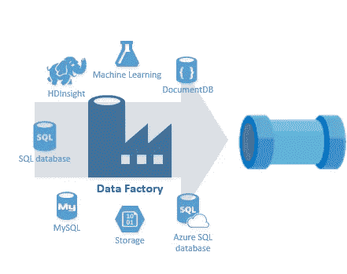
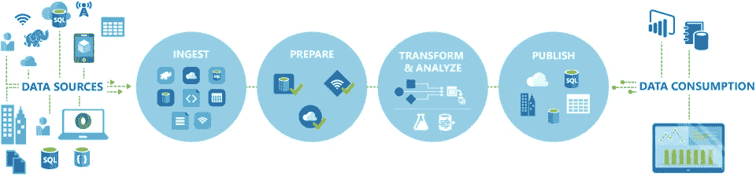
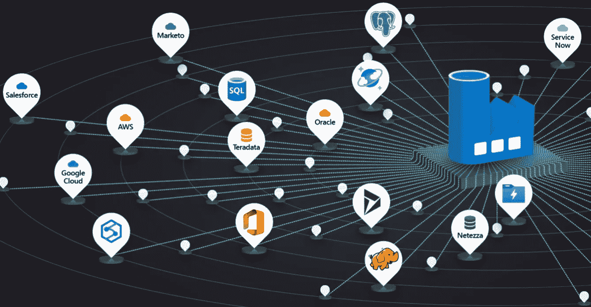
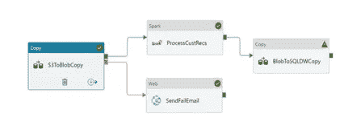
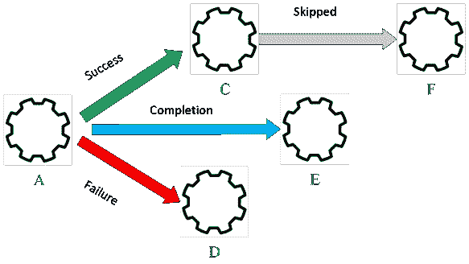
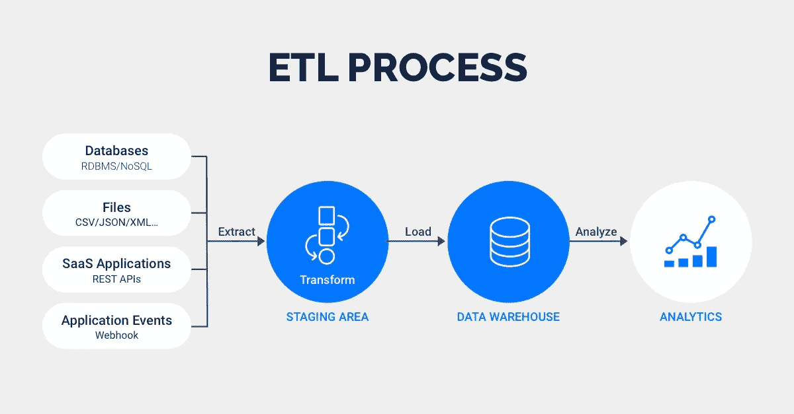
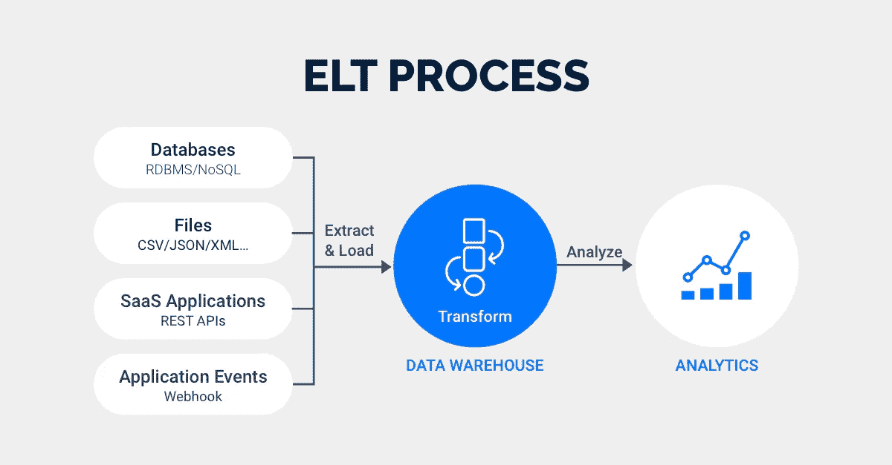

# 简介:微软 Azure 数据工厂中的数据驱动工作流。

> 原文：<https://medium.com/analytics-vidhya/introduction-data-driven-workflows-in-microsoft-azure-data-fatory-826f619842b3?source=collection_archive---------4----------------------->

# Azure 数据工厂

大多数分析解决方案都需要触发数据的批量移动并准备定期计划，这可以通过使用基于云的数据集成服务来实现，该服务可以协调数据的移动和转换。

Azure Data Factory (ADF)是一种基于云的 ETL 和数据集成服务，允许您创建数据驱动的工作流来协调数据移动和大规模转换数据。使用 Azure Data Factory，您可以创建和安排数据驱动的工作流(称为管道),这些工作流可以从不同的数据存储中获取数据。您可以构建复杂的 ETL 流程，使用数据流或 Azure 中的计算服务可视化地转换数据。

[Img。1 —数据工厂云计算和存储集成。](https://www.bluegranite.com/hubfs/adfflow.png)

# 什么是编排？

打个比方，想想交响乐团。管弦乐队的核心成员是指挥。指挥并不演奏乐器，他们只是简单地带领交响乐团成员演奏整首乐曲。音乐家使用他们自己的技巧在交响乐的不同阶段发出特定的声音，所以他们可能只学习音乐的某些部分。指挥指挥整首乐曲，因此知道正在演奏的整个乐谱。他们还会使用特定的手臂动作来指导音乐家如何演奏一首乐曲。

ADF 可以使用类似的方法，虽然它具有接收和转换数据的本机功能，但有时**它会指示另一个服务代表它执行所需的实际工作**，例如 Databricks 执行转换查询。因此，在这种情况下，应该是 Databricks 执行这项工作，而不是 ADF。 **ADF 仅仅编排查询的执行，然后提供管道将数据移动到下一步或目的地**。

[img . 2—Azure 数据工厂中的数据驱动工作流。](https://docs.microsoft.com/pt-br/learn/modules/data-integration-azure-data-factory/4-explain-process)

它还提供丰富的可视化功能来显示数据管道之间的沿袭和依赖关系，并从一个统一的视图中监控所有数据管道，以轻松查明问题并设置监控警报。

数据集成首先涉及从一个或多个来源收集数据。可选地，它通常包括一个过程，在该过程中，数据可能被清理和转换，或者可能被增加额外的数据并被准备。最后，合并的数据存储在数据平台服务中，该服务处理您想要执行的分析类型。这个过程被称为提取、转换和加载(ETL)。

# 提取

**在提取过程**中，数据工程师定义数据及其来源:

1.  **定义数据源:**识别数据源细节，比如资源组、订阅和身份信息，比如密钥或秘密**。**
2.  **定义数据:**标识要提取的数据。通过使用数据库查询、一组文件或用于 Blob 存储的 Azure Blob 存储名称来定义数据。

[Img。3 —简化的混合数据集成。](https://azure.microsoft.com/en-us/services/data-factory/#interactive-demos)

# 改变

**定义数据转换:**数据转换操作可以包括拆分、合并、派生、添加、删除或透视列。在数据源和数据目标之间映射字段。您可能还需要聚合或合并数据。

[Img。4-Ex。数据转换管道。](https://www.element61.be/sites/default/files/competence/Azure%20Factory)

# 负荷

**定义目的地:**在加载期间，许多 Azure 目的地可以接受 JavaScript 对象符号(JSON)、文件或 blob 格式的数据。您可能需要编写代码来与应用程序 API 进行交互。

Azure Data Factory 提供了对 Azure 函数的内置支持。您还会发现对许多编程语言的支持，包括 Node.js。NET、Python 和 Java。尽管可扩展标记语言(XML)在过去很常见，但是大多数系统都迁移到了 JSON，因为它作为半结构化数据类型非常灵活。

**启动作业:**在开发或测试环境中测试 ETL 作业。然后将作业迁移到生产环境，以加载生产系统。

**监视作业:** ETL 操作可能涉及许多复杂的过程。建立一个主动和被动的监控系统，以便在出现问题时提供信息。根据将要使用的技术设置日志记录。

Img。5-管道工作流程。

# ETL 与 ELT:有什么区别？

ETL 和 ELT 都是将数据从源传输到数据仓库的数据集成方法。尽管有相似之处，ETL 和 ELT 在根本上是不同的。这里有一个 ETL 和 ELT 的快速比较。

[Img。7 — ETL 过程。](https://rivery.io/etl-vs-elt-whats-the-difference/)

当数据必须被转换以符合目标数据库的数据体制时，使用 ETL。这种方法出现于 20 世纪 70 年代，在拥有有限内存和处理能力的本地数据库中仍然很流行。

考虑一个实际的 ETL 例子。在线分析处理(OLAP)数据仓库只接受基于关系 SQL 的数据结构。对于这种类型的数据仓库，诸如 ETL 之类的协议通过将提取的数据路由到处理服务器，然后将不一致的数据转换成基于 SQL 的数据来确保合规性。提取的数据只有在成功转换后才会从处理服务器移动到数据仓库。

[Img。8 — ELT 流程。](https://rivery.io/etl-vs-elt-whats-the-difference/)

**ELT 流程也与数据湖密切相关。**

> ***数据湖*** *是特殊类型的数据存储，与 OLAP 数据仓库不同，它接受任何类型的结构化或非结构化数据。数据湖不要求您在加载数据之前转换数据。您可以立即将任何* ***类型*** *的原始信息加载到数据湖中，无论其格式如何。*

使用 ELT，数据清理、丰富和转换都发生在数据仓库内部。原始数据无限期地存储在数据仓库中，允许多次转换。

[Img 9 — ETL 与 ELT](https://rivery.io/wp-content/uploads/2020/01/etlvselt.png)

ETL 和 ELT 在两个主要方面不同。一个区别是数据在哪里转换，另一个区别是数据仓库如何保留数据。

*   ETL 在单独的处理服务器上转换数据，而 ELT 在 DW/数据湖本身中转换数据。
*   ETL 不将原始数据传输到数据仓库，而 ELT 将原始数据直接发送到 DW/Data lake。

对于 ETL，通过在加载过程之前在单独的服务器上转换数据，数据接收过程变得更慢。相比之下，ELT 的数据接收速度更快，因为数据不会发送到辅助服务器进行重构。事实上，使用 ELT，数据可以同时加载和转换。

ELT 的原始数据保留为生成商业智能创建了丰富的历史档案。随着目标和策略的改变，BI 团队可以重新查询原始数据，以使用全面的数据集开发新的转换。另一方面，ETL 并不生成可无限查询的完整的原始数据集。

这些因素使 ELT 更加灵活、高效和可扩展，特别是在接收大量数据、处理包含结构化和非结构化数据的数据集以及开发多样化的商业智能方面。

另一方面，ETL 非常适合计算密集型转换、具有遗留架构的系统，或者在进入目标系统之前需要操作的数据工作流，例如擦除个人身份信息(PII)。

