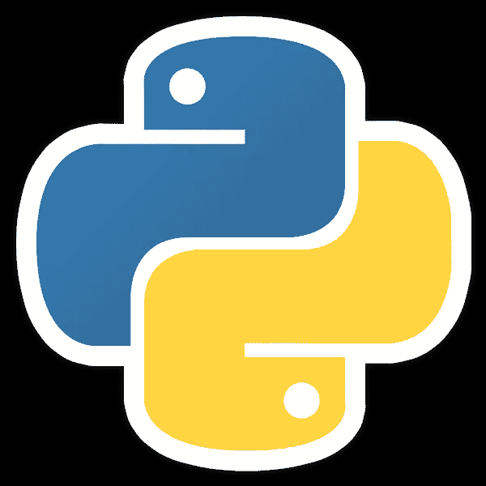

# Python 数据科学简介

> 原文：<https://medium.com/analytics-vidhya/introduction-data-science-with-python-4819a20f4743?source=collection_archive---------7----------------------->

在这个系列中，我们将看到用 Big-O 符号表示的时间复杂性。

每个程序员都应该知道他/她写代码要花多少钱。除此之外，一只猫在键盘上乱按也没什么区别。