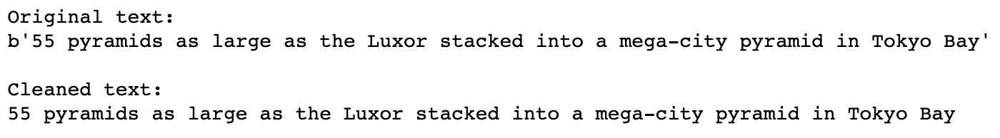
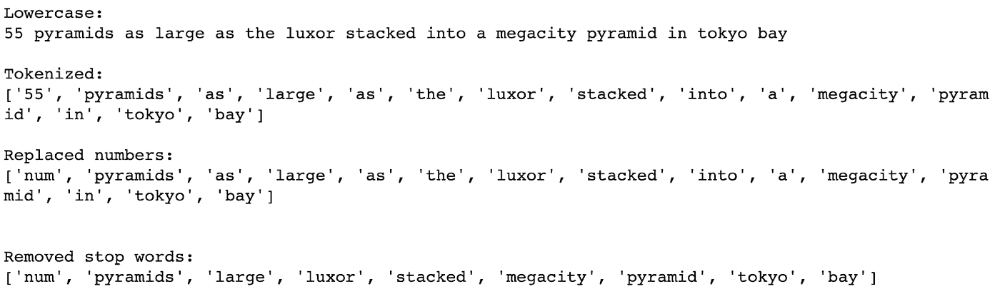

# 我们可以通过将自然语言处理(NLP)技术应用于新闻标题来预测股市变化吗？

> 原文：<https://medium.com/analytics-vidhya/introduction-e2861d4a45a0?source=collection_archive---------13----------------------->


新闻标题与我们的股票市场有多大关联？本文应用了 NLP 数据预处理技术，如标记化、规范化、词干化和词条化。然后，我们使用 word2vec 库将单词转换为向量，看看是否可以创建一个预测模型。

# 密码

你可以在 GitHub 链接找到这篇文章的代码。

# 介绍

NLP 怎么用才能赚钱？人类语言是各种内容的表现:情感、思想、事实和虚构。同样，媒体中使用的语言可以代表那个特定时期的世界。

这就是为什么我们决定参加由 Kaggle 主办的“[每日股票市场预测新闻](https://www.kaggle.com/aaron7sun/stocknews)”挑战赛。挑战试图看看主要新闻标题是否可以用来预测股票价格。**标题数据集**是从 [Reddit 世界新闻频道](https://www.reddit.com/r/worldnews) (/r/worldnews)收集的，新闻标题的重要性由它从 Reddit 用户那里获得的“投票”数量来衡量。最终数据集是从 2008 年 6 月 8 日到 2016 年 7 月 1 日每个日期的**前 25 个标题**的集合。股票价格被选为道琼斯工业平均指数，取自同一日期跨度。

最终的挑战将是衡量标题的绝对重要性，并将这些权重乘以每个标题的情绪，以提供一般的逐日期情绪分析。这种情绪测量将能够预测股票的涨跌幅度。

本文描述了上述过程的粗略简化。标题不是绝对重要，而是根据日期相对衡量，筛选出前 25 个标题。一旦入选 25 强，每一个头条都一视同仁。我们不是对每个标题进行综合情感分析，而是生成一个向量，聚合每个日期的某些词。最终的预测不是对下一级股票的预测，而是对股票可能上涨或下跌的简单二元分类。

# 资料组

该数据集由 1，989 个数据点组成，每个数据点对应于 2008 年 6 月 8 日至 2016 年 7 月 1 日期间的某个日期。每个日期数据点有 27 个特征。一个特征描述了确切的日期，另一个特征是对应于该日期的股票水平变化的二进制代码，以及新闻标题的 25 个特征。这个原始数据集存储在名为 **data** 的 pandas 数据集中。

```
# import data
data = pd.read_csv('Combined_News_DJIA.csv')print('data is %d data points with %d features'%(data.shape[0],data.shape[1]))
data.head()
```


包含 27 个特征的 1989 个数据点的数据集。第一个功能是日期，第二个是 DJIA 标签，其余的是当天的 25 大新闻标题

# 数据预处理

## 数据清理

标题是从 Reddit 网站上刮下来的。因此，所有标题都在标题文本周围加上引号，并在文本前面加上标题 HTML 代码，如“b”。这在数据预处理的第一步中被清除。

```
dataClean.iloc[:,i]=dataClean.iloc[:,i].str.strip("b'")
```



第一层清洗去除了开头的 b '和结尾的'

## 正常化

通过删除标点符号、将所有字符转换为小写并将数字替换为文本“num”来规范化数据。标点符号取自字符串库。

```
## All punctuations found in string.punctuation were substituted with blanks
dataClean.iloc[:,i]=dataClean.iloc[:,i].str.translate(str.maketrans('', '', string.punctuation))
dataClean.iloc[:,i]=dataClean.iloc[:,i].str.lower()
```


从清理过的文字到去掉的标点，“特大城市”变成了“特大城市”。

## 标记化

然后，数据被单词标记。每个标题文本通过 **str.split()** 方法被空格分隔。从标记列表中识别停用词，并从词列表中移除停用词。停用词是从 NLTK 库的英语停用词列表中导入的。停用词存储在字典集中，以便更快地访问和识别。

```
dataClean.iloc[:,i]=dataClean.iloc[:,i].str.split()
dataClean.iloc[:,i]=dataClean.iloc[:,i].apply(lambda sent: 'num' if isinstance(sent,float) else ['num' if token.isdigit() else token for token in sent])
```



在标记化中，单个字符串对象被转换成字符串对象的列表，其中每个字符串对象是单个单词。在替换数字时，数字“55”被替换为文本“num”在删除停用词时，从列表中删除了单词“as”、“the”、“Into”、“a”和“in”。

```
## Stopwords were imported from NLTK package. The list of stopwords was stored in a set for faster accessing.
stops = set(stopwords.words('english'))
```

每个标题每个日期清理过的单词都存储在**数据清理**熊猫数据集中。

# 词干化和词汇化

这些词然后被蒸或词条化。这两个过程都试图识别语料库中每个单词的词根。词干处理使用 NLTK 包中的 **PorterStemmer** 类。词干处理会删除给定单词的后缀和前缀，即使生成的词根不是字典中的单词。词汇化过程使用了 **WordNetLemmatizer** 类，也来自 NLTK 包。词汇化识别单词的规范词根，其中结果单词是字典中的合法单词。在本文中，我们将记号符号化，但是代码也允许开关使用词干。

```
if stemming:
    porter = PorterStemmer()   
    for i in range(2,dataNormal.shape[1]):
        dataNormal.iloc[:,i]=dataNormal.iloc[:,i].apply(lambda x: [porter.stem(y) for y in x])

elif lemmatization:
    lemmatizer = WordNetLemmatizer()
    for i in range(2,data.shape[1]):
        dataNormal.iloc[:,i]=dataNormal.iloc[:,i].apply(lambda x: [lemmatizer.lemmatize(y) for y in x])
```


词汇化将“tanks”后面的复数“s”删除为“tank”WordNetLemmatizer 未能对"移动"、"朝向"、"据报道"、"完全"、"摧毁"和"格鲁吉亚"这些词进行词汇化，这些词本应是" moe "、"朝向"、"报告"、"完全"、"摧毁"和"乔治"。


在一个更完整的例子中，标题开头的“b”Al-Qa ' EDA 会聚合为“alqaeda”。“un-Islamic”中间的连字符也被删除为“unislamic”，而“un-Islamic”和“including”之间的连字符也被删除。

结果数据存储在**数据正常**数据集中。


# 数据矢量化

为了从整体上分析整个日期的单词，我们将使用数据矢量化过程。每个单词将被转置到高维空间中的一个向量，这将允许将每个日期的单词聚合到一个向量中。

## 数据扁平化

目前，数据集是 1989 个数据点(1989 年的日期)，有 27 个特征，对应于日期、标签和 25 个标题。在这个模型中，我们不区分标题的排名，所以没有额外的权重给予具有最大点赞量的标题和在当天标题中排名第 25 的标题。因此，我们将标题简化为每个日期的一个单词列表。展平后的数据存储在 **dataFlat** 数据集中，该数据集中有 1989 个数据点，具有三个特征。


## 数据矢量化

词与词之间没有直接的可比性。 **Gensim** 包的 **Word2Vec** 类创建了一个表示每个单词的数字向量。向量代表意义以及单词之间的关系。使用 100 维空间以合理的准确度表示向量，如果该词在语料库中重复至少 5 次，则创建向量。


**Word2Vec 模型**花了 1.4 秒来训练，结果产生了一个**10197 个单词的字典**。粗略地看一下 Word2Vector 模型，可以看出该模型相当准确。例如，向量形式最接近“战争”对应向量的单词是“人类”、“犯罪”、“卡特尔”和“伊拉克”。它还表明，正如预期的那样，“和平”和“恐怖”这两个词与“战争”的关联度更高，而不是“学校”。


dataFlat 数据集通过首先移除没有出现在 W2V 模型中的单词来进行矢量化。剩余的单词具有相应的 100 维向量，这些向量按日期保存在一个 **words_in_date** 列表中。对每个日期形成的向量取平均值。因此，单个 100 维向量现在表示每个数据点(日期)，作为单词字典中显示的该日期标题 ***和*** 中使用的所有单词的代理。该平均向量作为附加列保存到**数据平面**，成为**数据向量**。


dataVector 数据集添加了“Average”列，该列存储 100 维向量，该向量对当天前 25 条新闻中记录的所有词典单词进行平均

# 数据分割

DataVector 是 1989 个数据点，具有四个特征:日期、标签、单词列表，最后是一个 100 维向量，即每个日期的平均向量值。对于分类器模型，它只对每个向量的 100 个特征感兴趣。因此，这 100 个维度在**数据模型**中各自扩展到自己的列，这是具有 102 个特征的 1989 个数据点。两个非向量维特征是日期和 DJIA 变化标签。


通过按日期 2014 年 12 月 31 日分割数据集，创建了一个**训练/测试数据集**。这导致 **1610 个向量**在训练数据集中，而 **379 个向量**在测试数据集中，一个**大约 80.9%到 19.1%的分割**。


# 建模

构建了 5 种不同的模型来进行二元分类预测。所有模型都取自 **scikit-learn 包**，这些模型是随机森林分类器(“RF”)、XG Boost(“XGB”)、逻辑回归(“LogReg”)、支持向量分类器(“SVC”)和多层感知器分类器(“MLP”)。

# 结果

所有五个模型都预测了**接近概率的结果**。结果几乎与**准确度**指标和 **ROC AUC** (曲线下的接收器工作特性面积)指标相同，后者是 Kaggle 竞赛定义的待测指标。


奇怪的是，LogReg、SVC 和 MLP 模型都预测所有测试数据点的结果为“1”(即 DJIA 将上升)。


五个模型的混淆矩阵。注意，对数、SVC 和 MLP 模型预测所有数据点都是正的

仔细观察 ROC 曲线可以发现，RF 的 ROC 曲线相对平滑，而 XGB、LogReg 和 SVC 的 ROC 曲线更为崎岖，而 MLP 的 ROC 曲线是绝对线性的。但是所有五个模型的 ROC 曲线都接近简单随机分类线，导致 AUC 分数接近-0.5。


# 结论

从我们的代码得出的结论是，我们的模型不亚于 DJIA 股票价格的随机预测器。次优结果可能是由以下任何原因或任何原因组合造成的。

首先，**平均机制**可能会使最终的 100 维向量携带**没有意义的信息**。在我们的数据集中，对应于单词的 100 维向量被数学平均以创建单个向量。我们的假设之一是，这种平均的结果可以代表当时的经济情绪。如果任何有意义的信息在大多数情况下相互抵消，或者如果无意义的信息(如由停用词传达的信息)在平均值中占主导地位，则得到的平均向量彼此不会有太大不同。

其次，有意义的信息可能会在**矢量化过程中丢失。**在我们当前的模型中，某个特定单词在当天新闻标题中的**频率**被忽略。然而，有意义的信息可能不是“战争”或“恐怖”这个词被展示，而是在那个特定的日子里**如何经常**被使用。当矢量化过程不能准确捕捉矢量的方向时，这种加权系统尤其重要。

第三，**矢量化过程**不足以表示单词的**情感**。理论上，Word2Vec 模型应该能够用足够大的语料库来捕捉这样的情感。但是从战争与和平和战争与恐怖的例子来看，战争与和平比战争与恐怖更相似。这可能是因为语料库不足以建立情感分析，并且相似性更多地受共现的影响。当感情上对立的词(如“战争”和“和平”)经常一起出现时，这种方法是有害的。


最后，很可能前 25 条新闻标题的内容与股价变化没有太大关联。虽然股票价格受实时事件的影响很大，但世界经济是一个新兴产业，同一条新闻在不同的背景下可能会对股票价格产生不同的影响。也许“25 条”新闻标题的信息量不足以捕捉真实世界的情况。也许 Reddit 选择“头条”新闻的投票机制并不能准确衡量一篇新闻的重要性。