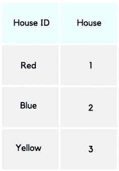

# 3NF 简介

> 原文：<https://medium.com/analytics-vidhya/introduction-of-3nf-86193aa1f0e8?source=collection_archive---------7----------------------->

## **(继续…初学者理解数据规范化的尝试)**

[Chor 曾](https://unsplash.com/@chortsang?utm_source=medium&utm_medium=referral)在 [Unsplash](https://unsplash.com?utm_source=medium&utm_medium=referral) 上拍照

在我的上一篇题为“初学者理解数据规范化的尝试”的文章中，我试图对 1NF 和 2NF 规范化的含义做一个简单的解释。

这一次，我要‘升一级’，寻求引入 3NF 规范化。

首先，我认为了解将数据库规范化到 3NF 的好处是有帮助的；

## 3NF 规格化的好处？

*   确保没有数据重复
*   提高查询运行的效率
*   减少所需的存储量

而且在我们深入研究数据规范化之前，我也认为最好是用规范化中常用的某些术语的定义来装备或提醒我们自己；

## 关键列与非关键列…？

*   ***键列*** 是表中的一列值，用来唯一标识一条记录。
*   ***非键列*** …因此指的是表中不唯一标识记录的列。

## 传递函数依赖…？

*   传递函数依赖是指当对一个*非键*列进行更改时，也可能会更改任何其他*非键*列。

现在，既然基础已经清楚了，那就让我们深入了解一下 3NF 到底是怎么回事吧！

## 3NF 标准化的规则:

*   必须在 1nf ( *咄。*)
*   必须在 2nf ( *又来了，咄。*
*   没有可传递的函数依赖。(*啊啊啊，新东西。*)

我将用一个例子来说明如何将数据库规范化为 3NF。

背景:这是一份参加新生迎新营的参与者名单。

图 2NF 中的数据库。

“参与者 ID”是主键，关系是这样流动的；

“参与者 ID”→“姓名”→“迎新小组”→“住所”

在这个数据库中(图 1)，“房子”是对“方位组”的传递依赖，这打破了 3NF 归一化的最后一个规则。因此，为了将这个数据库的值转换成 3NF，我们将这个表分解成两个表。

图 2a

“House”的键现在是外键，它引用了图 2b 的主键；房屋 ID。

图 2b

对于这样的数据库，这就完成了 3NF 数据规范化。数据规范化的迷人之处在于，每规范化一级，效率就会降低，所需的存储空间也会减少。数据库分解得越多，获得的好处就越多。我现在停在 3NF，但规范化可以继续到 Boyce-Codd 范式(也称为 3.5NF)，4NF，5NF…

据我所知，即使是 6NF 也还没有标准化。

了解如何规范化他们的数据库，我相信这是每个人都应该掌握的技能。它在效率和资源利用方面带来了很多价值。