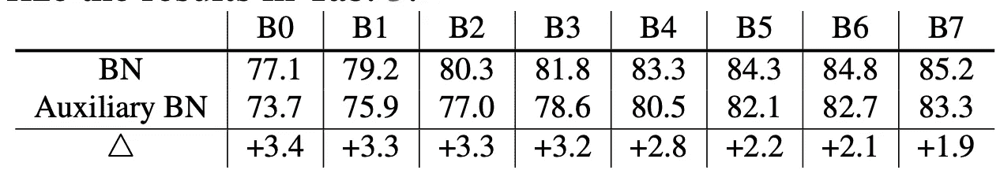

# 介绍“对抗性例子提高图像识别”，ImageNet SOTA 方法使用对抗性训练

> 原文：<https://medium.com/analytics-vidhya/introduction-of-adversarial-examples-improve-image-recognition-imagenet-sota-method-using-1fe981b303e?source=collection_archive---------8----------------------->

# 关于这篇文章

本文是对 2019 年 11 月 21 日发布的“对立的例子改善图像识别”[1]的评论。本文摘要如下。

***他们提出使用对立样本的 AdvProp，显著提高 ImageNet 和带噪声的 ImageNet 的精度。这是一种对抗性的训练，他们在训练中使用 2 批标准化。其中一个用于正常数据，另一个用于对立样本。基于这样的想法，即不适合用混合两个数据的分布来学习，因为没有噪声的正常数据和有噪声的数据在不同的域中。在不使用外部数据的情况下，使用 ImageNet Top-1 Acc 达到 85.5%，在不使用外部数据的情况下达到最先进水平。***

# 对抗范例和对抗训练

对立的例子是数据中人为制造的少量噪声，以错误识别样本。用于该图像的示例如下所示。

对立例子的例子。模型被愚弄了，但人类从未因微小的噪音而被愚弄。

这里有一个小噪声，旨在错误识别熊猫的图像。

稍微自信点回答“熊猫”的模型(左)在变成对抗性例子(右)时，被回答为高自信的长臂猿(一种猴子)。使用这种噪声来错误识别数据被称为对抗性攻击。

这种噪声可以通过添加扰动来产生，当分类到正确的标签中时，扰动会增加损耗。对抗性攻击和保护模型免受攻击的方法是最热门的研究领域之一。

敌对攻击的噪音

虽然创建的对抗性示例会对数据产生误判，但有一种方法可以通过将它放入训练数据来改进模型，这种方法称为对抗性训练。

众所周知，预先向训练数据中添加对立示例会稍微提高对对立示例的抵抗力，并且在某些情况下还会提高泛化性能。

# 关键洞察力

在这篇论文中，他们提出了一种通过使用称为 AdaProp 的对抗性训练来提高准确性的方法。

本文的重点是如何使用称为批量归一化的正则化方法。批次归一化是一种正则化方法，它计算每个小批次的平均值和方差，标准化输入，将其乘以可学习系数，然后输出添加了可学习偏差的输入。批处理规范化是经常使用的正则化方法之一，也是使 ResNet 中的层更深的因素之一，这将在后面描述。

批量标准化算法

尽管旨在通过使用对立示例来提高泛化性能，但对立示例和正态数据具有不同的分布，因此，如果在批处理规范化中将它们放在一起，输出数据的分布将不同于最初的分布。由于这个原因，他们通过对对立的例子和正常的数据进行单独的批量标准化来减少不适当的混合分布的影响。

# 方法

在本文提出的 AdvProp 中，在每个训练步骤中都创建了对立的例子。并且使用这些对立的例子和正常的小批量数据来更新模型。算法如下。

请注意，对立示例的生成和模型更新都要经过辅助批处理规范化(辅助 BN ),这是针对对立示例的，而带有正常数据的模型更新要经过主 BN。这可以防止当来自两个不同域的数据混合时产生不适当的混合分布。

辅助 BN 原则上不限于一个。您可以根据需要制作 2 个或更多。请注意，在推断过程中仅使用主 BN。

# 网络

在展示结果之前，我先解释一下实验中使用的 ResNet 和 EfficientNet。

## 雷斯内特

ResNet [7]是 2015 年底提出的一个用于图像识别的网络，它有 152 层，是当时最深的神经网络，在 ImageNet 上达到了最高的性能。

在深度网络中，存在梯度消失的问题，但 ResNet 使用批量规范化和跳过连接解决了该问题。即使是现在，四年后，它仍被频繁引用为比较目标，是图像识别中事实上的基本模型之一。

跳过连接

## 效率网

接下来，我解释 EfficientNet [9]。EfficientNet 是 2019 年 5 月提出的自动神经网络架构搜索(NAS，Neural Architecture Search)中优化的网络，最近引起了关注。

通过同时搜索宽度(通道数)、深度(层数)和分辨率，获得了具有高精度和小参数的网络结构。通过固定缩放参数φ，在改变宽度、深度和分辨率的同时执行搜索。这些网络按照参数的升序(按照φ的升序)命名为 EfficientNet-B0，B1 … B7。

有效净性能(左)，搜索区域(右)

# 结果

## 关于干净数据

首先，使用 EfficientNet 学习 ImageNet 无噪声的结果。Top-1 Acc 提高了 0.7%，而 EfficientNet-B7 达到了 85.2%。虽然没有说明，但在没有外部数据(最先进)的情况下，EfficientNet-B8 在 ImageNet Top-1 Acc 下实现了 85.5%。据我所知，截至 2019 年 11 月 28 日，ImageNet SOTA 的外部数据为 87.4% [3]。

## 关于噪声数据

接下来，噪声数据的结果。使用了三个基于 ImageNet 的数据集:ImageNet-A [4]、ImageNet-C [5]风格化的 ImageNet [6]。ImageNet-A 是收集困难图像的数据集，ImageNet-C 是在图像中多层次加入各种噪声的数据集，styled-ImageNet 是经过风格转换的数据集。

噪声数据集

在 ImageNet-C 中，使用了称为平均损坏误差(mCE)的评估指标。简单地说，它是一个指标，表明与 AlexNet 相比，它对图像噪声的抵抗能力有多强。它是五个噪声级的平均值。较低的 mCE 意味着更强的抗噪声模型。

CE(损坏错误)定义。mCE 是所有讹误的 CE 总和。

结果如下。任何数据集的准确性都有所提高。

## 辅助 BN 的作用

最后再来看“辅助 BN”的效果，这也是本文的重点。下表显示了分离 BN 的效果与 EfficientNet 网络规模的关系(B0

The following table compares AdvProp with the original Adversarial Training. Using original Adversarial Training, the generalization performance deteriorates, but using AdvProp that separates BN , accuracies improve. It can be seen that separating BN has had a great effect. Also, as the network size increases (ResNet-50

# Conclusion

This blog post introduced AdvProp, the kind of Adversarial Training, which provides two Batch Normalizations for hostile samples and regular data. This strategy is a very general technique that can be used regardless of the network architecture. In addition, we can create a network that is resistant to noise, so I think that this is a very practical method.

# Weekly Machine Learning newsletter with Revue

 [## Akira's ML news - Revue

### About me : Manufacturing Engineer / Machine Learning Engineer/ Master of Science in Physics / ExaWizards Inc. _ _ _ _ _…

www.getrevue.co](https://www.getrevue.co/profile/akiratosei) 

***我在对 Twitter 上关于机器学习的论文做一个简短的归纳和解释。***

 [## 阿基拉

### akira 的最新推文(@AkiraTOSEI)。机器学习工程师/数据科学家/物理学硕士/…

twitter.com](https://twitter.com/AkiraTOSEI) 

# 参考

1.  谢慈航，对抗性例子提高图像识别，arXiv:1911.09665，2019
2.  Ian J Goodfellow，解释和利用对立的例子，ICLR2015
3.  谢启哲，对立样本-带噪声学生的训练改进图像网络分类，arXiv:1911.04252，2019
4.  丹·亨德里克斯等《自然对立的例子》。arXiv 预印本 arXiv:1907.07174，2019
5.  丹·亨德里克斯和托马斯·G·迪特里奇。测试神经网络对常见腐蚀和表面变化的鲁棒性。arXiv:1807.01697，2018
6.  经 Imagenet 训练的 CNN 偏向于纹理；增加形状偏差可以提高精确度和鲁棒性。在 2018 年的 ICLR。
7.  何，**，深度残差学习在图像识别中的应用，srXiv1512.03385，2015**
8.  Sergey Ioffe 等人.批量标准化:通过减少内部协变量偏移加速深度网络训练，arXiv:1502.03167，2015
9.  谭明兴和 Quoc V，EfficientNet:反思卷积神经网络的模型缩放，arXiv:2019.11946，2019