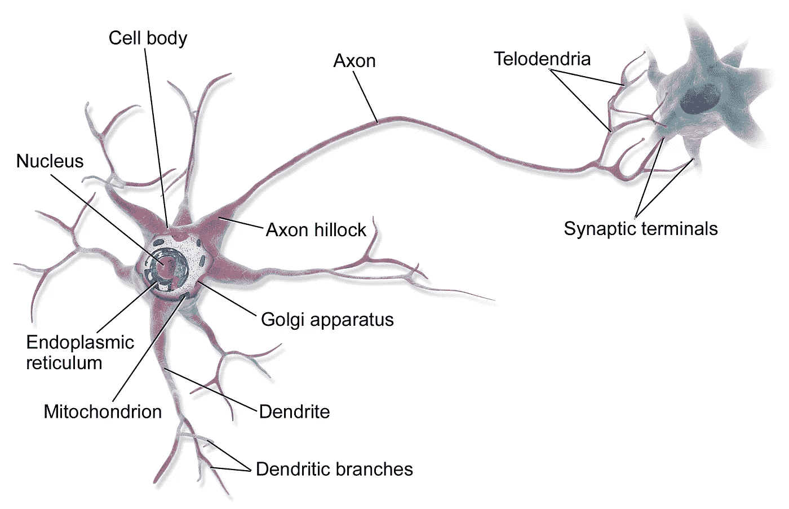
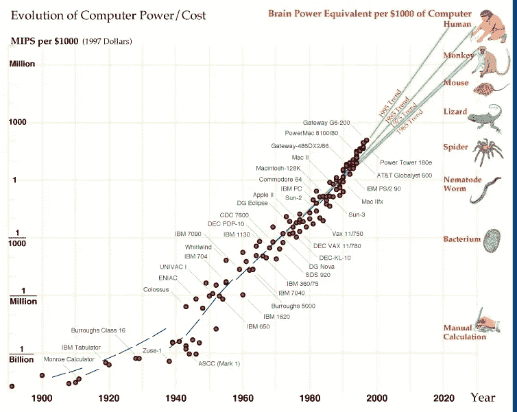
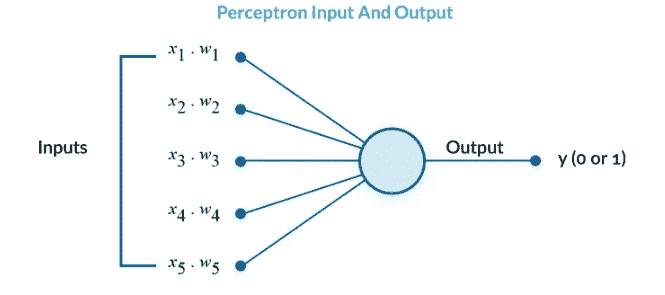
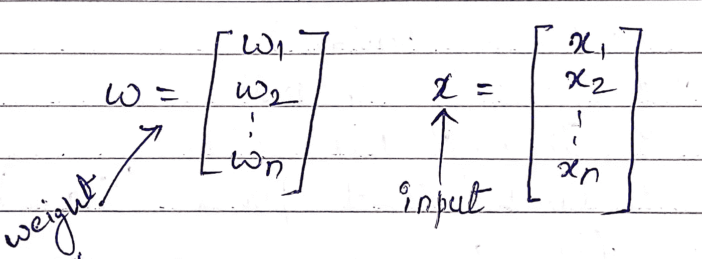
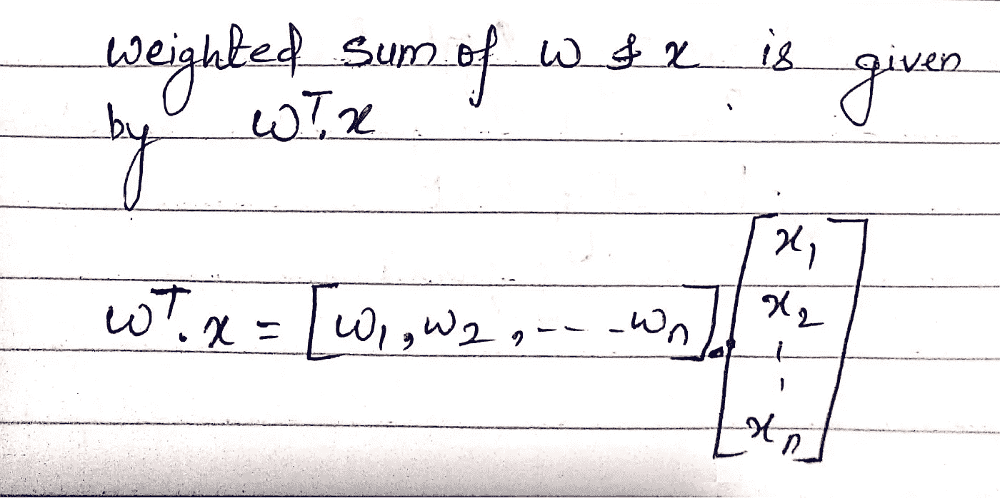
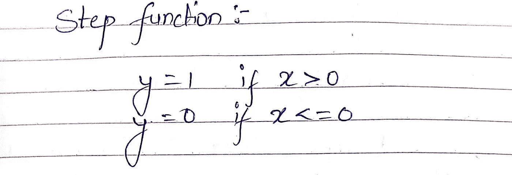

# 人工神经网络简介——二元分类

> 原文：<https://medium.com/analytics-vidhya/introduction-of-artificial-neural-network-binary-classification-e4bc5395051d?source=collection_archive---------7----------------------->

人工神经网络是深度学习的基础算法。它的灵感来自动物大脑。因为大脑是由许多神经元组成。类似地，神经网络由多个人工神经元组合而成。下面是神经元细胞的示意图，其中两个重要部分是树突和轴突，树突接收来自受体的信息，这些信息在通过轴突传递给另一个神经元之前被放大或抑制。

来源:-维基百科

人工神经网络能够解决传统机器学习无法解决的复杂问题。神经网络有许多应用，如物体识别、自动语音识别、机器翻译、图像字幕、视频分类、文本翻译等。

但是你可能会问为什么现在深度学习(神经网络)开始流行了。深度学习/神经网络并不是一个新概念，它已经被研究了很长时间。你可能会惊讶地发现，第一个神经网络是由 D . O Hebb 在 1940 年设计的，他基于神经可塑性创建了一个学习假设，后来被称为 Hebbian 学习。说到你的问题，为什么它现在流行。现在神经网络发展的重要因素是计算能力和并行处理架构(分布式计算)的发展。神经网络算法具有很高的计算能力，现在计算量的增长是惊人的，大量 GPU 和高计算机器的出现使得神经网络算法的训练变得可行。正如你可以在下面的图片中看到计算机能力在过去是如何发展的。

来源:-[https://blog . associatie . kule uven . be/Kaili/increasing-power/comment-page-1/](https://blog.associatie.kuleuven.be/kaili/increasing-power/comment-page-1/)

深度学习流行第二个原因是大量数据的可用性。来自国际电联的数据表明，互联网用了大约 16 年时间达到第一个 10 亿用户，但只用了 6 年就达到了 20 亿。然而，我们的数字 **2019** 报告中的数据表明，互联网现在正以每 2.7 年 10 亿新用户的速度增长。现在，该公司的数据库中存储了 10 千兆字节(10 ⁵字节)的数据，可用于决策过程。

现在我们可以开始理解人工神经网络的基本单元— **感知器**。

我们用一个例子来了解一下感知器。假设你和朋友计划了一次果阿之旅。现在你将决定去还是不去，这将取决于许多因素，如

1.  这个地方的天气是好是坏？
2.  是否得到家长的允许？
3.  会有多贵？

你会根据这些因素来决定你的决定，但是这些因素会有相同的权重吗？绝对没有..是的，可能得到父母的同意比旅行的花费更重要。

感知器以类似的方式工作，它接受一些输入并执行简单的激活功能以达到期望的结果。如下图所示，x1、x2 … X5 是输入函数，w1、w2… w5 是与每个函数相关联的权重，y 是输出，因为在上面的示例中，它要么进行，要么不进行。

来源:【https://missinglink.ai/】T2

在得到输出之前，累积输入(x1*w1 + x2*w2… +x5*w5)通过某个**激活函数**，它是累积输入和输出之间的一个数学门。

在继续讨论之前，我们先了解另一项，**Bias**(b)——Bias 是一个恒定误差项，在通过激活函数之前会添加到累计输入中。所以我们更新的累积输入变成了

累积输入= x1 * w1+x2 * w2+x3 * w3+x4 * w4+X5 * w5+b

让我们用向量来理解累积输入。假设输入信号是向量 x，每个输入的权重由向量 w 给出

输入和权重向量

然后向量 w 和向量 x 的加权和由向量 w 和向量 x 的转置的点积给出。

重量的加权和。x

现在让我们给加权和加上偏差

加权和= x1*w1+ x2*w2 + x3*w3 … x5*w5 +b

让我们来理解预加速器如何作为二进制分类器或二进制分类问题工作。

让我们定义一个阶跃函数，如果输入大于 1，阶跃函数返回 1，如果输入小于 1，阶跃函数返回 0。

用数学方法检查阶跃函数-

阶跃函数

在我们的例子中，激活函数是阶跃函数，如果输入大于 0，它将给出输出 1，如果输入小于等于 0，它将给出输出 0，这里 0 和 1 是两个不同的类。

阶跃函数的输入是累积输入，偏差将被传递。我们需要找到正确的 w 和 b，使得对于 y=+1 的所有点，wT.x + b > 0，对于 y=0 的点，wT.x + b < 0。

我们将拥有某些数据点，这些数据点将根据其输入函数值被分类为 1 或 0 类标签。

感谢阅读！！