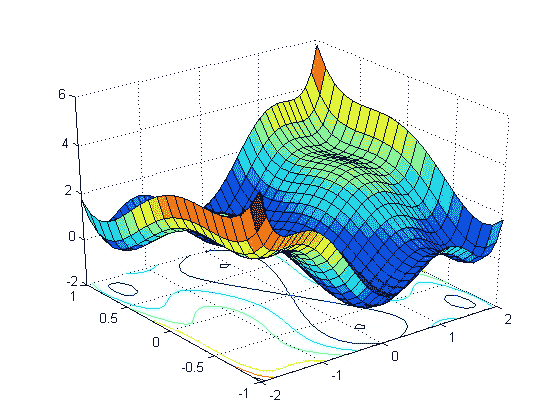

# 机器学习和深度学习中不同类型损失函数的介绍

> 原文：<https://medium.com/analytics-vidhya/introduction-of-different-types-of-loss-functions-in-machine-learning-and-deep-learning-66ef7804668b?source=collection_archive---------7----------------------->

**什么是损失和损失函数？**

在深度学习和机器学习领域，“T2 损失”和“T3”是糟糕预测的损失。这意味着损失表明模型的预测是令人满意的还是糟糕的。如果损失很高，这意味着模型在测试数据上没有给出令人满意的结果，如果…