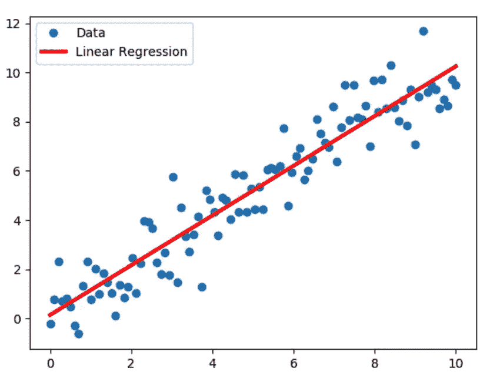

# 线性回归简介

> 原文：<https://medium.com/analytics-vidhya/introduction-of-linear-regression-692da653072a?source=collection_archive---------28----------------------->

> 通往梦想的道路很少是直线的。你必须曲折地走向幸福。

在本文中，我们将学习线性回归和线性回归的类型。

# **线性回归**

*- >回归的思想是获取连续的数据，并找出一条最适合该数据的直线。*

## 1.假设的表示

*   y = b + m x
*   也可以写成:- h(x) = theta(0)+ theta(1)x
*   基本上回归的目的是找出 m 是什么。

# 最适合的是什么？

根据参数的数量，它可以是任何形状(轴上的一个点、二维中的一条线、三维中的一个平面或高维中的超平面)。

## 2.价值函数

这将计算出如何将最佳直线拟合到我们的数据，或者简单地说:成本函数是通过确保形状和每个点的实际观察值之间的所有距离之和尽可能相同来完成的。

**成本函数的数学表示**

> 注意:我只展示了简单线性回归的方法。你可以把它推广到多元线性回归。如果你不知道什么是一元和多元回归？那就别急，继续看。

# **线性回归的类型**

## **答。简单线性回归**

这种方法通过拟合最佳线性关系，使用单个自变量来预测因变量。

**线性回归的图形表示**

## b)。多元线性回归

这种方法通过拟合最佳线性关系，使用多个自变量来预测因变量。

**多元线性回归**

在多元回归的情况下，可以通过使用下式最小化成本函数，以与简单线性回归相同的方式找到参数:

## 3.梯度下降:

给定由参数训练集定义的函数，梯度下降从初始训练集值开始，并向使函数最小化的一组值移动。这种最小化是通过使用微积分完成的，在函数梯度的负方向上采取步骤。

*注意:Alpha 基本上控制了我们在下坡时的坡度*

## **梯度下降的一些重要性质:**

1.  如果你在某个地方稍微改变你的设置，那么你会达到另一个局部最小值。
2.  如果θ(0)和θ(1)被初始化为局部最小值，那么一次迭代不会改变它们的值。
3.  不同的特征具有相似的值范围，那么梯度下降可以更快地收敛。

## 结论

> 在这篇文章中，我们成功地学习了线性回归的假设，线性回归的成本函数，线性回归的类型和线性回归的梯度下降。请继续关注更多更新。如果你喜欢这篇文章，并从中学到了一些东西，请留下掌声。
> 
> *感谢您的阅读:)*